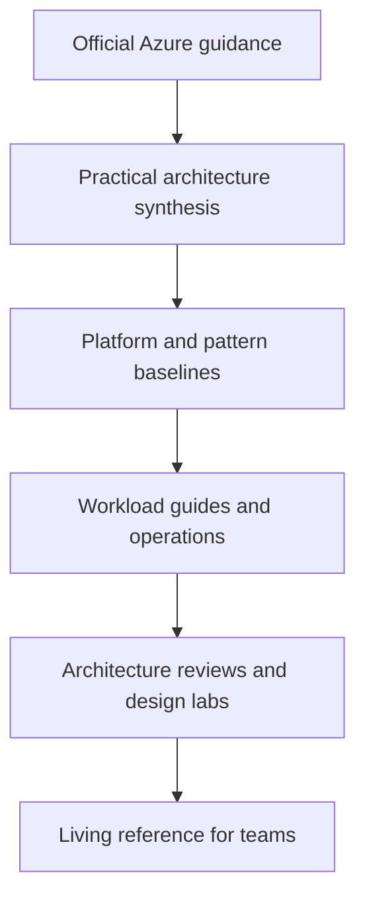

---
content_sources:
  diagrams:
    - id: about-diagram-1
      type: flowchart
      source: self-generated
      justification: "Project evolution diagram synthesized from repository goals, related projects, and Microsoft Learn source strategy."
      based_on:
        - https://learn.microsoft.com/en-us/azure/architecture/
        - https://learn.microsoft.com/en-us/azure/well-architected/
---
# About

Azure Architecture Practical Guide is an independent documentation project for teams that need Azure architecture guidance in a form that is practical, reviewable, and reusable.

## Why this project exists

[Documented] Microsoft Learn provides the authoritative source for Azure architecture guidance and service behavior.

[Inferred] Delivery teams often still need a layer that connects official guidance to recurring decisions such as:

- where the platform boundary ends and workload ownership begins
- which service family best fits a workload's operating model
- which trade-offs are acceptable for a given business priority
- how to validate architecture choices before they harden into organizational defaults

This project exists to fill that decision-focused gap.

## Project rationale

The guide is intentionally:

- practical rather than encyclopedic
- opinionated where trade-offs are repeatable
- evidence-based rather than slogan-driven
- architecture-first rather than service-first

[Inferred] The goal is not to replace Microsoft Learn, but to make architecture choices easier to reason about under delivery pressure.

## Project evolution

<!-- diagram-id: about-diagram-1 -->

## Design principles

| Principle | Meaning in practice |
|---|---|
| MSLearn-first | **Documented** core claims should trace back to Microsoft Learn |
| Architecture-first | **Inferred** the guide should prioritize decisions and consequences over product detail |
| Evidence-tagged | **Documented** important claims should declare their confidence level |
| Reusable | **Inferred** patterns and review methods should work across more than one workload |
| Low-PII | **Documented** examples should avoid real tenant, subscription, or private environment data |

## What the project is not

This repository is not intended to be:

- a one-stop service configuration manual
- a replacement for official product limits and release notes
- a benchmark catalog promising universal performance outcomes
- a certification study guide optimized for exam coverage

## Related projects

The broader practical-guide family separates architecture-level decisions from service-level implementation detail.

| Project | Focus |
|---|---|
| [azure-architecture-practical-guide](https://github.com/yeongseon/azure-architecture-practical-guide) | Cross-service Azure architecture decisions |
| [azure-virtual-machine-practical-guide](https://github.com/yeongseon/azure-virtual-machine-practical-guide) | VM-specific operational and implementation guidance |
| [azure-networking-practical-guide](https://github.com/yeongseon/azure-networking-practical-guide) | Networking configuration and operational detail |
| [azure-storage-practical-guide](https://github.com/yeongseon/azure-storage-practical-guide) | Storage implementation detail and usage patterns |
| [azure-functions-practical-guide](https://github.com/yeongseon/azure-functions-practical-guide) | Functions-specific delivery guidance |
| [azure-container-apps-practical-guide](https://github.com/yeongseon/azure-container-apps-practical-guide) | Container Apps implementation and operations |
| [azure-kubernetes-service-practical-guide](https://github.com/yeongseon/azure-kubernetes-service-practical-guide) | AKS platform and workload operations |
| [azure-monitoring-practical-guide](https://github.com/yeongseon/azure-monitoring-practical-guide) | Monitoring implementation and observability detail |

## Governance stance

[Assumed] Content quality improves when architecture guidance is written as living documentation that can be challenged and revised.

That implies:

- diagrams should declare provenance
- trade-off statements should declare evidence strength
- pages should be scoped tightly enough to stay current
- build and link validation should be part of contribution hygiene

## Microsoft Learn anchors

- [Azure Architecture Center](https://learn.microsoft.com/en-us/azure/architecture/)
- [Azure Well-Architected Framework](https://learn.microsoft.com/en-us/azure/well-architected/)

## Disclaimer

This is an independent community project and is not affiliated with or endorsed by Microsoft.

## Takeaway

[Inferred] The project exists to make Azure architecture choices easier to discuss, review, and validate.

If Microsoft Learn tells you what Azure can do, this guide is meant to help you decide what your team should do next.
