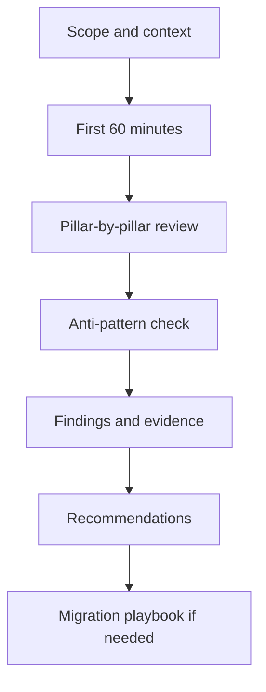

---
content_sources:
  diagrams:
    - id: architecture-reviews-methodology
      type: flowchart
      source: self-generated
      justification: "Synthesized from Azure Well-Architected Framework review guidance and Azure Architecture Center methodology."
      based_on:
        - https://learn.microsoft.com/en-us/azure/well-architected/
        - https://learn.microsoft.com/en-us/azure/architecture/framework/
        - https://learn.microsoft.com/en-us/assessments/azure-architecture-review/
content_validation:
  status: pending_review
  last_reviewed: '2026-04-22'
  reviewer: agent
  core_claims:
  - claim: Document covers Architecture Reviews aligned with Azure architecture guidance
    source: https://learn.microsoft.com/en-us/azure/well-architected/
    verified: false
  - claim: Document includes Microsoft Learn-traceable guidance for Architecture Reviews
    source: https://learn.microsoft.com/en-us/azure/architecture/framework/
    verified: false
  - claim: Document addresses Sections for Architecture Reviews
    source: https://learn.microsoft.com/en-us/assessments/azure-architecture-review/
    verified: false
  - claim: Document addresses Review methodology for Architecture Reviews
    source: https://learn.microsoft.com/en-us/azure/architecture/
    verified: false
  - claim: Document addresses How to use this section for Architecture Reviews
    source: https://learn.microsoft.com/en-us/azure/well-architected/
    verified: false
---
# Architecture Reviews

Architecture Reviews provide a structured methodology for evaluating Azure workloads against the Well-Architected Framework pillars [Documented]. This section covers decision trees, evidence-based review playbooks, common anti-patterns, and migration strategies [Inferred].

## Sections

| Section | Purpose |
|---|---|
| First 60 Minutes | Rapid architecture assessment framework for initial workload evaluations |
| Playbooks | Step-by-step review guides for common workload archetypes |
| Anti-Patterns | Architecture failure modes and corrective patterns |
| Migration Playbooks | Stepwise modernization and transition guides |

## Review methodology

<!-- diagram-id: architecture-reviews-methodology -->

## How to use this section

1. **Start with First 60 Minutes** to frame the workload scope and identify high-risk areas quickly [Documented].
2. **Use Playbooks** for structured, pillar-by-pillar deep dives on specific workload types [Documented].
3. **Check Anti-Patterns** to validate that common failure modes are addressed [Validated].
4. **Apply Migration Playbooks** when transitioning from on-premises or between Azure architectures [Inferred].

## See Also

- [Well-Architected Framework](../waf/index.md)
- [Design Labs](../design-labs/index.md)
- [Architecture Patterns](../patterns/index.md)

## Sources

- [Azure Well-Architected Framework](https://learn.microsoft.com/en-us/azure/well-architected/)
- [Azure Architecture Center](https://learn.microsoft.com/en-us/azure/architecture/)
- [Azure Well-Architected Review Assessment](https://learn.microsoft.com/en-us/assessments/azure-architecture-review/)
