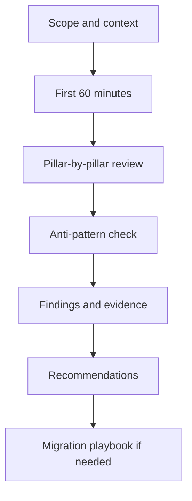

---
content_sources:
  - type: self-generated
    justification: "Navigation index for the Architecture Reviews section, synthesized from Azure Well-Architected Framework review guidance and Azure Architecture Center methodology."
    based_on:
      - https://learn.microsoft.com/en-us/azure/well-architected/
      - https://learn.microsoft.com/en-us/azure/architecture/framework/
      - https://learn.microsoft.com/en-us/assessments/azure-architecture-review/
---
# Architecture Reviews

Architecture Reviews provide a structured methodology for evaluating Azure workloads against the Well-Architected Framework pillars. This section covers decision trees, evidence-based review playbooks, common anti-patterns, and migration strategies.

## Sections

| Section | Purpose |
|---|---|
| First 60 Minutes | Rapid architecture assessment framework for initial workload evaluations |
| Playbooks | Step-by-step review guides for common workload archetypes |
| Anti-Patterns | Architecture failure modes and corrective patterns |
| Migration Playbooks | Stepwise modernization and transition guides |

## Review methodology

<!-- diagram-id: architecture-reviews-methodology -->

## How to use this section

1. **Start with First 60 Minutes** to frame the workload scope and identify high-risk areas quickly.
2. **Use Playbooks** for structured, pillar-by-pillar deep dives on specific workload types.
3. **Check Anti-Patterns** to validate that common failure modes are addressed.
4. **Apply Migration Playbooks** when transitioning from on-premises or between Azure architectures.

## See Also

- [Well-Architected Framework](../waf/index.md)
- [Design Labs](../design-labs/index.md)
- [Architecture Patterns](../patterns/index.md)

## Sources

- [Azure Well-Architected Framework](https://learn.microsoft.com/en-us/azure/well-architected/)
- [Azure Architecture Center](https://learn.microsoft.com/en-us/azure/architecture/)
- [Azure Well-Architected Review Assessment](https://learn.microsoft.com/en-us/assessments/azure-architecture-review/)
