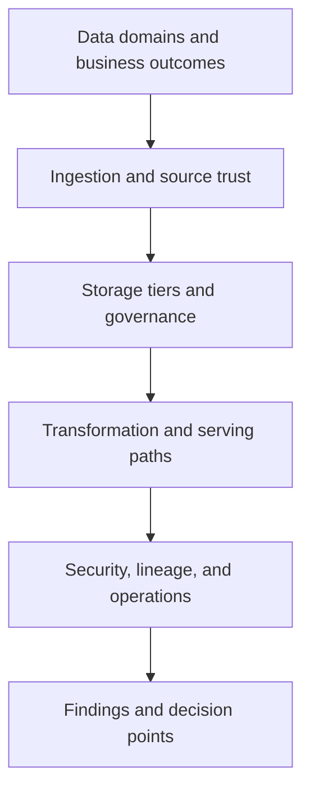

---
content_sources:
  documents:
    - type: self-generated
      justification: "Review playbook synthesized from Azure data architecture and analytics service guidance for modern data platforms."
      based_on:
        - https://learn.microsoft.com/en-us/azure/architecture/guide/technology-choices/data-store-overview
        - https://learn.microsoft.com/en-us/azure/architecture/guide/technology-choices/data-store-decision-tree
        - https://learn.microsoft.com/en-us/azure/synapse-analytics/overview-what-is
        - https://learn.microsoft.com/en-us/azure/databricks/introduction/
        - https://learn.microsoft.com/en-us/azure/storage/blobs/data-lake-storage-introduction
  diagrams:
    - id: playbook-data-platform
      type: flowchart
      source: self-generated
      justification: "Summarizes review flow for Azure data platforms across ingestion, storage, transformation, and consumption."
      based_on:
        - https://learn.microsoft.com/en-us/azure/architecture/guide/technology-choices/data-store-overview
        - https://learn.microsoft.com/en-us/azure/storage/blobs/data-lake-storage-introduction
content_validation:
  status: pending_review
  last_reviewed: 2026-04-22
  reviewer: agent
  core_claims:
    - claim: Azure Architecture Center provides technology-choice guidance for selecting data stores.
      source: https://learn.microsoft.com/en-us/azure/architecture/guide/technology-choices/data-store-overview
      verified: false
    - claim: Data store decision trees are part of Azure architecture guidance.
      source: https://learn.microsoft.com/en-us/azure/architecture/guide/technology-choices/data-store-decision-tree
      verified: false
    - claim: Azure Data Lake Storage is an Azure capability for analytics-oriented data storage.
      source: https://learn.microsoft.com/en-us/azure/storage/blobs/data-lake-storage-introduction
      verified: false
---
# Data Platform Review Playbook

Use this playbook to review architectures centered on ingestion, storage, transformation, analytics, reporting, AI feature pipelines, or shared data products on Azure.

<!-- diagram-id: playbook-data-platform -->

## Decision Question

Does the data platform architecture provide trustworthy, governable, and operable data flows for ingestion, transformation, and consumption on Azure?

## Business Context

Data platforms exist to turn raw operational data into governed, reusable business value through analytics, reporting, machine learning, or shared data products. [Documented] Their success depends as much on data ownership, freshness expectations, and governance as on raw processing power. [Validated] Reviews should therefore begin with which decisions the data platform enables, who consumes the outputs, and what happens when data is late, wrong, duplicated, or inaccessible. [Observed]

## Scope and Non-Goals

In scope are ingestion paths, storage layers, transformation engines, serving patterns, access control, lineage, data quality, observability, and recovery posture. Out of scope are detailed BI report design, model feature engineering specifics, and deep SQL or Spark tuning unless they materially affect architecture risk. [Assumed] This playbook reviews the platform as an end-to-end data operating system, not just a warehouse or lake in isolation. [Inferred]

## Constraints

- Different datasets have different structure, latency, quality, and retention needs, so one store rarely fits all. [Documented]
- Data platforms often combine batch and streaming paths, which can blur ownership and freshness expectations. [Observed]
- Governance, privacy, and access control requirements may be stricter than for application data because reuse multiplies exposure. [Correlated]
- Shared platforms attract many consumers, making lineage and change management operationally significant. [Validated]

## Quality Attribute Priorities

1. Reliability
2. Security
3. Operability
4. Performance efficiency
5. Cost optimization

The reviewer should require explicit ranking of freshness, accuracy, and access control goals because data platforms commonly fail when these remain implicit. [Inferred]

## Candidate Options

1. **Lake-centric platform** using ADLS as the system of storage with separate processing and serving layers.
2. **Warehouse-centric platform** optimized for curated analytics and structured consumption.
3. **Hybrid lakehouse or multi-engine platform** combining ingestion, raw retention, transformation, and multiple serving modes.

The review should test whether the chosen pattern is driven by data product needs and team operating model rather than by tool popularity. [Validated]

## Recommended Option

Use an explicitly layered data platform as the review baseline: source ingestion, governed storage, transformation, and controlled serving, each with clear ownership and evidence expectations. [Inferred] Azure guidance on data-store choices and analytics services supports matching technology to workload characteristics rather than collapsing all requirements into one engine. [Documented]

## Architecture Hypothesis

If the platform separates raw ingestion from curated serving, enforces governance and lineage, and instruments pipeline health and data quality, then consumers can trust outputs without turning every data incident into a manual investigation. [Inferred] If storage, transformation, and access rules are ambiguous, then the platform will accumulate duplicate pipelines, conflicting truths, and uncontrolled exposure. [Correlated]

## Predicted Outcomes

- Reviews that inspect lineage and ownership usually reveal whether the platform is truly reusable or merely shared. [Observed]
- Platforms without defined data quality checks often discover issues only after executive or customer-facing reports are wrong. [Validated]
- Batch and streaming paths frequently have mismatched freshness claims that are not visible in architecture diagrams. [Correlated]
- Using multiple engines can be justified, but only when data domain and access patterns clearly require them. [Documented]

## Validation Plan

- Collect source-system inventory, ingestion patterns, storage-tier design, pipeline schedules, data quality rules, lineage documentation, and access-control model. [Validated]
- Ask data owners and consumers to explain acceptable data freshness, correction process, and what happens when a trusted dataset fails validation. [Observed]
- Verify how the platform handles schema evolution, late-arriving data, backfills, and privileged access to raw versus curated zones. [Documented]
- Request measurements for pipeline success rate, freshness lag, data quality failure rate, query latency, and recovery time after a failed load. [Measured]

## Falsification Criteria

- The team cannot identify owners for critical datasets, transformations, or data quality rules. [Observed]
- Access control and lineage are incomplete enough that the platform cannot explain who used which data and from where. [Validated]
- Storage and processing choices are presented as universal answers without reference to workload-specific data characteristics. [Documented]
- Freshness and reliability claims are unsupported by pipeline telemetry or operational evidence. [Measured]

## Evidence

- [Documented] Data domain map, store selection rationale, platform security model, retention policy, and lineage or catalog approach.
- [Observed] Past incidents involving failed ingestion, late data, access confusion, or incorrect downstream analytics.
- [Measured] Pipeline duration, ingestion lag, quality-check failure counts, serving latency, and cost concentration by platform layer.
- [Assumed] Source systems can continue to provide stable contracts or manageable change windows.
- [Unknown] Whether future data product growth will require stronger self-service governance capabilities.

## Trade-offs and Risks

Centralizing data can improve reuse while increasing blast radius for governance and quality failures. [Correlated] A lake-first approach supports flexibility, but can degrade into an unmanaged dump without ownership and serving discipline. [Observed] Warehouse-centric designs improve structure and query consistency, yet may struggle with unstructured or rapidly changing source patterns. [Documented] Reviewers should challenge any platform that optimizes one analytics team at the expense of broader data trust and operating clarity. [Inferred]

## Guardrails and Operating Model

- Define ownership for source onboarding, schema change approval, data quality thresholds, lineage maintenance, and privileged access. [Validated]
- Separate raw, curated, and serving access paths with least privilege and auditable controls. [Documented]
- Establish operational reviews for failed pipelines, late data, backfills, and consumer-facing incident communication. [Observed]
- Track platform cost by ingestion, storage, transformation, and serving layers so growth decisions are evidence-based. [Measured]

## Revisit Triggers

- Data product count or consumer diversity increases faster than governance maturity.
- Streaming and near-real-time use cases become dominant over batch assumptions.
- Regulatory requirements demand stronger lineage, retention, or data residency controls.
- Platform cost concentration shifts enough to justify service or storage pattern changes.

## Takeaway

Review a data platform as a chain of trust from source ingestion to consumer decision, not as a collection of analytics services. The best review outcome proves that ownership, quality, lineage, and operational recovery are as mature as the platform's compute and storage choices.

## Review Matrix

| Review area | Page-specific check |
|---|---|
| Scope | Confirm the guidance applies to Data Platform Review Playbook. |
| Source basis | Validate the recommendation against the Microsoft Learn sources in this page. |
| Evidence | Capture command output, portal state, metrics, logs, or screenshots before treating the result as proven. |

## See Also

- [Architecture Reviews](../index.md)
- [Playbooks](index.md)
- [Data Selection Cheatsheet](../../reference/data-selection-cheatsheet.md)

## Microsoft Learn references

- https://learn.microsoft.com/en-us/azure/architecture/guide/technology-choices/data-store-overview
- https://learn.microsoft.com/en-us/azure/architecture/guide/technology-choices/data-store-decision-tree
- https://learn.microsoft.com/en-us/azure/storage/blobs/data-lake-storage-introduction
- https://learn.microsoft.com/en-us/azure/synapse-analytics/overview-what-is
- https://learn.microsoft.com/en-us/azure/databricks/introduction/

## Sources

- [Microsoft Learn source 1](https://learn.microsoft.com/en-us/azure/architecture/guide/technology-choices/data-store-overview)
- [Microsoft Learn source 2](https://learn.microsoft.com/en-us/azure/architecture/guide/technology-choices/data-store-decision-tree)
- [Microsoft Learn source 3](https://learn.microsoft.com/en-us/azure/synapse-analytics/overview-what-is)
- [Microsoft Learn source 4](https://learn.microsoft.com/en-us/azure/databricks/introduction/)
- [Microsoft Learn source 5](https://learn.microsoft.com/en-us/azure/storage/blobs/data-lake-storage-introduction)
