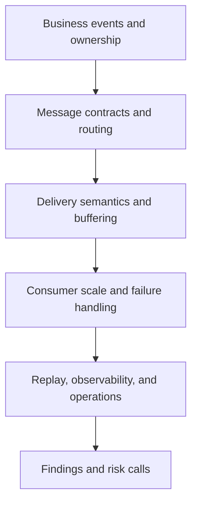

---
content_sources:
  documents:
    - type: self-generated
      justification: "Review playbook synthesized from Azure event-driven architecture, messaging service, and serverless scale guidance."
      based_on:
        - https://learn.microsoft.com/en-us/azure/architecture/guide/architecture-styles/event-driven
        - https://learn.microsoft.com/en-us/azure/event-grid/compare-messaging-services
        - https://learn.microsoft.com/en-us/azure/service-bus-messaging/service-bus-messaging-overview
        - https://learn.microsoft.com/en-us/azure/azure-functions/functions-scale
  diagrams:
    - id: playbook-event-driven
      type: flowchart
      source: self-generated
      justification: "Summarizes review flow for event-driven architectures on Azure."
      based_on:
        - https://learn.microsoft.com/en-us/azure/architecture/guide/architecture-styles/event-driven
        - https://learn.microsoft.com/en-us/azure/event-grid/compare-messaging-services
content_validation:
  status: pending_review
  last_reviewed: 2026-04-22
  reviewer: agent
  core_claims:
    - claim: Azure guidance distinguishes event-driven architectures from synchronous styles.
      source: https://learn.microsoft.com/en-us/azure/architecture/guide/architecture-styles/event-driven
      verified: false
    - claim: Azure messaging services have different trade-offs and selection criteria.
      source: https://learn.microsoft.com/en-us/azure/event-grid/compare-messaging-services
      verified: false
    - claim: Azure Functions scale behavior is relevant to event-driven processing design.
      source: https://learn.microsoft.com/en-us/azure/azure-functions/functions-scale
      verified: false
---
# Event-Driven Review Playbook

Use this playbook to review architectures where asynchronous messaging, event publication, background processing, and replay semantics are central to the business workflow.

<!-- diagram-id: playbook-event-driven -->

## Decision Question

Does the event-driven architecture provide the right delivery guarantees, failure isolation, and operating controls for asynchronous business workflows on Azure?

## Business Context

Event-driven systems are usually adopted to decouple change, absorb spikes, and connect independently evolving producers and consumers. [Documented] Their business value often depends on acceptable delay, eventual completion, and the ability to continue processing even when downstream systems are impaired. [Validated] The review must therefore test not only transport selection but also whether stakeholders actually understand business ownership of events, replay, and compensation. [Observed]

## Scope and Non-Goals

In scope are event ownership, message contracts, service selection, buffering, retries, dead-lettering, replay, consumer scaling, observability, and business-operational support. Out of scope are low-level code tuning of handlers, exhaustive schema governance implementation details, and UI workflow design unless they alter delivery expectations. [Assumed] The playbook examines event-driven architecture as an operating model, not just as a queue insertion exercise. [Inferred]

## Constraints

- Different Azure messaging services optimize for different routing and delivery patterns, so service selection matters. [Documented]
- Producers and consumers are often owned by different teams with different release cadences. [Observed]
- Business stakeholders may expect immediate completion even when the design intentionally buffers work. [Correlated]
- Replay and dead-letter handling create operational duties that many teams underestimate. [Observed]

## Quality Attribute Priorities

1. Reliability
2. Operability
3. Security
4. Performance efficiency
5. Cost optimization

Event-driven reviews should explicitly clarify whether the business values throughput smoothing, loose coupling, or auditable completion most, because those priorities shape every downstream trade-off. [Validated]

## Candidate Options

1. **Event notification pattern** using lightweight pub-sub and reactive consumers.
2. **Brokered workflow pattern** using durable queues or topics with retries, dead-lettering, and ordered handling where required.
3. **Hybrid event plus command pattern** combining domain events with explicit workflow commands and compensating logic.

The reviewer should judge whether the current mix matches business semantics rather than allowing one messaging technology to dictate all interactions. [Inferred]

## Recommended Option

Use explicit event ownership and delivery semantics as the review baseline, then evaluate whether Azure messaging services are mapped to those semantics correctly. [Validated] Microsoft guidance on event-driven style and messaging comparison supports choosing services based on fan-out, durability, ordering, and operational needs rather than habit. [Documented]

## Architecture Hypothesis

If producers publish well-bounded events, consumers scale independently, and the system has deliberate retry, replay, and dead-letter procedures, then the architecture can deliver resilient asynchronous workflows with lower coupling than synchronous dependency chains. [Inferred] If events are poorly owned or operational recovery is undefined, the same architecture will turn normal backlog, duplication, and delay into incidents. [Correlated]

## Predicted Outcomes

- Reviews that inspect dead-letter and replay processes reveal whether the team can operate the architecture after the first real failure. [Observed]
- Systems that do not define idempotency and duplicate handling generally cannot defend their reliability claims. [Validated]
- Messaging service selection often exposes mismatches between business semantics and platform behavior, such as assuming notifications behave like durable work queues. [Documented]
- Consumer autoscale without dependency protection can simply move failure pressure downstream faster. [Correlated]

## Validation Plan

- Collect event catalogs, message schemas, routing topology, retry policies, dead-letter procedures, and backlog dashboards. [Validated]
- Ask product and operations stakeholders to explain what happens when a consumer is down for one hour, one day, and after a replay request. [Observed]
- Verify which messages require ordering, deduplication, exactly-once-like behavior, or compensation and where those guarantees actually live. [Documented]
- Request measurements for backlog growth, processing latency, poison-message rate, and recovery time after downstream outages. [Measured]

## Falsification Criteria

- No one can name the business owner for a critical event type or message contract. [Observed]
- Consumers cannot safely replay events or handle duplicates without manual data cleanup. [Validated]
- The architecture assumes all messages are equally durable, ordered, or immediate even when the chosen Azure services do not provide that behavior. [Documented]
- Backlog health is invisible until users report stale or missing business outcomes. [Correlated]

## Evidence

- [Documented] Messaging service choice rationale, schema ownership, retry policy, dead-letter policy, and security model.
- [Observed] Examples of delayed consumers, replay events, poison messages, and operator runbooks used in prior incidents.
- [Measured] Queue depth, consumer lag, throughput, handler success rate, and replay duration for representative workloads.
- [Assumed] Business users accept eventual completion windows that are consistent with current SLAs.
- [Unknown] Whether downstream legacy systems can tolerate replay frequency at incident scale.

## Trade-offs and Risks

Loose coupling is valuable, but it moves complexity into contracts, operations, and delayed failure handling. [Correlated] Durable brokers improve resilience but also create backlog management, replay cost, and data retention questions. [Observed] Event-driven designs can be overused when the business actually needs synchronous confirmation or tight transactional boundaries. [Validated] Reviewers should flag any architecture that calls itself event-driven while still depending on brittle synchronous chains for business completion. [Inferred]

## Guardrails and Operating Model

- Assign ownership for schemas, routing configuration, replay authorization, and dead-letter triage. [Validated]
- Require idempotency guidance, dependency protection, and alerting on backlog and poison-message conditions. [Documented]
- Record business recovery procedures, not only technical retry logic, for lost, duplicated, or delayed outcomes. [Observed]
- Review security around publish and subscribe rights so event distribution does not become implicit trust sprawl. [Correlated]

## Revisit Triggers

- The business no longer tolerates eventual completion for critical workflows.
- Replay operations become frequent enough to indicate systemic design problems.
- New regulatory or audit requirements demand stronger traceability and event retention guarantees.
- The platform evolves into a broader microservices estate with cross-domain service governance concerns.

## Takeaway

Review event-driven architectures by forcing clarity on ownership, semantics, and operational recovery rather than focusing only on queue or topic configuration. A strong event-driven review proves the team can explain delayed processing, duplicate handling, and replay outcomes in business terms as well as technical terms.

## Review Matrix

| Review area | Page-specific check |
|---|---|
| Scope | Confirm the guidance applies to Event-Driven Review Playbook. |
| Source basis | Validate the recommendation against the Microsoft Learn sources in this page. |
| Evidence | Capture command output, portal state, metrics, logs, or screenshots before treating the result as proven. |

## See Also

- [Architecture Reviews](../index.md)
- [Playbooks](index.md)
- [Event-Driven Integration workload guide](../../workload-guides/event-driven-integration/index.md)

## Microsoft Learn references

- https://learn.microsoft.com/en-us/azure/architecture/guide/architecture-styles/event-driven
- https://learn.microsoft.com/en-us/azure/event-grid/compare-messaging-services
- https://learn.microsoft.com/en-us/azure/service-bus-messaging/service-bus-messaging-overview
- https://learn.microsoft.com/en-us/azure/azure-functions/functions-scale

## Sources

- [Microsoft Learn source 1](https://learn.microsoft.com/en-us/azure/architecture/guide/architecture-styles/event-driven)
- [Microsoft Learn source 2](https://learn.microsoft.com/en-us/azure/event-grid/compare-messaging-services)
- [Microsoft Learn source 3](https://learn.microsoft.com/en-us/azure/service-bus-messaging/service-bus-messaging-overview)
- [Microsoft Learn source 4](https://learn.microsoft.com/en-us/azure/azure-functions/functions-scale)
