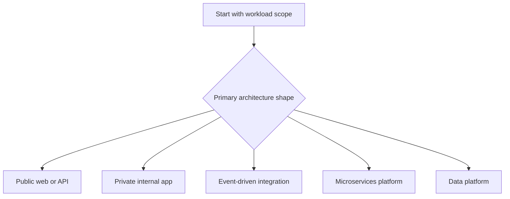

---
content_sources:
  documents:
    - type: self-generated
      justification: "Navigation hub for architecture review playbooks synthesized from Azure Architecture Center and Azure Well-Architected review guidance."
      based_on:
        - https://learn.microsoft.com/en-us/azure/well-architected/
        - https://learn.microsoft.com/en-us/azure/architecture/framework/
        - https://learn.microsoft.com/en-us/assessments/azure-architecture-review/
  diagrams:
    - id: playbook-selection-flow
      type: flowchart
      source: self-generated
      justification: "Summarizes how reviewers choose a workload-specific playbook after scoping an Azure architecture review."
      based_on:
        - https://learn.microsoft.com/en-us/azure/well-architected/
        - https://learn.microsoft.com/en-us/azure/architecture/framework/
content_validation:
  status: pending_review
  last_reviewed: '2026-04-22'
  reviewer: agent
  core_claims:
    - claim: Document covers Architecture Review Playbooks aligned with Azure architecture guidance
      source: https://learn.microsoft.com/en-us/azure/well-architected/
      verified: false
    - claim: Document includes Microsoft Learn-traceable guidance for Architecture Review Playbooks
      source: https://learn.microsoft.com/en-us/azure/architecture/framework/
      verified: false
    - claim: Azure Well-Architected Review is an established assessment entry point for Azure architecture reviews
      source: https://learn.microsoft.com/en-us/assessments/azure-architecture-review/
      verified: false
---
# Architecture Review Playbooks

Use these playbooks to move from a generic Azure Well-Architected review to workload-specific evidence gathering, stakeholder interviews, and architecture challenge questions. [Documented] Each playbook assumes the reviewer already understands workload scope, business drivers, and priority quality attributes. [Inferred]

<!-- diagram-id: playbook-selection-flow -->

## Playbook catalog

| Playbook | Use when | Primary review focus |
|---|---|---|
| [Public Web and API Review](public-web-api-review.md) | The workload serves internet or partner traffic over HTTP or HTTPS | Edge security, public ingress resilience, state handling, and API dependency risk |
| [Private Internal App Review](private-internal-app-review.md) | The workload is intended for workforce, managed devices, or private network access | Private connectivity, DNS, identity boundaries, and enterprise dependency operability |
| [Event-Driven Review](event-driven-review.md) | Business workflows depend on asynchronous messaging or event distribution | Delivery semantics, replayability, backlog handling, and schema ownership |
| [Microservices Review](microservices-review.md) | Multiple teams own independently deployable services on a shared platform | Service boundaries, platform controls, contract governance, and operational maturity |
| [Data Platform Review](data-platform-review.md) | The architecture centers on ingestion, transformation, analytics, ML, or shared data products | Data lineage, governance, processing reliability, and access control over data estates |

## How to use the playbooks

1. Confirm the dominant workload shape and operating model before choosing a playbook. [Validated]
2. Use the selected playbook to collect evidence, interview the right stakeholders, and challenge the current design with workload-specific falsification questions. [Inferred]
3. Record findings with evidence tags so recommendations distinguish documentation gaps from measured risk. [Documented]
4. If the workload blends patterns, start with the dominant playbook and explicitly note adjacent review threads rather than mixing all concerns into one checklist. [Correlated]

## See Also

- [Architecture Reviews](../index.md)
- [Design Labs](../../design-labs/index.md)
- [Architecture Decision Matrix](../../reference/architecture-decision-matrix.md)

## Microsoft Learn references

- https://learn.microsoft.com/en-us/azure/well-architected/
- https://learn.microsoft.com/en-us/azure/architecture/framework/
- https://learn.microsoft.com/en-us/assessments/azure-architecture-review/
