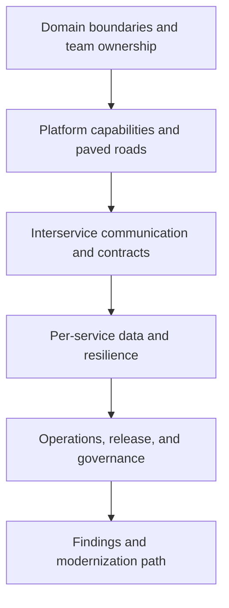

---
content_sources:
  documents:
    - type: self-generated
      justification: "Review playbook synthesized from Azure microservices guidance, AKS platform guidance, and Azure Well-Architected review practices."
      based_on:
        - https://learn.microsoft.com/en-us/azure/architecture/microservices/
        - https://learn.microsoft.com/en-us/azure/architecture/microservices/design/interservice-communication
        - https://learn.microsoft.com/en-us/azure/architecture/microservices/design/data-considerations
        - https://learn.microsoft.com/en-us/azure/aks/what-is-aks
  diagrams:
    - id: playbook-microservices
      type: flowchart
      source: self-generated
      justification: "Summarizes review flow for microservices platforms on Azure."
      based_on:
        - https://learn.microsoft.com/en-us/azure/architecture/microservices/
        - https://learn.microsoft.com/en-us/azure/architecture/microservices/design/interservice-communication
content_validation:
  status: pending_review
  last_reviewed: 2026-04-22
  reviewer: agent
  core_claims:
    - claim: Azure Architecture Center provides dedicated guidance for microservices on Azure.
      source: https://learn.microsoft.com/en-us/azure/architecture/microservices/
      verified: false
    - claim: Interservice communication choices are central to microservices architecture design.
      source: https://learn.microsoft.com/en-us/azure/architecture/microservices/design/interservice-communication
      verified: false
    - claim: Data ownership and consistency trade-offs are key design topics in microservices.
      source: https://learn.microsoft.com/en-us/azure/architecture/microservices/design/data-considerations
      verified: false
---
# Microservices Review Playbook

Use this playbook to review platforms where multiple teams own independently deployable services and the architecture outcome depends on service boundaries, platform guardrails, and operational discipline at scale.

<!-- diagram-id: playbook-microservices -->

## Decision Question

Does the microservices platform justify its complexity through credible service boundaries, independent operations, and strong platform governance on Azure?

## Business Context

Microservices reviews usually occur when an organization is scaling product teams, dealing with domain complexity, or trying to increase deployment independence. [Documented] The business case should be explicit: faster team autonomy, bounded blast radius, or differentiated scaling, not generic enthusiasm for containers. [Validated] Reviewers should test whether the organization has actually changed its delivery and support model, because platform complexity without ownership maturity rarely pays off. [Observed]

## Scope and Non-Goals

In scope are domain decomposition, platform capabilities, runtime standardization, service communication, data ownership, release controls, observability, and operational governance. Out of scope are repository structure debates, one-off implementation bugs, and tool-by-tool procurement choices unless they materially affect architecture risk. [Assumed] This playbook is intended for reviewing microservices as a socio-technical system, not only as a cluster deployment. [Inferred]

## Constraints

- Service count, team count, and dependency count increase faster than in single-application architectures. [Observed]
- Shared infrastructure still requires central guardrails for identity, policy, secrets, and networking. [Documented]
- Data consistency and interservice communication trade-offs are unavoidable when domains split. [Documented]
- Platform teams may become delivery bottlenecks if paved roads are incomplete or over-governed. [Correlated]

## Quality Attribute Priorities

1. Operability
2. Reliability
3. Security
4. Agility
5. Performance efficiency
6. Cost optimization

Microservices reviews should ask whether the organization values independent change enough to fund the platform capabilities required to keep that change safe. [Validated]

## Candidate Options

1. **Focused microservices platform** with a limited number of domains, strong guardrails, and clear team ownership.
2. **Distributed monolith in disguise** where services exist but still share releases, schemas, or operational responsibilities.
3. **Simpler workload baseline** such as modular monolith, internal app, or public web baseline for domains that do not need service autonomy.

The review should allow the possibility that some parts of the estate should leave the microservices platform rather than forcing all workloads deeper into it. [Inferred]

## Recommended Option

Use microservices only where domain and team boundaries are credible, and review the platform against that standard. [Validated] Azure guidance on microservices emphasizes communication, data ownership, and design discipline, so the reviewer should treat service autonomy plus platform governance as the minimum bar for acceptance. [Documented]

## Architecture Hypothesis

If services align to bounded contexts, teams can build and operate them independently, and the platform provides consistent identity, networking, telemetry, and release controls, then the microservices architecture can outperform a single-app model in change velocity and fault isolation. [Inferred] If service decomposition is cosmetic or platform controls are immature, the architecture will create more coordination overhead than business value. [Correlated]

## Predicted Outcomes

- Reviews that map service ownership to actual on-call and release practice reveal whether microservices independence is real. [Observed]
- Shared databases, synchronized releases, or undocumented API contracts usually indicate a distributed monolith risk. [Validated]
- Platform teams with clear paved roads reduce security and operations drift across services. [Documented]
- Service meshes, gateways, and cluster features can add complexity faster than they reduce it if the operational model is weak. [Correlated]

## Validation Plan

- Gather domain maps, service catalogs, ownership rosters, API standards, deployment pipelines, observability standards, and incident reviews. [Validated]
- Ask at least two product teams and the platform team to explain how a service is built, released, rolled back, observed, and supported independently. [Observed]
- Verify whether each service owns its data, whether shared schemas remain, and how breaking API changes are prevented or coordinated. [Documented]
- Request measurements for deployment frequency, lead time, mean time to recovery, dependency failure impact, and cross-team coordination overhead. [Measured]

## Falsification Criteria

- Teams cannot release or recover services independently in practice. [Validated]
- Shared databases or tightly coupled contracts force synchronized change across multiple services. [Documented]
- The platform lacks standard telemetry, secret handling, or policy controls, leaving each team to reinvent critical controls. [Observed]
- Platform complexity is justified only by technology preference rather than by business domain or ownership needs. [Correlated]

## Evidence

- [Documented] Service boundary definitions, communication patterns, data ownership rules, and platform guardrails.
- [Observed] Real examples of isolated service release, rollback, incident containment, and cross-team dependency failures.
- [Measured] Service-level deployment cadence, recovery metrics, change failure rate, and dependency latency between services.
- [Assumed] Product teams have enough maturity to own services end to end if platform constraints are reasonable.
- [Unknown] Whether the current service granularity will remain stable as domains and teams evolve.

## Trade-offs and Risks

Microservices can improve local autonomy while making system-wide diagnosis harder. [Observed] Per-service data ownership reduces some coupling but introduces consistency and reporting challenges. [Documented] Platform centralization improves safety, yet excessive gatekeeping can erase the agility microservices were meant to create. [Correlated] Reviewers should also question whether one shared cluster or network model creates hidden blast radius that contradicts the platform narrative. [Inferred]

## Guardrails and Operating Model

- Require a service catalog with owning team, runtime, dependencies, data stores, SLOs, and escalation paths. [Validated]
- Standardize identity, secret management, policy enforcement, and telemetry collection across services. [Documented]
- Maintain paved roads for secure deployment, rollback, traffic control, and incident response so teams are not inventing safety controls individually. [Observed]
- Review communication patterns regularly to prevent accidental chatty APIs or event sprawl from overwhelming the platform. [Correlated]

## Revisit Triggers

- The majority of services still change together.
- Platform operational cost or cognitive load outgrows the business value of decomposition.
- A domain consolidates under one team and no longer needs distributed autonomy.
- Data consistency or reporting requirements require different architectural patterns for part of the estate.

## Takeaway

Review microservices platforms by asking whether the organization has earned the right to keep the complexity it operates. The best review outcome is a clear answer on service ownership, platform guardrails, and where decomposition creates real value versus distributed overhead.

## Review Matrix

| Review area | Page-specific check |
|---|---|
| Scope | Confirm the guidance applies to Microservices Review Playbook. |
| Source basis | Validate the recommendation against the Microsoft Learn sources in this page. |
| Evidence | Capture command output, portal state, metrics, logs, or screenshots before treating the result as proven. |

## See Also

- [Architecture Reviews](../index.md)
- [Playbooks](index.md)
- [Microservices Platform workload guide](../../workload-guides/microservices-platform/index.md)

## Microsoft Learn references

- https://learn.microsoft.com/en-us/azure/architecture/microservices/
- https://learn.microsoft.com/en-us/azure/architecture/microservices/design/interservice-communication
- https://learn.microsoft.com/en-us/azure/architecture/microservices/design/data-considerations
- https://learn.microsoft.com/en-us/azure/aks/what-is-aks

## Sources

- [Microsoft Learn source 1](https://learn.microsoft.com/en-us/azure/architecture/microservices/)
- [Microsoft Learn source 2](https://learn.microsoft.com/en-us/azure/architecture/microservices/design/interservice-communication)
- [Microsoft Learn source 3](https://learn.microsoft.com/en-us/azure/architecture/microservices/design/data-considerations)
- [Microsoft Learn source 4](https://learn.microsoft.com/en-us/azure/aks/what-is-aks)
