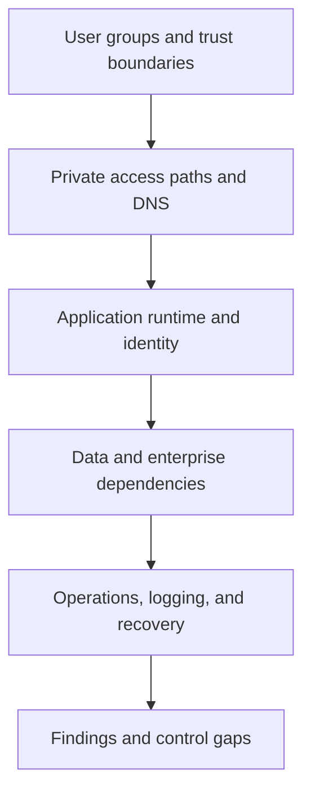

---
content_sources:
  documents:
    - type: self-generated
      justification: "Review playbook synthesized from Azure private connectivity, App Service private access, and Azure Monitor guidance for internal applications."
      based_on:
        - https://learn.microsoft.com/en-us/azure/private-link/private-endpoint-overview
        - https://learn.microsoft.com/en-us/azure/app-service/overview-vnet-integration
        - https://learn.microsoft.com/en-us/azure/azure-monitor/overview
        - https://learn.microsoft.com/en-us/azure/well-architected/
  diagrams:
    - id: playbook-private-internal-app
      type: flowchart
      source: self-generated
      justification: "Summarizes review flow for private internal applications on Azure."
      based_on:
        - https://learn.microsoft.com/en-us/azure/private-link/private-endpoint-overview
        - https://learn.microsoft.com/en-us/azure/app-service/overview-vnet-integration
content_validation:
  status: pending_review
  last_reviewed: 2026-04-22
  reviewer: agent
  core_claims:
    - claim: Private Endpoint is an Azure mechanism for private access to platform services.
      source: https://learn.microsoft.com/en-us/azure/private-link/private-endpoint-overview
      verified: false
    - claim: App Service virtual network integration applies to outbound connectivity from the app.
      source: https://learn.microsoft.com/en-us/azure/app-service/overview-vnet-integration
      verified: false
    - claim: Azure Monitor provides a platform for collecting and analyzing telemetry from Azure resources and applications.
      source: https://learn.microsoft.com/en-us/azure/azure-monitor/overview
      verified: false
---
# Private Internal App Review Playbook

Use this playbook to review employee-facing, operations-facing, or partner-controlled applications whose primary value depends on private connectivity, enterprise identity, and controlled access to internal dependencies.

<!-- diagram-id: playbook-private-internal-app -->

## Decision Question

Does the internal application architecture achieve private reachability, strong identity controls, and dependable enterprise operations without creating brittle network or DNS dependencies?

## Business Context

Internal applications support workforce productivity, regulated business processes, or operational workflows where confidentiality and controlled access matter more than public growth. [Documented] These systems often depend on corporate connectivity, private name resolution, managed devices, and line-of-business integrations that are less visible than internet traffic but just as business-critical. [Observed] Reviews should therefore start with who must reach the system, from where, under what trust assumptions, and during which business hours or operational windows. [Validated]

## Scope and Non-Goals

In scope are inbound and outbound private access patterns, enterprise identity, DNS dependencies, runtime placement, internal data access, monitoring, and support operating model. Out of scope are low-level network packet analysis, endpoint device configuration, and security certification activities not directly tied to architecture decisions. [Assumed] The playbook is intended to test private application design credibility, not to replace a full network architecture review. [Inferred]

## Constraints

- Reachability may depend on VPN, ExpressRoute, hub-spoke routing, or zero-trust remote access paths. [Observed]
- Private DNS ownership is often split across infrastructure and application teams, which can hide failure modes. [Correlated]
- Workforce identity and conditional access policies can affect application availability as much as the runtime itself. [Documented]
- Internal applications commonly inherit legacy integrations that are hard to mock, isolate, or scale independently. [Observed]

## Quality Attribute Priorities

1. Security
2. Reliability
3. Operability
4. Performance efficiency
5. Cost optimization

The review should force a choice between private exposure reduction and operational simplicity when those goals conflict. [Inferred]

## Candidate Options

1. **Private PaaS application baseline** using private endpoints, managed runtime, private DNS, and managed identity.
2. **Hybrid-dependent application pattern** where Azure components rely heavily on on-premises identity, data, or middleware.
3. **Network-isolated application platform** with stricter segmentation and dedicated per-domain access boundaries.

The reviewer should evaluate not just connectivity diagrams but also what fails when DNS, hybrid routing, or central identity services become degraded. [Validated]

## Recommended Option

Use a private-first managed baseline as the default review benchmark, then justify any broader exposure or bespoke routing with explicit business need. [Inferred] Azure guidance makes clear that private endpoints, managed identities, and observable platform services form the safer starting point for internal workloads than custom credential and network exceptions. [Documented]

## Architecture Hypothesis

If the application exposes private ingress through approved connectivity paths, uses enterprise identity correctly, and limits secret sprawl through managed identity and private service access, then internal users can reach the workload with lower data exposure and clearer operational controls. [Inferred] If private access instead depends on undocumented DNS zones, ad hoc firewall changes, or opaque hybrid dependencies, the architecture will accumulate silent fragility. [Correlated]

## Predicted Outcomes

- Reviews that include DNS and connectivity owners reveal failure modes that application-only reviews miss. [Observed]
- Applications that confuse App Service private ingress with outbound VNet integration usually have incomplete access assumptions. [Documented]
- Workforce identity outages or conditional access misconfiguration may dominate perceived availability for internal applications. [Correlated]
- Well-instrumented private apps reduce triage time because teams can distinguish network reachability issues from application failures. [Validated]

## Validation Plan

- Collect network topology diagrams, private DNS ownership records, identity flow diagrams, support runbooks, and dependency inventories. [Validated]
- Ask stakeholders to demonstrate how a user reaches the app from a managed device, remote access path, and privileged operator path. [Observed]
- Verify that private endpoints, outbound integration, DNS resolution, certificate handling, and dependency authentication are documented and testable. [Documented]
- Request incident examples involving VPN, DNS, or identity disruptions and examine whether observability isolated the root cause quickly. [Measured]

## Falsification Criteria

- The team cannot explain how private DNS is managed, tested, and recovered during incidents. [Validated]
- The architecture assumes VNet integration alone makes an App Service privately reachable. [Documented]
- Operators lack telemetry to distinguish corporate network issues from runtime or dependency failures. [Observed]
- Security posture depends on private access claims while public endpoints remain enabled without clear governance. [Correlated]

## Evidence

- [Documented] Private endpoint configuration, private DNS zones, hybrid connectivity model, and identity architecture.
- [Observed] Real incident examples involving failed name resolution, expired certificates, blocked routes, or conditional access changes.
- [Measured] User login latency, dependency response times across hybrid links, and time to isolate DNS versus application failure.
- [Assumed] Enterprise connectivity remains sufficiently available during business-critical periods unless evidence shows otherwise.
- [Unknown] The degree to which legacy dependencies can tolerate modernization or segmentation changes.

## Trade-offs and Risks

Private-only exposure reduces attack surface but often increases operational coupling to DNS and enterprise networking. [Correlated] Centralized identity policies can improve security while creating organization-wide blast radius for configuration errors. [Observed] Hybrid dependencies may be tolerated for business reasons, but they should be reviewed as reliability constraints rather than invisible implementation details. [Validated] Reviewers should also look for accidental complexity where a simple internal app inherited an over-engineered network pattern with too many approval boundaries. [Inferred]

## Guardrails and Operating Model

- Assign clear ownership for private DNS, network routes, identity policy changes, and application runtime operations. [Validated]
- Require managed identity, diagnostic settings, and least-privilege access to internal data services. [Documented]
- Ensure support teams have runbooks for certificate rotation, DNS faults, remote-access impairment, and dependency failover. [Observed]
- Track user experience from inside trusted paths so the team can prove that private access works in practice, not just in diagrams. [Measured]

## Revisit Triggers

- The application begins serving external users or unmanaged devices.
- Hybrid dependencies dominate incident volume or change lead time.
- Internal access rules fragment across business units and no longer align to one trust model.
- The application becomes a multi-team platform that needs microservices-style review rather than a single-app review.

## Takeaway

Review private internal applications by testing the full path from user trust boundary to private dependency, with special attention to DNS, identity, and hybrid connectivity as first-class architecture components. The strongest review finding is often not about a single Azure service choice; it is about whether the operating model can keep private access dependable under real enterprise conditions.

## Review Matrix

| Review area | Page-specific check |
|---|---|
| Scope | Confirm the guidance applies to Private Internal App Review Playbook. |
| Source basis | Validate the recommendation against the Microsoft Learn sources in this page. |
| Evidence | Capture command output, portal state, metrics, logs, or screenshots before treating the result as proven. |

## See Also

- [Architecture Reviews](../index.md)
- [Playbooks](index.md)
- [Private Internal App workload guide](../../workload-guides/private-internal-app/index.md)

## Microsoft Learn references

- https://learn.microsoft.com/en-us/azure/private-link/private-endpoint-overview
- https://learn.microsoft.com/en-us/azure/app-service/overview-vnet-integration
- https://learn.microsoft.com/en-us/azure/azure-monitor/overview
- https://learn.microsoft.com/en-us/azure/well-architected/

## Sources

- [Microsoft Learn source 1](https://learn.microsoft.com/en-us/azure/private-link/private-endpoint-overview)
- [Microsoft Learn source 2](https://learn.microsoft.com/en-us/azure/app-service/overview-vnet-integration)
- [Microsoft Learn source 3](https://learn.microsoft.com/en-us/azure/azure-monitor/overview)
- [Microsoft Learn source 4](https://learn.microsoft.com/en-us/azure/well-architected/)
