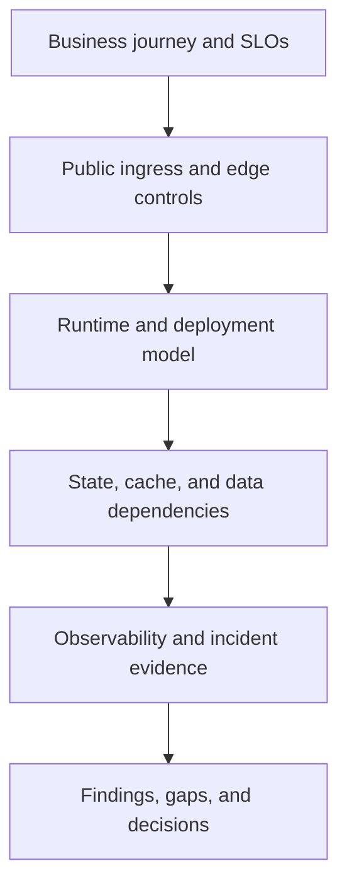

---
content_sources:
  documents:
    - type: self-generated
      justification: "Review playbook synthesized from Azure public web workload guidance, Azure Front Door guidance, and Azure Well-Architected review practices."
      based_on:
        - https://learn.microsoft.com/en-us/azure/architecture/web-apps/app-service/architectures/baseline-zone-redundant
        - https://learn.microsoft.com/en-us/azure/frontdoor/front-door-overview
        - https://learn.microsoft.com/en-us/azure/well-architected/
        - https://learn.microsoft.com/en-us/azure/reliability/reliability-app-service
  diagrams:
    - id: playbook-public-web-api
      type: flowchart
      source: self-generated
      justification: "Summarizes the review flow for internet-facing web and API workloads on Azure."
      based_on:
        - https://learn.microsoft.com/en-us/azure/architecture/web-apps/app-service/architectures/baseline-zone-redundant
        - https://learn.microsoft.com/en-us/azure/frontdoor/front-door-overview
content_validation:
  status: pending_review
  last_reviewed: 2026-04-22
  reviewer: agent
  core_claims:
    - claim: Azure Front Door is a primary edge entry option for public Azure web workloads.
      source: https://learn.microsoft.com/en-us/azure/frontdoor/front-door-overview
      verified: false
    - claim: Zone-redundant App Service is a recommended baseline pattern for highly available Azure web applications.
      source: https://learn.microsoft.com/en-us/azure/architecture/web-apps/app-service/architectures/baseline-zone-redundant
      verified: false
    - claim: Reliability review of App Service workloads should consider resiliency, health, and failure handling.
      source: https://learn.microsoft.com/en-us/azure/reliability/reliability-app-service
      verified: false
---
# Public Web and API Review Playbook

Use this playbook to review internet-facing web applications, mobile back ends, and partner APIs where public ingress, edge protection, and dependency resilience shape the architecture outcome.

<!-- diagram-id: playbook-public-web-api -->

## Decision Question

Is the public web or API architecture secure, resilient, and operationally supportable for internet-facing demand while staying aligned with business-critical user journeys?

## Business Context

These reviews typically involve revenue-impacting customer paths, externally visible uptime expectations, and release frequency that is higher than classic enterprise systems. [Observed] Public workloads usually face stronger pressure on edge protection, latency, availability, and abuse management than private applications. [Documented] The review should identify which journeys actually matter to the business, such as sign-in, checkout, onboarding, or partner API submission, before technical scoring begins. [Validated]

## Scope and Non-Goals

In scope are edge entry, WAF and TLS posture, runtime selection, session and cache behavior, core data dependencies, observability, deployment safety, and regional resilience. Out of scope are deep code-level application security testing, detailed API schema design, and product feature prioritization unless they materially change architecture risk. [Assumed] The playbook is for review methodology, not for prescribing one mandatory service stack. [Inferred]

## Constraints

- Public ingress is unavoidable, so layered controls must exist before traffic reaches the application runtime. [Documented]
- Launch dates and campaign spikes often create bursty load patterns that are imperfectly forecasted. [Observed]
- Identity may combine anonymous, customer, and partner access models in one workload, which complicates cache and token design. [Correlated]
- Teams often prefer managed services to reduce patching and undifferentiated operational work. [Observed]

## Quality Attribute Priorities

1. Security
2. Reliability
3. Performance efficiency
4. Operability
5. Cost optimization

During the review, require stakeholders to rank these explicitly; public workloads often claim all five are equal, which usually hides unresolved trade-offs. [Inferred]

## Candidate Options

1. **Managed PaaS web baseline**: Azure Front Door, App Service or Container Apps, managed data stores, and Azure Monitor.
2. **Regional edge plus private app perimeter**: Front Door with deeper regional controls such as Application Gateway or private origin patterns.
3. **Container platform-centric web stack**: AKS-based runtime with ingress, per-service release control, and custom networking.

The review is not choosing technology in isolation; it is testing whether the current architecture matches scale profile, security posture, and team maturity. [Validated]

## Recommended Option

Start the review from a managed public web baseline and require explicit evidence before accepting more complex alternatives. [Inferred] In most Azure estates, the reviewer should treat Front Door, managed application hosting, managed identity, and native monitoring as the default reference point because Microsoft documents these as baseline building blocks for resilient web workloads. [Documented]

## Architecture Hypothesis

If the workload uses a well-protected edge, a managed runtime, explicit dependency health monitoring, and clearly bounded state management, then the architecture can meet public traffic expectations with lower operational risk than bespoke network or platform designs. [Inferred] Conversely, if public traffic reaches fragile shared dependencies or poorly understood regional single points of failure, then visible incidents will occur faster than the team can diagnose them. [Correlated]

## Predicted Outcomes

- Reviews that begin with user journey and dependency mapping will expose whether the uptime target is constrained by application code, identity provider dependence, or data tier fragility. [Validated]
- Teams with undocumented edge rules, rate limits, or cache behavior usually discover hidden coupling between security controls and release operations. [Observed]
- Public workloads that lack synthetic monitoring for critical paths generally overestimate real customer availability. [Correlated]
- A managed baseline often lowers routine operations burden, but may surface hard limits around custom networking or runtime control that must be justified. [Documented]

## Validation Plan

- Gather architecture diagrams, dependency maps, SLOs, incident history, WAF policies, and deployment runbooks before the review meeting. [Validated]
- Ask stakeholders to walk one successful customer journey and one failed dependency scenario end to end. [Observed]
- Verify whether edge protections, bot controls, TLS ownership, secrets handling, health probes, and failover behavior are documented and tested. [Documented]
- Request measured evidence for latency, autoscale thresholds, error budgets, and database saturation rather than relying on design intent. [Measured]

## Falsification Criteria

- The architecture cannot explain how core journeys degrade when identity, cache, or primary data dependencies fail. [Validated]
- Public origins remain directly reachable or insufficiently segmented from the internet without a justified exception. [Documented]
- Release and rollback safety depends on tribal knowledge instead of repeatable deployment controls and telemetry gates. [Observed]
- Claimed scale characteristics are not supported by load, chaos, or incident evidence. [Measured]

## Evidence

- [Documented] Front Door configuration, WAF policy, TLS ownership model, and origin security design.
- [Documented] Runtime topology, autoscale settings, secret management approach, and backup or restore configuration.
- [Observed] Incident timelines for latency spikes, 5xx bursts, dependency failures, and release regressions.
- [Measured] Request latency percentiles, error-rate trends, cache hit ratio, and database utilization under peak load.
- [Unknown] Business acceptance for degraded modes such as read-only operation, queueing, or temporary feature suppression.

## Trade-offs and Risks

Public workloads often underinvest in dependency isolation because application response times look healthy in normal conditions. [Correlated] Aggressive caching can improve performance while masking authorization, invalidation, or stale content risks. [Observed] Strong edge protection can increase delivery complexity if certificate ownership, routing rules, and incident response responsibilities are unclear. [Validated] The reviewer should call out any place where the architecture relies on a single region, shared database choke point, or synchronous downstream API without a conscious business decision. [Inferred]

## Guardrails and Operating Model

- Define clear ownership for edge routing, WAF changes, certificates, secrets, and origin runtime changes. [Validated]
- Require managed identity and secret isolation rather than application-embedded credentials wherever Azure services support it. [Documented]
- Enforce synthetic monitoring for critical public journeys and alerting that distinguishes edge failure from origin failure. [Correlated]
- Maintain rollout, rollback, incident communication, and dependency-throttling runbooks that operators can execute during live incidents. [Observed]

## Revisit Triggers

- The workload expands from one region to multi-region active-active or strict geo-residency requirements.
- Session, cache, or database contention becomes the main driver of incidents.
- The product introduces partner APIs or mobile traffic patterns that materially change abuse, throttling, or identity assumptions.
- The team starts adopting service-by-service autonomy, suggesting a microservices review is now more appropriate.

## Takeaway

Review public web and API architectures by tracing customer-critical journeys through edge, runtime, and dependency layers, then demanding evidence for failure handling, operational readiness, and measured performance. A good review outcome is not just a service choice; it is a credible explanation of how the workload behaves during bad traffic days, bad release days, and bad dependency days.

## See Also

- [Architecture Reviews](../index.md)
- [Playbooks](index.md)
- [Public Web and API workload guide](../../workload-guides/public-web-api/index.md)

## Microsoft Learn references

- https://learn.microsoft.com/en-us/azure/architecture/web-apps/app-service/architectures/baseline-zone-redundant
- https://learn.microsoft.com/en-us/azure/frontdoor/front-door-overview
- https://learn.microsoft.com/en-us/azure/reliability/reliability-app-service
- https://learn.microsoft.com/en-us/azure/well-architected/
- https://learn.microsoft.com/en-us/assessments/azure-architecture-review/
