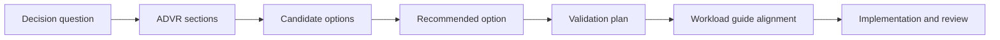

---
content_sources:
  diagrams:
    - id: design-labs-index-map
      type: flowchart
      source: self-generated
      justification: "Navigation map for the Design Labs section synthesized from Azure Architecture Center guidance and the repository structure."
      based_on:
        - https://learn.microsoft.com/en-us/azure/architecture/
        - https://learn.microsoft.com/en-us/azure/well-architected/
---
# Design Labs

Design Labs are guided architecture exercises that turn Azure guidance into explicit decisions, testable hypotheses, and review-ready evidence. Each lab is written as an Architecture Decision and Validation Record (ADVR) so teams can compare options, justify a recommendation, and define how the recommendation will be proven or disproven.

## What makes a good architecture lab

- Starts with a decision question, not a service wishlist. [Documented]
- States business drivers, scope, and non-goals before discussing Azure services. [Validated]
- Compares realistic candidate options and names trade-offs clearly. [Correlated]
- Includes a validation plan, falsification criteria, and operating guardrails. [Documented]
- Connects to the relevant workload guide so the lab can be reused as a blueprint seed. [Inferred]

## How to use labs with workload guides

Use a design lab first to frame the decision, then use the aligned workload guide to elaborate implementation detail, platform standards, and operating practices.

| Design lab | Best paired workload guide | When to use it | Phase 1 status |
|---|---|---|---|
| [Methodology](methodology.md) | Workload Guides overview | Establish team-wide decision discipline | Complete |
| [Lab 01: Public Web Baseline](lab-01-public-web-baseline.md) | Public Web and API | Internet-facing HTTP workloads with moderate scale | Complete |
| [Lab 02: Private Internal App](lab-02-private-internal-app.md) | Private Internal App | Corporate applications with private connectivity only | Complete |
| [Lab 03: Event-Driven Orders](lab-03-event-driven-orders.md) | Event-Driven Integration | Decoupled workflows with asynchronous processing | Complete |
| Lab 04: Serverless Processing | Serverless Processing | Backlog item for later phase | Planned |
| Lab 05: Microservices Platform | Microservices Platform | Backlog item for later phase | Planned |
| Lab 06: Multi-Region Resilience | Reliability and resilience content | Backlog item for later phase | Planned |
| Lab 07: Landing Zone Baseline | Landing Zone and Shared Services | Backlog item for later phase | Planned |
| Lab 08: AI RAG Enterprise Baseline | AI and RAG | Backlog item for later phase | Planned |

## Lab workflow

<!-- diagram-id: design-labs-index-map -->

## Evidence expectations

Use the evidence tags consistently:

- **Documented** for Microsoft Learn or approved standards.
- **Observed** for platform behavior seen in deployments or logs.
- **Measured** for latency, throughput, cost, or recovery numbers.
- **Validated** for drills, tests, or proof-of-concept results.
- **Correlated** when multiple weak signals support a conclusion.
- **Inferred** when reasoning is required across sources.
- **Assumed** when validation is still pending.
- **Unknown** when evidence is missing.

## Microsoft Learn references

- https://learn.microsoft.com/en-us/azure/architecture/
- https://learn.microsoft.com/en-us/azure/well-architected/
