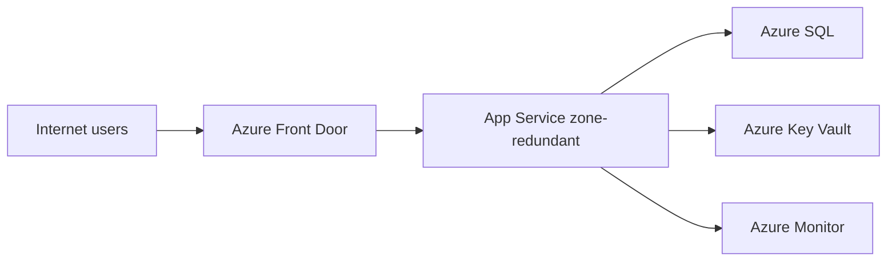

---
content_sources:
  diagrams:
    - id: lab-01-architecture
      type: flowchart
      source: mslearn-adapted
      mslearn_url: https://learn.microsoft.com/en-us/azure/architecture/web-apps/app-service/architectures/baseline-zone-redundant
---
# Lab 01: Public Web Baseline

This lab should be used with the Public Web and API workload guidance and the deployment assets under `infra/bicep/lab-01/`.

<!-- diagram-id: lab-01-architecture -->

## Decision Question

What is the right baseline architecture for a public-facing web application on Azure?

## Business Context

The workload serves anonymous and authenticated internet users, must support routine product releases, and needs a baseline that a small platform team can repeat across multiple apps. The business driver is fast delivery with production-ready security and resilience. [Documented]

## Scope and Non-Goals

In scope: web tier, core data tier, secret handling, monitoring, and edge entry pattern. Out of scope: multi-region active-active, complex background processing, and bespoke network appliances. [Assumed]

## Constraints

- Public internet entry is required. [Documented]
- Team prefers managed PaaS over VM-heavy operations. [Observed]
- Budget must stay in a moderate baseline band before scale-out demand is proven. [Assumed]
- Primary deployment is single region with zone redundancy where supported. [Documented]

## Quality Attribute Priorities

1. Security
2. Reliability
3. Operability
4. Performance efficiency
5. Cost optimization
6. Agility

## Candidate Options

1. Front Door + App Service + Azure SQL + Key Vault + Monitor.
2. Application Gateway + App Service + Azure SQL.
3. AKS-based web platform with ingress, SQL, and external secret management.

Option 1 is the leanest repeatable PaaS baseline. Option 2 is valid when regional edge features are sufficient. Option 3 adds control but exceeds the baseline team skill target. [Inferred]

## Recommended Option

Use **Azure Front Door → App Service (zone-redundant) → Azure SQL → Key Vault → Azure Monitor** as the Phase 1 baseline. This aligns to Microsoft Learn baseline guidance for App Service-hosted web workloads. [Documented]

## Architecture Hypothesis

If the workload uses Front Door for edge protection and routing, App Service for managed hosting, Azure SQL for transactional state, Key Vault for secret custody, and Azure Monitor for operational visibility, then the team can achieve a resilient, supportable public web baseline with lower operational burden than VM or Kubernetes-heavy alternatives. [Inferred]

## Predicted Outcomes

- Median request latency remains acceptable for moderate regional traffic because compute and data stay in a single primary region. [Assumed]
- Zone-redundant hosting reduces single-zone failure impact. [Documented]
- Operational load stays low because patching and scale primitives are managed. [Observed]
- Cost is higher than a minimal single-instance web app, but lower than a custom Kubernetes platform at this scale. [Correlated]

## Validation Plan

- Run load tests against Front Door and App Service autoscale thresholds. [Validated]
- Perform a dependency failure exercise for Azure SQL connection handling and Key Vault secret retrieval fallback. [Validated]
- Review WAF, identity, and secret flows with a threat model. [Documented]
- Compare estimated monthly cost with the reference Bicep deployment in `infra/bicep/lab-01/`. [Validated]

## Falsification Criteria

- Required latency cannot be met without moving to regional edge caching or a different compute model. [Validated]
- The app requires container-level control, sidecars, or custom network routing not well served by App Service. [Observed]
- Database throughput or tenancy isolation requirements outgrow the baseline Azure SQL choice. [Validated]

## Evidence

- [Documented] Microsoft Learn App Service baseline zone-redundant architecture.
- [Documented] Azure Well-Architected guidance for reliability and security.
- [Assumed] Initial traffic profile is moderate and regionally concentrated.
- Diagram `lab-01-architecture`.

## Trade-offs and Risks

- Less runtime control than AKS or VMs.
- Single-region baseline still has regional outage exposure.
- Azure SQL may require later sharding or read-scale patterns if demand changes.
- Front Door introduces an extra service boundary that must be monitored and governed.

## Guardrails and Operating Model

- Use managed identities between App Service and Key Vault where possible. [Documented]
- Enforce HTTPS, WAF policy, diagnostic settings, backup policy, and alert rules. [Validated]
- Define app team ownership for code and SLOs, and platform team ownership for shared guardrails. [Inferred]
- Maintain runbooks for certificate rotation, secret rotation, incident triage, and scale events. [Observed]

## Revisit Triggers

- Expansion to multi-region availability targets.
- Need for asynchronous integration or event-driven workflows.
- Sustained throughput that pushes App Service plan or Azure SQL sizing beyond target cost bands.
- New compliance requirements for private ingress or stricter data residency.

## Takeaway

For a public-facing Azure web application, Front Door plus zone-redundant App Service, Azure SQL, Key Vault, and Azure Monitor is the recommended starting point when the goal is strong security and reliability with manageable operational overhead. Validate it with load, cost, and failure testing before standardizing.

## Microsoft Learn references

- https://learn.microsoft.com/en-us/azure/architecture/web-apps/app-service/architectures/baseline-zone-redundant
- https://learn.microsoft.com/en-us/azure/well-architected/
