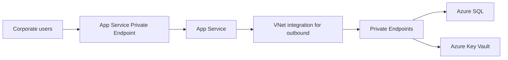

---
content_sources:
  diagrams:
    - id: lab-02-architecture
      type: flowchart
      source: mslearn-adapted
      mslearn_url: https://learn.microsoft.com/en-us/azure/private-link/private-endpoint-overview
      based_on:
        - https://learn.microsoft.com/en-us/azure/app-service/overview-vnet-integration
---
# Lab 02: Private Internal App

This lab should be used with the Private Internal App workload guidance and the deployment assets under `infra/bicep/lab-02/`.

<!-- diagram-id: lab-02-architecture -->

## Decision Question

How should we design a private internal application with no internet exposure?

## Business Context

The workload serves employees, contractors, or partner users over controlled enterprise networks. The business driver is secure internal productivity without exposing the application or data plane to the public internet. [Documented]

## Scope and Non-Goals

In scope: private ingress, app hosting, private data access, secret management, and enterprise operations. Out of scope: B2C internet access, edge CDN behavior, and multi-region disaster recovery design. [Assumed]

## Constraints

- No direct internet exposure for application endpoints. [Documented]
- Connectivity must align with enterprise VNet and private DNS patterns. [Documented]
- Team still prefers managed application hosting. [Observed]
- Budget tolerates private networking overhead only where it materially reduces exposure. [Correlated]

## Quality Attribute Priorities

1. Security
2. Reliability
3. Operability
4. Compliance
5. Cost optimization
6. Performance efficiency

## Candidate Options

1. App Service Private Endpoint + App Service with VNet integration + Private Endpoints for Azure SQL and Key Vault.
2. VM-based internal web tier behind an Internal Load Balancer.
3. Container Apps or AKS with private ingress and private data dependencies.

Option 1 keeps operations lighter than VM or Kubernetes options while satisfying the private-access requirement. [Inferred]

## Recommended Option

Use **App Service Private Endpoint → App Service + outbound VNet integration → Private Endpoints for Azure SQL and Key Vault** as the baseline private application pattern, with **public network access disabled** on the App Service to ensure a true private-only posture, supported by Azure Monitor and enterprise DNS even when not shown in the simplified diagram. [Documented]

## Architecture Hypothesis

If ingress uses an App Service Private Endpoint, platform dependencies are reached through Private Endpoints with outbound VNet integration, and the app remains on managed App Service, then the team can minimize public exposure while keeping day-two operations simpler than infrastructure-heavy alternatives. [Inferred]

## Predicted Outcomes

- Attack surface is reduced because endpoints are not publicly routable. [Documented]
- Private DNS and endpoint management add operational complexity. [Observed]
- User latency remains acceptable inside the corporate network if the app and data stay regionally aligned. [Assumed]
- Cost increases relative to a public-only baseline because of private networking components. [Correlated]

## Validation Plan

- Confirm there is no public ingress path from the internet and that public network access is explicitly disabled on the App Service. [Validated]
- Test internal name resolution and fail scenarios for private DNS and endpoint access. [Validated]
- Run application connectivity tests to Azure SQL and Key Vault over their intended private paths. [Observed]
- Review cost deltas from private endpoints, DNS, and monitoring against the Bicep baseline in `infra/bicep/lab-02/`. [Measured]

## Falsification Criteria

- The application must support unmanaged external users or public APIs. [Observed]
- Private connectivity introduces unacceptable operational friction for the owning team. [Measured]
- Network architecture or policy prevents the required private endpoint and DNS model. [Validated]

## Evidence

- [Documented] Azure App Service Private Endpoint and VNet integration guidance.
- [Documented] Azure architecture guidance for private networking patterns.
- [Observed] Enterprise workloads commonly accept extra network complexity to remove public exposure.
- Diagram `lab-02-architecture`.

## Trade-offs and Risks

- More DNS, routing, and private endpoint management than a public baseline.
- Troubleshooting is slower when network path visibility is weak.
- Internal-only access can delay partner integration unless a future exposure pattern is planned.

## Guardrails and Operating Model

- Enforce private DNS standards, approved Private Endpoint and VNet integration patterns, and diagnostic settings. [Validated]
- Block public network access where supported on dependent services. [Documented]
- Maintain runbooks for DNS resolution failures, private endpoint approval, and credential rotation. [Observed]
- Assign clear ownership between app, network, and platform teams. [Inferred]

## Revisit Triggers

- Requirement for external user access or public APIs.
- New low-latency regional access needs that drive edge or branch optimization.
- Major increase in integration points that makes App Service insufficiently flexible.
- Compliance changes requiring stronger isolation boundaries.

## Takeaway

For a private internal Azure application, App Service Private Endpoint for ingress plus outbound VNet integration and private data dependencies provides a strong baseline when the goal is to remove internet exposure without adopting a heavier compute platform. Validate DNS, routing, and operational ownership early.

## Microsoft Learn references

- https://learn.microsoft.com/en-us/azure/private-link/private-endpoint-overview
- https://learn.microsoft.com/en-us/azure/app-service/overview-vnet-integration
- https://learn.microsoft.com/en-us/azure/architecture/networking/architecture/hub-spoke
