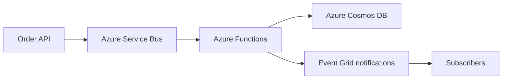

---
content_sources:
  diagrams:
    - id: lab-03-architecture
      type: flowchart
      source: mslearn-adapted
      mslearn_url: https://learn.microsoft.com/en-us/azure/architecture/guide/architecture-styles/event-driven
---
# Lab 03: Event-Driven Orders

This lab should be used with the Event-Driven Integration workload guidance and the deployment assets under `infra/bicep/lab-03/`.

<!-- diagram-id: lab-03-architecture -->

## Decision Question

How should we design an event-driven order processing system?

## Business Context

The workload accepts orders synchronously at the API edge but performs fulfillment, enrichment, and notification asynchronously. The business driver is to decouple user-facing order capture from downstream processing and partner variability. [Documented]

## Scope and Non-Goals

In scope: ingress API, message broker, serverless processing, operational data store, and notification fan-out. Out of scope: warehouse systems, ERP internals, and complex long-running orchestration across many business domains. [Assumed]

## Constraints

- Orders must be durably accepted even when downstream handlers are slow. [Documented]
- Consumers may scale independently and fail independently. [Observed]
- Team wants managed messaging and serverless processing rather than self-managed brokers. [Observed]
- Cost should remain elastic with order volume. [Correlated]

## Quality Attribute Priorities

1. Reliability
2. Scalability
3. Operability
4. Security
5. Performance efficiency
6. Cost optimization

## Candidate Options

1. API + Service Bus + Functions + Cosmos DB + Event Grid.
2. API + Event Hubs + stream processors + data lake-oriented persistence.
3. Synchronous API chain across multiple services with direct database calls.

Option 1 fits transactional asynchronous processing best. Option 2 fits telemetry-scale streaming better. Option 3 is simplest initially but weakest for resilience and decoupling. [Inferred]

## Recommended Option

Use **API → Service Bus → Functions → Cosmos DB → Event Grid for notifications** as the baseline order-processing architecture. This follows Azure event-driven guidance by separating command acceptance, durable messaging, processing, state updates, and event fan-out. [Documented]

## Architecture Hypothesis

If orders are accepted through a thin API and durably queued in Service Bus before asynchronous processing by Azure Functions, then downstream failures will not directly break order intake, and Cosmos DB plus Event Grid will support scalable state tracking and notification distribution. [Inferred]

## Predicted Outcomes

- Order intake remains available during transient processor failures because the queue buffers work. [Documented]
- Eventual consistency becomes a normal operating characteristic and must be explained to stakeholders. [Observed]
- Functions and Cosmos DB allow elastic scaling with variable order volumes. [Correlated]
- Operational complexity shifts from synchronous debugging to idempotency, poison-message handling, and replay workflows. [Validated]

## Validation Plan

- Test duplicate delivery handling and idempotent processing logic. [Validated]
- Run backlog growth and drain-rate tests under peak order bursts. [Measured]
- Simulate downstream subscriber outages and verify notification retry or dead-letter behavior. [Validated]
- Compare throughput and cost characteristics using the reference assets in `infra/bicep/lab-03/`. [Measured]

## Falsification Criteria

- The business requires immediate all-or-nothing synchronous completion across all order steps. [Documented]
- Ordering guarantees, transaction boundaries, or processing latency cannot be met with the selected broker and function model. [Measured]
- Operational maturity is insufficient to manage retries, poison messages, and event versioning. [Observed]

## Evidence

- [Documented] Azure event-driven architecture style guidance.
- [Documented] Azure messaging technology choice guidance.
- [Validated] Common event-driven risks can be reduced with idempotency, dead-letter handling, and replay patterns.
- Diagram `lab-03-architecture`.

## Trade-offs and Risks

- Stronger decoupling means weaker immediate consistency.
- Message contracts and event versioning require governance.
- Debugging spans API, broker, compute, state, and subscribers.
- Cosmos DB may be the wrong store if relational reporting dominates later.

## Guardrails and Operating Model

- Define message TTL, retry, dead-letter, and replay procedures. [Validated]
- Enforce managed identity, secret minimization, and diagnostic collection for broker and functions. [Documented]
- Publish schema ownership and event versioning rules. [Observed]
- Set alerts for queue depth, dead-letter growth, function failures, and notification delivery anomalies. [Measured]

## Revisit Triggers

- Shift from asynchronous fulfillment to strict synchronous transaction requirements.
- Order throughput or fan-out volume exceeds the baseline service assumptions.
- Need for multi-step orchestration with compensations across many domains.
- New reporting or consistency demands favor a different primary data model.

## Takeaway

For event-driven order processing on Azure, Service Bus plus Functions, Cosmos DB, and Event Grid is a practical baseline when durable intake, decoupled scale, and resilient downstream integration matter more than immediate cross-system consistency. Prove idempotency and backlog behavior before production rollout.

## Microsoft Learn references

- https://learn.microsoft.com/en-us/azure/architecture/guide/architecture-styles/event-driven
- https://learn.microsoft.com/en-us/azure/architecture/guide/technology-choices/messaging
