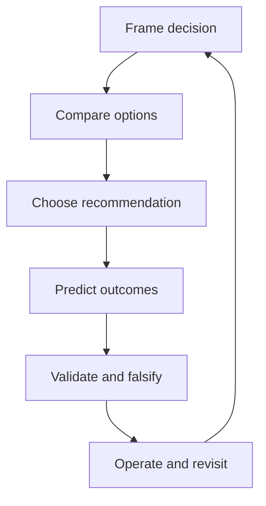

---
content_sources:
  diagrams:
    - id: advr-method-cycle
      type: flowchart
      source: mslearn-adapted
      mslearn_url: https://learn.microsoft.com/en-us/azure/architecture/patterns/
---
# Design Lab Methodology

The Design Labs section uses a 16-section Architecture Decision and Validation Record (ADVR). The goal is to keep architecture work evidence-based, testable, and reusable across design, review, and operations.

## ADVR lifecycle

<!-- diagram-id: advr-method-cycle -->


## The 16 ADVR sections

1. **Decision Question** — the architecture question that must be answered.
2. **Business Context** — users, critical journeys, and business drivers. [Documented]
3. **Scope and Non-Goals** — what the decision covers and what it intentionally excludes.
4. **Constraints** — compliance, budget, geography, skill, latency, and lifecycle constraints.
5. **Quality Attribute Priorities** — ordered priorities such as security, reliability, performance, cost, and operability.
6. **Candidate Options** — realistic alternatives that could satisfy the need.
7. **Recommended Option** — the selected pattern or baseline.
8. **Architecture Hypothesis** — why the recommendation should fit best. [Inferred]
9. **Predicted Outcomes** — expected benefits, costs, and operational consequences.
10. **Validation Plan** — the tests, reviews, and measurements required before standardization.
11. **Falsification Criteria** — the evidence that would prove the recommendation wrong.
12. **Evidence** — Microsoft Learn references, measured results, diagrams, and review notes.
13. **Trade-offs and Risks** — what the team gives up and the known failure modes.
14. **Guardrails and Operating Model** — policy, ownership, alerting, runbooks, and release controls.
15. **Revisit Triggers** — conditions that force redesign or revalidation.
16. **Takeaway** — a one-page summary for decision-makers.

## Evidence levels for architecture

| Tag | Meaning | Typical source |
|---|---|---|
| Documented | Explicitly stated in official guidance | Microsoft Learn, standards, approved ADRs |
| Observed | Seen in telemetry, deployments, or operations | Logs, metrics, platform behavior |
| Measured | Quantified result | Load test, cost export, recovery metric |
| Validated | Confirmed through experiment or drill | Failover test, threat model review |
| Correlated | Multiple signals support the conclusion | Combined logs, incidents, review notes |
| Inferred | Reasoned synthesis from evidence | Architecture analysis |
| Assumed | Working assumption pending proof | Early design workshop |
| Unknown | Missing or unresolved evidence | Gap to investigate |

## How to write an ADVR record

1. Write the decision question in one sentence.
2. Capture business context before naming services.
3. Rank quality attributes so trade-offs are explicit.
4. Keep candidate options realistic and comparable.
5. State the architecture hypothesis in falsifiable language.
6. Predict outcomes with numbers where possible. [Inferred]
7. Define validation steps that can be scheduled and owned.
8. Record guardrails so the design survives beyond diagram approval.

## Example ADVR stub

```markdown
## Decision Question
What is the right baseline architecture for workload X on Azure?

## Business Context
- Users: ...
- Driver: ...

## Candidate Options
1. Option A
2. Option B

## Recommended Option
Choose Option B because ...

## Validation Plan
- Load test to ...
- Threat model to ...
- Cost review to ...
```

## Writing guidance

- Prefer concise claims with evidence tags.
- Use diagrams to show request flow, dependency boundaries, and failure domains.
- Link the lab to the matching workload guide and infrastructure path when available.
- Mark unresolved points as [Assumed] or [Unknown] instead of hiding uncertainty.

## Microsoft Learn references

- https://learn.microsoft.com/en-us/azure/architecture/patterns/
- https://learn.microsoft.com/en-us/azure/well-architected/
