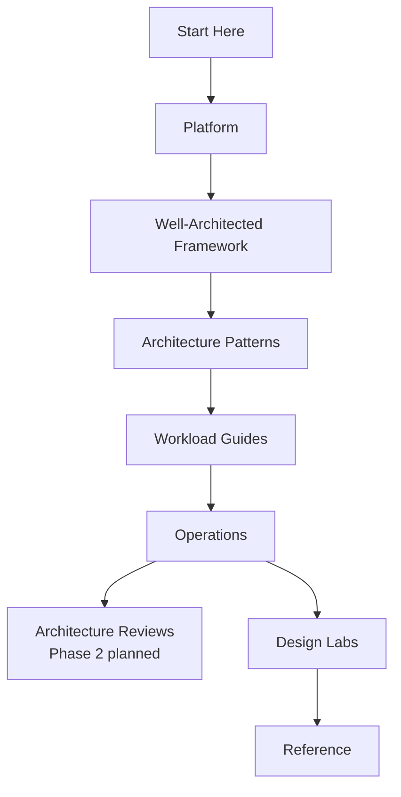

---
content_sources:
  diagrams:
    - id: index-diagram-1
      type: flowchart
      source: self-generated
      justification: "Self-generated navigation diagram for the Azure Architecture Practical Guide."
      based_on:
        - https://learn.microsoft.com/en-us/azure/well-architected/
        - https://learn.microsoft.com/en-us/azure/architecture/
---
# Azure Architecture Practical Guide

Comprehensive, practical documentation for designing, reviewing, and operating Azure architectures — from foundational patterns to production-grade workload blueprints.

This site is organized so you can move from Azure fundamentals to architecture patterns, workload blueprints, and evidence-based review practices.

-   :material-compass-outline:{ .lg .middle } **New to Azure architecture?**

    ---

    Start with orientation, platform fundamentals, and the learning paths that match your role.

    [:octicons-arrow-right-24: Start Here](start-here/index.md)

-   :material-scale-balance:{ .lg .middle } **Making architecture decisions?**

    ---

    Use the Well-Architected Framework, decision patterns, and service selection guidance to compare options.

    [:octicons-arrow-right-24: Architecture Patterns](patterns/index.md)

-   :material-clipboard-check-outline:{ .lg .middle } **Reviewing production designs?**

    ---

    Jump into workload guides and design labs for practical review workflows.

    [:octicons-arrow-right-24: Design Labs](design-labs/index.md)

## Navigate the Guide

| Section | Purpose |
|---|---|
| [Start Here](start-here/index.md) | Orientation, repository map, and learning paths for architects, operators, and reviewers. |
| [Platform](platform/index.md) | Understand core Azure architecture building blocks such as identity, networking, compute, data, and resilience. |
| [Well-Architected Framework](waf/index.md) | Apply Azure Well-Architected guidance to cost, security, reliability, performance, and operations. |
| [Architecture Patterns](patterns/index.md) | Compare decomposition, integration, data, resilience, security, and deployment patterns. |
| [Workload Guides](workload-guides/index.md) | Use baseline blueprints for common Azure workload types. |
| [Operations](operations/index.md) | Run architecture lifecycle processes with ADRs, guardrails, observability, and FinOps. |
| [Design Labs](design-labs/index.md) | Practice architecture design with guided scenarios. |
| [Reference](reference/index.md) | Look up matrices, cheatsheets, mappings, and glossary entries. |

For orientation and study order, start with [Start Here](start-here/index.md).

## Learning flow

<!-- diagram-id: index-diagram-1 -->

Architecture Reviews are planned for Phase 2. In the current published Phase 1 site, the practical path runs from Start Here through Platform, Well-Architected Framework, Patterns, Workload Guides, Operations, Design Labs, and Reference.

## Scope and disclaimer

This is an independent community project. Not affiliated with or endorsed by Microsoft.

Primary references: [Azure Architecture Center](https://learn.microsoft.com/azure/architecture/) and [Azure Well-Architected Framework](https://learn.microsoft.com/azure/well-architected/).
