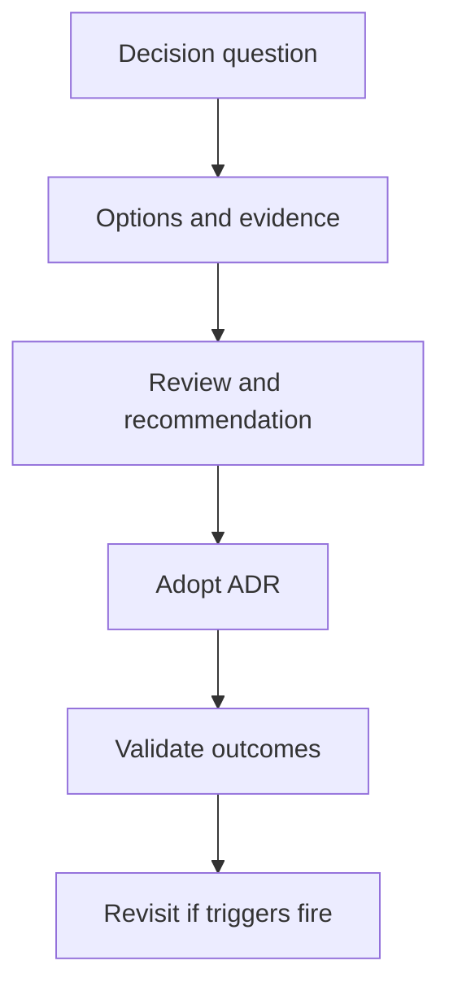

---
content_sources:
  diagrams:
    - id: adr-process-diagram-1
      type: flowchart
      source: self-generated
      justification: "Synthesized ADR workflow aligned to Azure architecture review and pattern documentation practices."
      based_on:
        - https://learn.microsoft.com/en-us/azure/architecture/patterns/
        - https://learn.microsoft.com/en-us/azure/well-architected/
content_validation:
  status: pending_review
  last_reviewed: '2026-04-22'
  reviewer: agent
  core_claims:
  - claim: Document covers ADR Process aligned with Azure architecture guidance
    source: https://learn.microsoft.com/en-us/azure/architecture/patterns/
    verified: false
  - claim: Document includes Microsoft Learn-traceable guidance for ADR Process
    source: https://learn.microsoft.com/en-us/azure/well-architected/
    verified: false
  - claim: Document addresses Why ADRs matter for ADR Process
    source: https://learn.microsoft.com/en-us/azure/architecture/patterns/
    verified: false
  - claim: Document addresses ADR workflow for ADR Process
    source: https://learn.microsoft.com/en-us/azure/well-architected/
    verified: false
  - claim: Document addresses The 16-section ADVR methodology for ADR Process
    source: https://learn.microsoft.com/en-us/azure/architecture/patterns/
    verified: false
---
# ADR Process

Architecture Decision Records (ADRs) are short, durable documents that explain why an architecture choice was made, what alternatives were considered, and what evidence would cause the decision to be revisited. In Azure environments, ADRs are critical because services evolve quickly and teams often inherit architectures long after the original reasoning is forgotten.

## Why ADRs matter

- They prevent architecture from becoming tribal knowledge.
- They make trade-offs auditable.
- They connect business constraints to technical choices.
- They define revisit triggers before conditions change.
- They improve review quality by forcing explicit evidence.

## ADR workflow

<!-- diagram-id: adr-process-diagram-1 -->

## The 16-section ADVR methodology

Use this template for significant architecture decisions and review records:

1. **Decision Question** — What must be decided?
2. **Business Context** — Which business drivers and stakeholders matter?
3. **Scope and Non-Goals** — What is included and excluded?
4. **Constraints** — Regulatory, organizational, budgetary, technical, or operational limits.
5. **Quality Attribute Priorities** — Ordered priorities such as security, reliability, cost, performance, and operability.
6. **Candidate Options** — Feasible alternatives.
7. **Recommended Option** — The selected choice.
8. **Architecture Hypothesis** — Why this option should work.
9. **Predicted Outcomes** — Expected benefits and side effects.
10. **Validation Plan** — How to test or review the decision.
11. **Falsification Criteria** — What evidence would prove the decision wrong.
12. **Evidence** — Documentation, tests, measurements, and observations.
13. **Trade-offs and Risks** — Accepted downsides and open risks.
14. **Guardrails and Operating Model** — Required controls and ownership.
15. **Revisit Triggers** — Conditions that require reassessment.
16. **Takeaway** — Practical conclusion for future readers.

## Maintaining an ADR log

An ADR log should be chronological, searchable, and linked to architecture diagrams, review notes, and major platform changes. A useful log includes:

- ADR identifier and title,
- status such as proposed, accepted, superseded, or retired,
- decision date,
- owners and approvers,
- affected systems or subscriptions,
- links to validation results and incident follow-up.

## Common anti-patterns

- Writing ADRs only after implementation is complete.
- Recording the decision but not the alternatives.
- Omitting falsification criteria, which makes revisit impossible.
- Letting accepted ADRs drift when architecture changes.
- Using one ADR to cover too many unrelated decisions.

## Evidence expectations

- [Documented] Official guidance and internal standards support the choice.
- [Observed] Current operational pain or platform behavior is described.
- [Measured] Cost, latency, throughput, or recovery data informs the choice.
- [Validated] Proof-of-concept or drill results exist for risky decisions.
- [Unknown] Missing data is called out explicitly rather than hidden.

## Review cadence

Create ADRs for platform baselines, identity boundaries, region strategy, deployment topology, data platform selection, and major operational model changes. Review them when incidents recur, costs spike, or the original assumptions no longer match reality.

## Practical guidance

[Inferred] A strong ADR is short enough to be read during a design review but specific enough to survive team turnover. If readers cannot tell why a choice was made or what would invalidate it, the record is incomplete.

## Microsoft Learn references

- [Azure Architecture Center patterns](https://learn.microsoft.com/en-us/azure/architecture/patterns/)
- [Azure Well-Architected Framework](https://learn.microsoft.com/en-us/azure/well-architected/)

## Takeaway

[Validated] ADRs turn architecture from memory into evidence. The 16-section ADVR format keeps decisions reviewable, testable, and revisitable.

## Review Matrix

| Review area | Page-specific check |
|---|---|
| Scope | Confirm the guidance applies to ADR Process. |
| Source basis | Validate the recommendation against the Microsoft Learn sources in this page. |
| Evidence | Capture command output, portal state, metrics, logs, or screenshots before treating the result as proven. |

## See Also

- [Guide home](../index.md)
- [Section index](index.md)
- [Start here](../start-here/overview.md)

## Sources

- [Microsoft Learn source 1](https://learn.microsoft.com/en-us/azure/architecture/patterns/)
- [Microsoft Learn source 2](https://learn.microsoft.com/en-us/azure/well-architected/)
