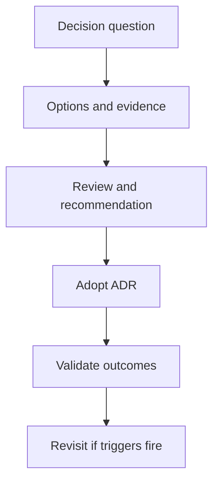

---
content_sources:
  diagrams:
    - id: adr-process-diagram-1
      type: flowchart
      source: self-generated
      justification: "Synthesized ADR workflow aligned to Azure architecture review and pattern documentation practices."
      based_on:
        - https://learn.microsoft.com/en-us/azure/architecture/patterns/
        - https://learn.microsoft.com/en-us/azure/well-architected/
---
# ADR Process

Architecture Decision Records (ADRs) are short, durable documents that explain why an architecture choice was made, what alternatives were considered, and what evidence would cause the decision to be revisited. In Azure environments, ADRs are critical because services evolve quickly and teams often inherit architectures long after the original reasoning is forgotten.

## Why ADRs matter

- They prevent architecture from becoming tribal knowledge.
- They make trade-offs auditable.
- They connect business constraints to technical choices.
- They define revisit triggers before conditions change.
- They improve review quality by forcing explicit evidence.

## ADR workflow

<!-- diagram-id: adr-process-diagram-1 -->

```mermaid
flowchart TD
    A[Decision question] --> B[Options and evidence]
    B --> C[Review and recommendation]
    C --> D[Adopt ADR]
    D --> E[Validate outcomes]
    E --> F[Revisit if triggers fire]
```

## The 16-section ADVR methodology

Use this template for significant architecture decisions and review records:

1. **Decision Question** — What must be decided?
2. **Business Context** — Which business drivers and stakeholders matter?
3. **Scope and Non-Goals** — What is included and excluded?
4. **Constraints** — Regulatory, organizational, budgetary, technical, or operational limits.
5. **Quality Attribute Priorities** — Ordered priorities such as security, reliability, cost, performance, and operability.
6. **Candidate Options** — Feasible alternatives.
7. **Recommended Option** — The selected choice.
8. **Architecture Hypothesis** — Why this option should work.
9. **Predicted Outcomes** — Expected benefits and side effects.
10. **Validation Plan** — How to test or review the decision.
11. **Falsification Criteria** — What evidence would prove the decision wrong.
12. **Evidence** — Documentation, tests, measurements, and observations.
13. **Trade-offs and Risks** — Accepted downsides and open risks.
14. **Guardrails and Operating Model** — Required controls and ownership.
15. **Revisit Triggers** — Conditions that require reassessment.
16. **Takeaway** — Practical conclusion for future readers.

## Maintaining an ADR log

An ADR log should be chronological, searchable, and linked to architecture diagrams, review notes, and major platform changes. A useful log includes:

- ADR identifier and title,
- status such as proposed, accepted, superseded, or retired,
- decision date,
- owners and approvers,
- affected systems or subscriptions,
- links to validation results and incident follow-up.

## Common anti-patterns

- Writing ADRs only after implementation is complete.
- Recording the decision but not the alternatives.
- Omitting falsification criteria, which makes revisit impossible.
- Letting accepted ADRs drift when architecture changes.
- Using one ADR to cover too many unrelated decisions.

## Evidence expectations

- [Documented] Official guidance and internal standards support the choice.
- [Observed] Current operational pain or platform behavior is described.
- [Measured] Cost, latency, throughput, or recovery data informs the choice.
- [Validated] Proof-of-concept or drill results exist for risky decisions.
- [Unknown] Missing data is called out explicitly rather than hidden.

## Review cadence

Create ADRs for platform baselines, identity boundaries, region strategy, deployment topology, data platform selection, and major operational model changes. Review them when incidents recur, costs spike, or the original assumptions no longer match reality.

## Practical guidance

[Inferred] A strong ADR is short enough to be read during a design review but specific enough to survive team turnover. If readers cannot tell why a choice was made or what would invalidate it, the record is incomplete.

## Takeaway

[Validated] ADRs turn architecture from memory into evidence. The 16-section ADVR format keeps decisions reviewable, testable, and revisitable.

## Prerequisites

- An agreed ADR template (the 16-section ADVR format above) and a location for the ADR log that is searchable and version-controlled.
- Named owners and approvers who can accept, supersede, or retire a decision.
- Links available to the architecture diagrams, review notes, and platform changes the decision affects.
- A shared understanding of the evidence levels (`[Documented]`, `[Observed]`, `[Measured]`, `[Validated]`, `[Unknown]`) so records state how strong their support is.

## When to Use

Create or revisit an ADR when a decision is durable, cross-cutting, or expensive to reverse. Typical triggers:

- platform baselines, identity boundaries, region strategy, deployment topology, or data platform selection,
- a major change to the operational model or ownership of a workload,
- recurring incidents, cost spikes, or assumptions that no longer match reality.

Do not raise an ADR for reversible, local implementation details that carry no lasting trade-off.

## Procedure

1. Frame the decision question and capture business context, scope, and constraints.
2. Record candidate options with evidence, then the recommended option and its architecture hypothesis.
3. Add predicted outcomes, a validation plan, and explicit falsification criteria.
4. Review with the affected owners, capture trade-offs, guardrails, and revisit triggers, then set the ADR status to accepted.
5. Append the record to the ADR log with identifier, date, owners, and affected systems.

## Verification

- Each accepted ADR states why the choice was made and what evidence would invalidate it.
- [Documented] Official guidance and internal standards are cited for the choice.
- [Validated] Risky decisions link to proof-of-concept or drill results, and missing data is tagged `[Unknown]` rather than hidden.
- The ADR log is reviewed on the cadence above when incidents recur, costs spike, or assumptions drift.

## Rollback / Troubleshooting

- If a decision proves wrong, do not silently edit it: mark the ADR superseded or retired and write a new record that references it.
- Watch for the common anti-patterns — ADRs written only after implementation, alternatives omitted, missing falsification criteria, or one ADR covering too many decisions — and correct the record rather than the memory.
- When accepted ADRs drift from the running architecture, open a revisit and restore alignment before adding new exceptions.

## See Also

- [Architecture lifecycle](architecture-lifecycle.md)
- [Architecture decision matrix](../reference/architecture-decision-matrix.md)
- [Policy and governance guardrails](policy-and-governance-guardrails.md)

## Sources

- [Azure Architecture Center patterns](https://learn.microsoft.com/en-us/azure/architecture/patterns/)
- [Azure Well-Architected Framework](https://learn.microsoft.com/en-us/azure/well-architected/)

