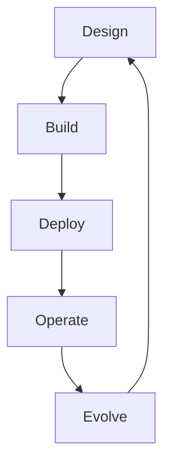

---
content_sources:
  diagrams:
    - id: architecture-lifecycle-diagram-1
      type: flowchart
      source: mslearn-adapted
      mslearn_url: https://learn.microsoft.com/en-us/azure/cloud-adoption-framework/
---
# Architecture Lifecycle

Azure architectures are not static artifacts. They move through a lifecycle in which design assumptions become implementation choices, those choices become production constraints, and production feedback forces redesign. Teams that treat architecture as a one-time document usually accumulate drift, exceptions, and avoidable operational risk.

## Lifecycle phases

1. **Design** — define goals, constraints, options, and quality priorities.
2. **Build** — encode topology, policy, identity, and dependencies into delivery assets.
3. **Deploy** — promote changes through controlled environments and approvals.
4. **Operate** — monitor, support, optimize, and recover the workload.
5. **Evolve** — revisit assumptions as demand, regulation, and platform capabilities change.

## Lifecycle loop

<!-- diagram-id: architecture-lifecycle-diagram-1 -->

## What changes over time

| Phase | Main concern | Typical output |
|---|---|---|
| Design | Fit and trade-offs | ADRs, diagrams, review notes |
| Build | Reproducibility | IaC, policy, pipeline definitions |
| Deploy | Change safety | Promotion gates, approvals, rollback plans |
| Operate | Service health | SLOs, dashboards, runbooks, incident records |
| Evolve | Continued fitness | Updated ADRs, redesign backlog, deprecations |

## When to revisit architecture decisions

[Inferred] The need to revisit architecture usually follows a material change in business or technical context. Common triggers include:

- major traffic growth or tenant mix change,
- new compliance or data residency constraints,
- repeated incidents with the same dependency or failure mode,
- cost growth that outpaces business value,
- platform capability changes that make a previous trade-off obsolete,
- team topology changes that alter operational ownership.

## Anti-patterns

- Treating the first approved diagram as the final architecture.
- Releasing architecture changes incrementally without updating decision records.
- Accumulating exceptions that silently replace the intended operating model.
- Waiting for a major outage before reviewing reliability or security assumptions.
- Allowing platform changes to drift without application-team impact review.

## Ownership by phase

- Design: architects, security, platform, product, and app leaders.
- Build: platform engineers, application engineers, and governance owners.
- Deploy: release engineering, operations, and risk approvers.
- Operate: app support, platform SRE, security operations, and service owners.
- Evolve: architecture review boards, platform strategy, and workload leads.

## Validation checkpoints

- Each phase has defined outputs and exit criteria.
- [Observed] Drift and exceptions are visible rather than hidden in tickets.
- [Correlated] Deployment, incident, cost, and performance trends inform changes.
- [Validated] Revisit triggers lead to actual architecture reviews.
- [Correlated] Repeated production pain is linked back to design decisions.

## Practical review questions

- What assumptions from the original design are no longer true?
- Which operating controls exist only because the architecture is compensating for earlier constraints?
- Has the workload outgrown its original scaling, security, or team model?
- What decisions are becoming expensive to reverse?

## Microsoft Learn references

- [Cloud Adoption Framework](https://learn.microsoft.com/en-us/azure/cloud-adoption-framework/)
- [Adopt cloud governance at scale](https://learn.microsoft.com/en-us/azure/cloud-adoption-framework/govern/)

## Takeaway

[Validated] The best architecture lifecycle is a deliberate loop: decide, encode, operate, learn, and revisit before production pressure makes redesign unavoidable.
