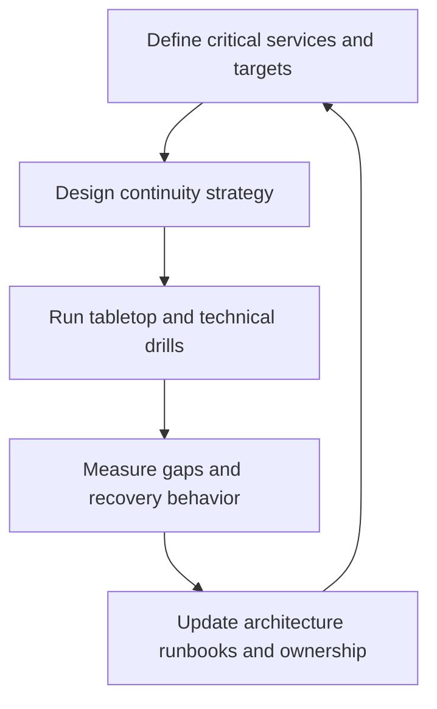

---
content_sources:
  diagrams:
    - id: bcdr-drills-diagram-1
      type: flowchart
      source: mslearn-adapted
      mslearn_url: https://learn.microsoft.com/en-us/azure/reliability/business-continuity-management-program
---
# Business Continuity and Drills

Business continuity is the architectural and operational discipline of keeping critical services usable during disruption and restoring them within agreed limits. In Azure, continuity planning must account for platform dependencies, identity, network paths, data recovery, team readiness, and the difference between theoretical failover and actual recovery.

## Core concepts

- Business continuity defines how critical business functions continue under disruption.
- Disaster recovery focuses on restoration after severe failure.
- Drills validate whether people, systems, and procedures actually work.
- Chaos practices expose hidden coupling and weak assumptions before real incidents do.

## Continuity drill loop

<!-- diagram-id: bcdr-drills-diagram-1 -->

## Planning elements

| Element | Key question | Example output |
|---|---|---|
| Criticality | Which processes must continue first? | Tiered recovery priority |
| Recovery targets | How fast and how much data loss is acceptable? | RTO and RPO targets |
| Dependency map | Which services or teams can block recovery? | Recovery dependency matrix |
| Recovery method | Fail over, restore, degrade, or pause? | Workload-specific playbook |
| Drill design | How will assumptions be tested? | Tabletop and technical drill plans |

## Failover drills

Plan drills that move beyond control-plane success:

- verify application behavior after failover,
- confirm identity, DNS, secrets, and data access paths,
- observe downstream capacity and rate limits,
- rehearse communication, escalation, and rollback decisions,
- capture measured recovery duration and unexpected manual steps.

## Chaos engineering on Azure

[Inferred] Chaos practices are useful when they target realistic failure modes and are run with safety boundaries. They are not random breakage. Good chaos exercises test hypotheses such as dependency latency, zonal failure, node loss, or configuration drift under controlled conditions.

## Common anti-patterns

- Equating backup existence with recovery readiness.
- Declaring multi-region readiness without drill evidence.
- Running tabletop exercises only and never testing the technical path.
- Ignoring operator access and communication dependencies.
- Treating continuity as only an infrastructure concern instead of an end-to-end workload concern.

## Failure modes

[Observed] Continuity plans fail when:

- runbooks require privileges unavailable during the incident,
- restored data is technically available but application reconciliation is incomplete,
- failover traffic overloads the secondary environment,
- a shared identity or secrets dependency becomes the real single point of failure,
- teams discover during the incident that ownership is ambiguous.

## Ownership

- Business owners define critical processes and acceptable disruption.
- Platform teams provide continuity patterns and recovery tooling.
- Application teams define workload-specific degradation and recovery behavior.
- Security teams ensure emergency access and response controls remain safe.
- Incident leaders coordinate drills and capture learning.

## Validation checklist

- Critical services and recovery targets are defined.
- [Observed] Recovery dependencies include people, access, and communications.
- [Measured] Drill results record real restoration time and blockers.
- [Validated] Technical drills supplement tabletop exercises.
- [Correlated] Incident findings influence continuity architecture.
- [Unknown] Untested recovery paths are tracked as risk.

## Microsoft Learn references

- [Business continuity management program guidance](https://learn.microsoft.com/en-us/azure/reliability/business-continuity-management-program)
- [Azure reliability documentation](https://learn.microsoft.com/en-us/azure/reliability/overview)

## Takeaway

[Validated] Continuity is proven by drills, not by architecture diagrams. Recovery plans must include technology, people, ownership, and measured outcomes.
