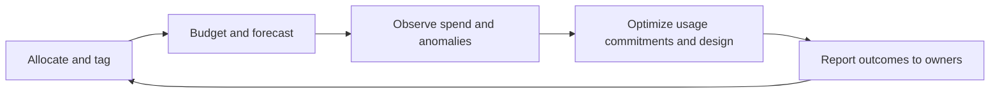

---
content_sources:
  diagrams:
    - id: finops-diagram-1
      type: flowchart
      source: mslearn-adapted
      mslearn_url: https://learn.microsoft.com/en-us/azure/cost-management-billing/
---
# Cost Management and FinOps

FinOps is the operating discipline that connects Azure consumption to business accountability. In architecture terms, it ensures teams can explain what they spend, why they spend it, and how to optimize without destabilizing the workload.

## FinOps principles for Azure

[Documented] Azure Cost Management and Billing guidance emphasizes visibility, accountability, and optimization. Practical architecture implications include:

1. Assign cost ownership at subscription, resource group, workload, and environment levels.
2. Use tags and hierarchy consistently so allocation is reliable.
3. Separate baseline spend from burst or project-specific spend.
4. Review reservations and savings plans against actual demand patterns.
5. Treat anomalies as signals of architectural or operational drift.

## FinOps loop

<!-- diagram-id: finops-diagram-1 -->

## Cost allocation with tags

Useful tag dimensions often include:

- workload or product,
- environment,
- owner,
- cost center,
- business unit,
- data classification where governance alignment matters.

[Observed] Allocation fails when tag policies are optional or when shared services are not charged back transparently.

## Budgets and anomaly detection

- Set budgets at the scopes where teams can actually act.
- Use alerts for meaningful thresholds, not every small variance.
- Compare anomalies to release events, traffic changes, and incident timelines.
- Review whether anomalies reflect waste, growth, attack, or measurement error.

## Reserved instances and savings plans

These commitment models are valuable when demand is stable enough. The architecture question is whether the workload has predictable consumption or whether elasticity is the true value. Overcommitting can become a hidden form of waste.

## Common anti-patterns

- Treating cloud cost as a monthly finance report instead of an engineering signal.
- Mixing unrelated workloads in scopes that hide accountability.
- Using commitment discounts without validating sustained usage.
- Focusing only on unit cost and ignoring labor cost.
- Cutting observability or resilience indiscriminately to hit short-term budget targets.

## Failure modes

[Observed] FinOps failures often emerge as:

- no clear owner for a growing shared service bill,
- difficult-to-explain egress or telemetry costs,
- premium services left in place after temporary scaling events,
- reservations that do not match actual workload shape,
- repeated budget surprises because architectural review is disconnected from finance review.

## Ownership

- Finance and FinOps teams provide allocation, reporting, and anomaly review.
- Platform teams enforce tags and baseline visibility.
- Application teams own workload consumption behavior and optimization decisions.
- Architects connect cost patterns back to topology and service choices.

## Validation checklist

- [Documented] Cost ownership and mandatory tags are defined.
- [Observed] Budget alerts reach teams that can act.
- [Measured] Spend by workload, environment, and shared service is visible.
- [Validated] Commitment discounts are reviewed against real usage.
- [Correlated] Cost anomalies are linked to traffic, releases, or topology changes.
- [Inferred] FinOps insights influence architecture reviews and backlog priorities.

## Microsoft Learn references

- [Azure Cost Management and Billing documentation](https://learn.microsoft.com/en-us/azure/cost-management-billing/)
- [FinOps on Azure](https://learn.microsoft.com/en-us/azure/cost-management-billing/finops/)

## Takeaway

[Validated] FinOps is effective when architecture, operations, and finance share the same cost signals and can act on them before waste becomes structural.
