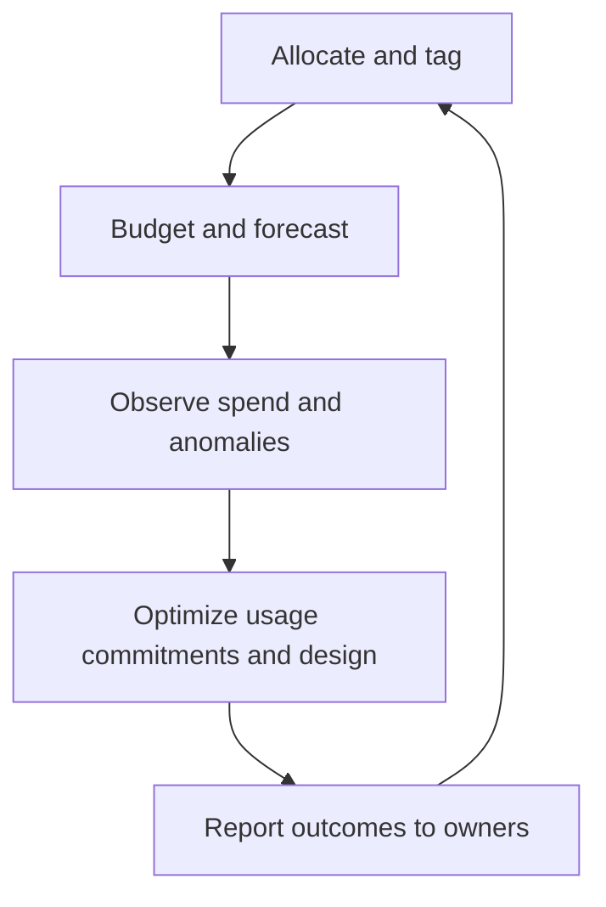

---
content_sources:
  diagrams:
    - id: finops-diagram-1
      type: flowchart
      source: mslearn-adapted
      mslearn_url: https://learn.microsoft.com/en-us/azure/cost-management-billing/
---
# Cost Management and FinOps

FinOps is the operating discipline that connects Azure consumption to business accountability. In architecture terms, it ensures teams can explain what they spend, why they spend it, and how to optimize without destabilizing the workload.

## FinOps principles for Azure

[Documented] Azure Cost Management and Billing guidance emphasizes visibility, accountability, and optimization. Practical architecture implications include:

1. Assign cost ownership at subscription, resource group, workload, and environment levels.
2. Use tags and hierarchy consistently so allocation is reliable.
3. Separate baseline spend from burst or project-specific spend.
4. Review reservations and savings plans against actual demand patterns.
5. Treat anomalies as signals of architectural or operational drift.

## FinOps loop

<!-- diagram-id: finops-diagram-1 -->

```mermaid
flowchart TD
    A[Allocate and tag] --> B[Budget and forecast]
    B --> C[Observe spend and anomalies]
    C --> D[Optimize usage commitments and design]
    D --> E[Report outcomes to owners]
    E --> A
```

## Cost allocation with tags

Useful tag dimensions often include:

- workload or product,
- environment,
- owner,
- cost center,
- business unit,
- data classification where governance alignment matters.

[Observed] Allocation fails when tag policies are optional or when shared services are not charged back transparently.

## Budgets and anomaly detection

- Set budgets at the scopes where teams can actually act.
- Use alerts for meaningful thresholds, not every small variance.
- Compare anomalies to release events, traffic changes, and incident timelines.
- Review whether anomalies reflect waste, growth, attack, or measurement error.

## Reserved instances and savings plans

These commitment models are valuable when demand is stable enough. The architecture question is whether the workload has predictable consumption or whether elasticity is the true value. Overcommitting can become a hidden form of waste.

## Common anti-patterns

- Treating cloud cost as a monthly finance report instead of an engineering signal.
- Mixing unrelated workloads in scopes that hide accountability.
- Using commitment discounts without validating sustained usage.
- Focusing only on unit cost and ignoring labor cost.
- Cutting observability or resilience indiscriminately to hit short-term budget targets.

## Failure modes

[Observed] FinOps failures often emerge as:

- no clear owner for a growing shared service bill,
- difficult-to-explain egress or telemetry costs,
- premium services left in place after temporary scaling events,
- reservations that do not match actual workload shape,
- repeated budget surprises because architectural review is disconnected from finance review.

## Ownership

- Finance and FinOps teams provide allocation, reporting, and anomaly review.
- Platform teams enforce tags and baseline visibility.
- Application teams own workload consumption behavior and optimization decisions.
- Architects connect cost patterns back to topology and service choices.

## Validation checklist

- Cost ownership and mandatory tags are defined.
- [Observed] Budget alerts reach teams that can act.
- [Observed] Spend by workload, environment, and shared service is visible.
- [Validated] Commitment discounts are reviewed against real usage.
- [Correlated] Cost anomalies are linked to traffic, releases, or topology changes.
- [Inferred] FinOps insights influence architecture reviews and backlog priorities.

## Takeaway

[Validated] FinOps is effective when architecture, operations, and finance share the same cost signals and can act on them before waste becomes structural.

## Prerequisites

- Cost ownership assigned at subscription, resource group, workload, and environment levels.
- A consistent tag taxonomy (workload, environment, owner, cost center, business unit) enforced by policy.
- Access to Azure Cost Management data, budgets, and anomaly alerts routed to teams that can act.
- Agreement that baseline spend is separated from burst or project-specific spend.

## When to Use

Apply FinOps continuously once a workload has meaningful or growing Azure consumption. Give it extra attention when:

- a shared-service bill grows without a clear owner,
- egress, telemetry, or premium-service costs become hard to explain,
- commitment discounts (reservations, savings plans) are being considered or renewed,
- budget surprises recur because architecture review is disconnected from finance review.

## Procedure

1. Allocate and tag resources so spend maps to accountable owners.
2. Set budgets and forecasts at scopes where teams can actually act.
3. Observe spend and anomalies, comparing them to release events, traffic changes, and incident timelines.
4. Optimize usage, commitments, and design — validating that discounts match sustained usage.
5. Report outcomes to owners and feed cost insights back into architecture reviews.

## Verification

- [Observed] Spend by workload, environment, and shared service is visible, and budget alerts reach teams that can act.
- [Validated] Commitment discounts are reviewed against real usage before renewal.
- [Correlated] Cost anomalies are linked to traffic, releases, or topology changes rather than treated as noise.
- [Inferred] FinOps insights influence architecture reviews and backlog priorities.

## Rollback / Troubleshooting

- If an optimization threatens stability, restore the prior configuration — never cut observability or resilience indiscriminately to hit a short-term budget target.
- Diagnose the documented failure modes: an unowned shared-service bill, premium services left running after temporary scaling, or reservations that no longer match workload shape.
- When commitments prove wrong for the demand pattern, treat overcommitment as waste and rebalance toward elasticity where that is the real value.

## See Also

- [WAF cost optimization pillar](../waf/cost-optimization.md)
- [Observability and SLOs](observability-and-slos.md)
- [Design patterns](../patterns/index.md)

## Sources

- [Azure Cost Management and Billing documentation](https://learn.microsoft.com/en-us/azure/cost-management-billing/)
- [FinOps on Azure](https://learn.microsoft.com/en-us/azure/cost-management-billing/finops/)

