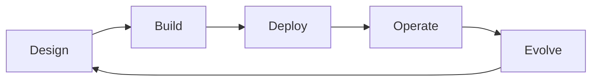

---
content_sources:
  diagrams:
    - id: operations-index-diagram-1
      type: flowchart
      source: mslearn-adapted
      mslearn_url: https://learn.microsoft.com/en-us/azure/cloud-adoption-framework/
---
# Operations

Operations is where architecture becomes durable. This section focuses on the lifecycle disciplines that keep Azure designs governable, observable, affordable, and adaptable after the initial design phase. It covers how teams record decisions, promote infrastructure safely, enforce guardrails, define service objectives, manage cost, rehearse continuity, and split responsibilities between platform and application ownership.

## What this section is for

[Documented] Azure guidance across the Cloud Adoption Framework, Azure Monitor, Azure Policy, and Well-Architected content consistently treats operations as a continuous discipline. In this guide, operations means the architecture practices that make good decisions repeatable:

- lifecycle review and revisit points,
- architecture decision records,
- infrastructure as code and environment promotion,
- policy and governance guardrails,
- observability and SLOs,
- cost management and FinOps,
- business continuity drills,
- team topology and ownership boundaries.

## Operating architecture lifecycle

<!-- diagram-id: operations-index-diagram-1 -->

## Themes in this section

| Theme | Core question | Primary outcome |
|---|---|---|
| Decision management | How are architecture choices recorded and revisited? | Durable reasoning and accountability |
| Delivery control | How does change move safely between environments? | Repeatable deployment and lower drift |
| Governance | Which controls are mandatory and how are exceptions handled? | Safe standardization |
| Observability | How do teams know whether the workload meets expectations? | Actionable signals and service objectives |
| FinOps | Is spending aligned with value and ownership? | Sustainable cost behavior |
| Continuity | Can the workload survive and recover from disruption? | Validated resilience |
| Team topology | Who owns what at platform and app layers? | Clear operating boundaries |

## Design stance

This section intentionally stays architectural. It explains how to choose operating models, not how to click through individual service features. If more than about a third of the content would become a feature tutorial, the topic belongs in a sibling service-specific guide.

## What good operations look like

- Architecture decisions and exceptions are written down.
- [Observed] Production behavior is visible through meaningful telemetry.
- [Observed] SLOs, budgets, and recovery targets are tracked.
- [Validated] Promotion paths, failover plans, and guardrails are exercised.
- [Correlated] Cost, performance, and incident patterns influence architecture changes.
- [Inferred] Platform and app team boundaries reduce ambiguity during change and failure.

## How to read these pages

Read the section in operating order rather than alphabetical order. Start with lifecycle and ADRs to understand how decisions are recorded, then move into IaC, policy, and observability to see how those decisions are enforced. Finish with continuity, FinOps, and team-topology guidance to confirm the architecture can survive failure, growth, and organizational change.

## Related pages

- [Architecture lifecycle](architecture-lifecycle.md)
- [ADR process](adr-process.md)
- [Observability and SLOs](observability-and-slos.md)
- [Business continuity and drills](business-continuity-and-drills.md)

## Microsoft Learn references

- [Cloud Adoption Framework](https://learn.microsoft.com/en-us/azure/cloud-adoption-framework/)
- [Azure Well-Architected Framework](https://learn.microsoft.com/en-us/azure/well-architected/)

## Takeaway

[Validated] Strong Azure operations are not an afterthought to architecture. They are the control system that keeps architecture decisions correct as teams, scale, and constraints change.
