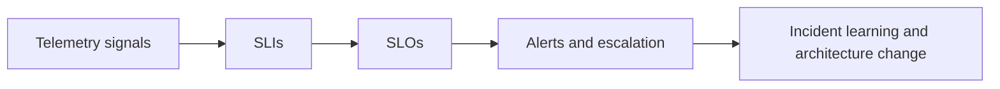

---
content_sources:
  diagrams:
    - id: observability-slo-diagram-1
      type: flowchart
      source: mslearn-adapted
      mslearn_url: https://learn.microsoft.com/en-us/azure/azure-monitor/overview
---
# Observability and SLOs

Observability is the ability to infer system state from telemetry. Service objectives turn that telemetry into operational intent. In Azure architecture, observability and SLO design determine whether teams can detect user-impacting problems, prioritize response, and decide when the architecture needs to change.

## Definitions

- **SLI**: a measured indicator of service behavior, such as availability or latency.
- **SLO**: the target value or range for an SLI over time.
- **SLA**: the formal commitment, usually contractual or provider-defined.

[Inferred] SLOs should reflect user value, while SLIs should be measurable and actionable. SLAs are not a substitute for internal service objectives.

## Observability model

<!-- diagram-id: observability-slo-diagram-1 -->

## Signal categories

| Signal | Purpose | Architecture relevance |
|---|---|---|
| Metrics | Fast trend and threshold detection | Capacity, latency, saturation, availability |
| Logs | Detailed event and context | Security, diagnosis, workflow tracing |
| Traces | Dependency and request path visibility | Latency and coupling analysis |
| Health events | Service and infrastructure state | Platform dependency awareness |

## Defining SLOs for Azure workloads

Choose indicators that represent user experience and operational risk:

- request success rate,
- p95 or p99 latency for critical journeys,
- queue age or backlog for asynchronous workloads,
- recovery time for critical services,
- freshness for data or analytics pipelines.

Avoid vanity SLOs that are easy to meet but weakly tied to actual user impact.

## Alert strategy and escalation

- Route urgent alerts to the team that can act immediately.
- Separate symptom alerts from cause signals.
- Include dependency context and runbook links.
- Review alert noise and stale rules continuously.
- Define escalation rules for unresolved or cross-team incidents.

## Common anti-patterns

- Using provider SLA as the only reliability metric.
- Alerting on infrastructure details with no user or service context.
- Collecting large telemetry volumes without deciding who will use them.
- Setting SLOs with no agreed error budget response.
- Ignoring shared dependencies in dashboards and alerts.

## Failure modes

[Observed] Weak observability usually means:

- teams know a service is failing only after user reports,
- alerts page the wrong owners,
- dashboards look healthy while critical workflows are degraded,
- dependency failures are visible only indirectly,
- investigations take too long because telemetry lacks correlation.

## Ownership

- Platform teams provide logging, metrics, tracing, and shared dashboards.
- Application teams define workload SLIs, SLOs, and alert routing.
- Security teams ensure security-relevant telemetry exists and is retained appropriately.
- Leadership and product owners help set the business meaning of error budgets.

## Validation checklist

- Critical user journeys have defined SLIs and SLOs.
- [Observed] Alerts map to actionable ownership.
- [Observed] Error budget burn, latency, and availability trends are visible.
- [Validated] Alert routing and escalation paths are exercised.
- [Correlated] Telemetry joins application, dependency, and platform signals.
- [Inferred] Observability backlog exists for blind spots and noisy alerts.

## Microsoft Learn references

- [Azure Monitor overview](https://learn.microsoft.com/en-us/azure/azure-monitor/overview)
- [Designing a scalable observability solution](https://learn.microsoft.com/en-us/azure/architecture/guide/design-principles/observability)

## Takeaway

[Validated] A workload is only as operable as its observability model. Good SLOs express user commitments, and good telemetry reveals when the architecture is no longer meeting them.
