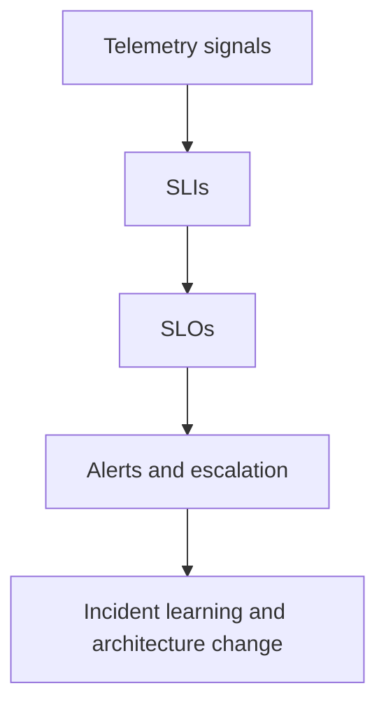

---
content_sources:
  diagrams:
    - id: observability-slo-diagram-1
      type: flowchart
      source: mslearn-adapted
      mslearn_url: https://learn.microsoft.com/en-us/azure/azure-monitor/overview
---
# Observability and SLOs

Observability is the ability to infer system state from telemetry. Service objectives turn that telemetry into operational intent. In Azure architecture, observability and SLO design determine whether teams can detect user-impacting problems, prioritize response, and decide when the architecture needs to change.

## Definitions

- **SLI**: a measured indicator of service behavior, such as availability or latency.
- **SLO**: the target value or range for an SLI over time.
- **SLA**: the formal commitment, usually contractual or provider-defined.

[Inferred] SLOs should reflect user value, while SLIs should be measurable and actionable. SLAs are not a substitute for internal service objectives.

## Observability model

<!-- diagram-id: observability-slo-diagram-1 -->

```mermaid
flowchart TD
    A[Telemetry signals] --> B[SLIs]
    B --> C[SLOs]
    C --> D[Alerts and escalation]
    D --> E[Incident learning and architecture change]
```

## Signal categories

| Signal | Purpose | Architecture relevance |
|---|---|---|
| Metrics | Fast trend and threshold detection | Capacity, latency, saturation, availability |
| Logs | Detailed event and context | Security, diagnosis, workflow tracing |
| Traces | Dependency and request path visibility | Latency and coupling analysis |
| Health events | Service and infrastructure state | Platform dependency awareness |

## Defining SLOs for Azure workloads

Choose indicators that represent user experience and operational risk:

- request success rate,
- p95 or p99 latency for critical journeys,
- queue age or backlog for asynchronous workloads,
- recovery time for critical services,
- freshness for data or analytics pipelines.

Avoid vanity SLOs that are easy to meet but weakly tied to actual user impact.

## Alert strategy and escalation

- Route urgent alerts to the team that can act immediately.
- Separate symptom alerts from cause signals.
- Include dependency context and runbook links.
- Review alert noise and stale rules continuously.
- Define escalation rules for unresolved or cross-team incidents.

## Common anti-patterns

- Using provider SLA as the only reliability metric.
- Alerting on infrastructure details with no user or service context.
- Collecting large telemetry volumes without deciding who will use them.
- Setting SLOs with no agreed error budget response.
- Ignoring shared dependencies in dashboards and alerts.

## Failure modes

[Observed] Weak observability usually means:

- teams know a service is failing only after user reports,
- alerts page the wrong owners,
- dashboards look healthy while critical workflows are degraded,
- dependency failures are visible only indirectly,
- investigations take too long because telemetry lacks correlation.

## Ownership

- Platform teams provide logging, metrics, tracing, and shared dashboards.
- Application teams define workload SLIs, SLOs, and alert routing.
- Security teams ensure security-relevant telemetry exists and is retained appropriately.
- Leadership and product owners help set the business meaning of error budgets.

## Validation checklist

- Critical user journeys have defined SLIs and SLOs.
- [Observed] Alerts map to actionable ownership.
- [Observed] Error budget burn, latency, and availability trends are visible.
- [Validated] Alert routing and escalation paths are exercised.
- [Correlated] Telemetry joins application, dependency, and platform signals.
- [Inferred] Observability backlog exists for blind spots and noisy alerts.

## Takeaway

[Validated] A workload is only as operable as its observability model. Good SLOs express user commitments, and good telemetry reveals when the architecture is no longer meeting them.

## Prerequisites

- Telemetry pipelines for metrics, logs, traces, and health events across the workload and its dependencies.
- Identified critical user journeys for which SLIs and SLOs can be defined.
- Alert routing and escalation paths mapped to teams that can act.
- Agreement on error-budget meaning between application, platform, security, and product owners.

## When to Use

Design observability and SLOs for any workload with real user or business impact. Revisit them when:

- new critical journeys or dependencies are introduced,
- alert noise rises or dashboards look healthy while users report failures,
- an incident review shows the wrong owners were paged,
- error-budget policy or reliability targets change.

## Procedure

1. Collect telemetry signals — metrics, logs, traces, and health events.
2. Derive SLIs that represent user experience and operational risk (success rate, p95/p99 latency, backlog age, recovery time, data freshness).
3. Set SLOs as targets over time, avoiding vanity indicators weakly tied to user impact.
4. Route alerts and escalation to the owners who can act, separating symptom alerts from cause signals.
5. Feed incident learning back into SLOs, telemetry coverage, and architecture change.

## Verification

- Critical user journeys have defined SLIs and SLOs, and alerts map to actionable ownership.
- [Observed] Error-budget burn, latency, and availability trends are visible on shared dashboards.
- [Validated] Alert routing and escalation paths are exercised, not assumed.
- [Correlated] Telemetry joins application, dependency, and platform signals for faster diagnosis.

## Rollback / Troubleshooting

- If an SLO or alert change increases noise or masks real degradation, revert to the prior definition and refine before re-enabling.
- Diagnose the documented failure modes — teams learning of failure only from user reports, alerts paging the wrong owners, or dashboards looking healthy while critical workflows degrade.
- Maintain an observability backlog for blind spots and noisy alerts so weak signals are corrected instead of tolerated.

## See Also

- [WAF operational excellence pillar](../waf/operational-excellence.md)
- [Business continuity and drills](business-continuity-and-drills.md)
- [Platform concepts](../platform/index.md)

## Sources

- [Azure Monitor overview](https://learn.microsoft.com/en-us/azure/azure-monitor/overview)
- [Designing a monitoring system](https://learn.microsoft.com/en-us/azure/well-architected/operational-excellence/observability)

