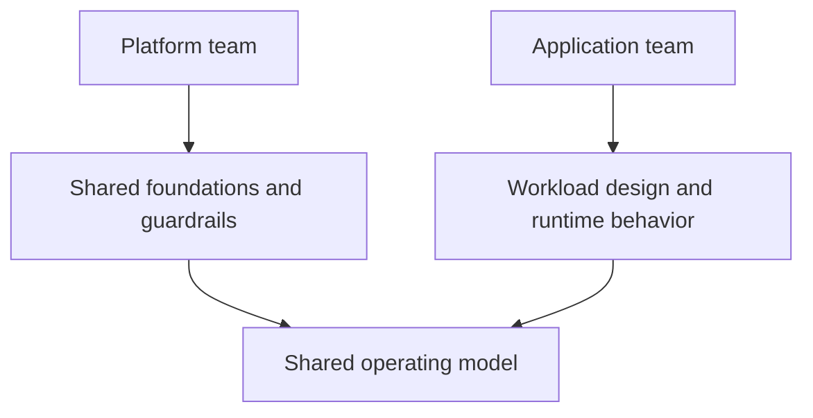

---
content_sources:
  diagrams:
    - id: team-responsibilities-diagram-1
      type: flowchart
      source: mslearn-adapted
      mslearn_url: https://learn.microsoft.com/en-us/azure/cloud-adoption-framework/organize/
---
# Platform Team vs App Team Responsibilities

Clear team boundaries are essential for operating Azure architectures at scale. Without them, governance becomes slow, platform services become bottlenecks, and incidents stall while teams debate ownership. This page explains how to separate platform and application responsibilities without creating a rigid handoff culture.

## Team topology goals

[Documented] The Cloud Adoption Framework emphasizes alignment between operating model and cloud outcomes. In practice, the goal is to create a platform that enables teams through paved roads, while keeping application teams accountable for workload behavior and service outcomes.

## Responsibility model

<!-- diagram-id: team-responsibilities-diagram-1 -->

## Typical responsibility split

| Domain | Platform team | Application team |
|---|---|---|
| Landing zones | Define and operate | Consume within standards |
| Identity baseline | Platform roles, shared patterns, guardrails | App authorization and workload identities |
| Networking baseline | Core connectivity, segmentation standards | Workload-specific exposure and dependency needs |
| Shared observability | Central tools and baseline telemetry | Workload SLIs, dashboards, and alerts |
| IaC modules | Reusable platform modules and standards | Workload composition and app-specific modules |
| Reliability patterns | Base resilience services and guidance | Workload failover, fallback, and data recovery behavior |
| Cost visibility | Tag standards and shared reporting | Consumption optimization and budget ownership |

## Shared responsibility principles

- Platform teams own the paved road, not every workload decision.
- App teams own the service users experience, even when platform dependencies contribute.
- Security and governance controls must be designed so both teams can act without bypassing each other.
- Exceptions should be temporary and visible.

## Common anti-patterns

- Platform teams becoming a ticket queue for every change.
- App teams bypassing standards because the platform path is too slow.
- Shared observability with no clear owner for workload alerts.
- Security decisions falling between central and local ownership.
- Incident response that mirrors the org chart instead of the dependency graph.

## Failure modes

[Observed] Responsibility confusion usually leads to:

- slow delivery due to excessive central control,
- inconsistent architectures due to weak platform enablement,
- repeated exceptions for the same missing platform capability,
- unclear escalation during incidents,
- hidden operational burden shifted to application teams without support.

## Governance and escalation

Use clear interfaces:

- service catalog or paved-road standards,
- exception workflow with owner and expiry,
- support and escalation matrix,
- platform roadmap informed by repeated app-team pain,
- review cadence for shared controls and workload feedback.

## Validation checklist

- Responsibilities for core operational domains are explicit.
- [Observed] Teams can identify the right owner for platform, workload, and security issues.
- [Observed] Repeated exception categories are tracked.
- [Validated] Incident and drill reviews confirm handoffs and escalation paths work.
- [Correlated] Platform roadmap changes respond to recurring app-team friction.
- [Inferred] Shared responsibility reduces ambiguity without diluting accountability.

## Microsoft Learn references

- [Cloud Adoption Framework organize guidance](https://learn.microsoft.com/en-us/azure/cloud-adoption-framework/organize/)
- [Cloud Adoption Framework ready guidance](https://learn.microsoft.com/en-us/azure/cloud-adoption-framework/ready/)

## Takeaway

[Validated] High-performing Azure organizations do not choose between platform control and app autonomy. They define interfaces, guardrails, and escalation paths so both can move with clarity.
