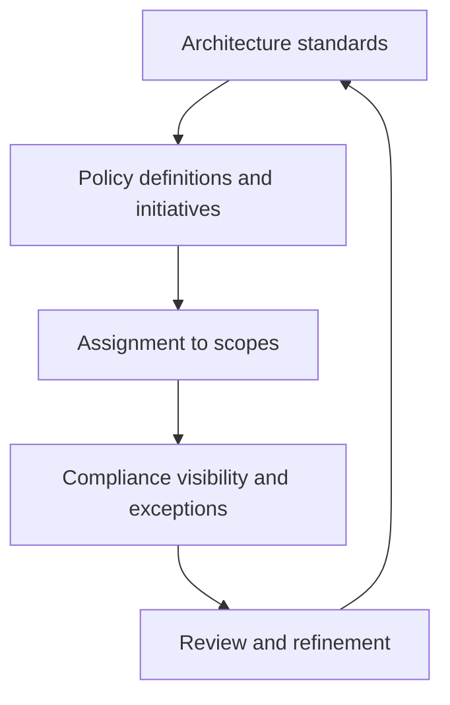

---
content_sources:
  diagrams:
    - id: policy-guardrails-diagram-1
      type: flowchart
      source: mslearn-adapted
      mslearn_url: https://learn.microsoft.com/en-us/azure/governance/policy/overview
---
# Policy and Governance Guardrails

Guardrails are the controls that keep Azure architecture decisions from eroding under day-to-day pressure. Azure Policy is a primary mechanism for expressing those controls, but the broader discipline includes ownership, exception handling, auditability, and policy as code.

## What guardrails should do

[Inferred] Governance controls should enforce minimum standards without making every workload identical. Effective guardrails:

- block clearly unacceptable configurations,
- audit conditions that need review,
- guide teams toward approved patterns,
- make exceptions explicit and time-bounded,
- scale across subscriptions and landing zones.

## Guardrail model

<!-- diagram-id: policy-guardrails-diagram-1 -->

## Built-in versus custom policies

| Option | When useful | Risk |
|---|---|---|
| Built-in policies | Common baseline requirements and fast adoption | May not fully reflect internal standards |
| Custom policies | Organization-specific controls and exceptions | Higher maintenance burden |
| Initiatives | Grouping related controls for landing zones or workload types | Can become opaque if too large |

## Policy as code workflow

1. Define architecture standards and guardrail intent.
2. Map standards to built-in or custom policy definitions.
3. Version policy definitions and assignments in source control.
4. Test in lower scopes before broad assignment.
5. Review compliance, exceptions, and false positives regularly.

## Common anti-patterns

- Creating too many custom policies when built-in coverage is sufficient.
- Using audit everywhere and never progressing to enforcement.
- Assigning policies without exception workflow or ownership.
- Allowing long-lived exceptions that quietly replace standards.
- Measuring compliance percentages without checking actual risk reduction.

## Failure modes

[Observed] Governance problems often appear as:

- subscription sprawl with inconsistent control posture,
- manual remediation after blocked deployments,
- broad exemptions granted under delivery pressure,
- security or networking decisions implemented differently across teams,
- no clear link between policy failure and architecture intent.

## Ownership

- Governance teams define minimum standards and exception rules.
- Platform teams encode and assign policy at the right scopes.
- Application teams design workloads to fit paved-road constraints or justify exceptions.
- Security teams review controls affecting identity, data, and network exposure.

## Validation checklist

- Required standards are mapped to specific policy controls.
- [Observed] Policy violations and exemptions are visible by scope and owner.
- [Measured] Compliance trend and remediation time are tracked.
- [Validated] New policies are tested before wide enforcement.
- [Correlated] Repeated exception patterns trigger architecture or platform changes.
- [Unknown] Any control without owner or escalation path is flagged.

## Microsoft Learn references

- [Azure Policy overview](https://learn.microsoft.com/en-us/azure/governance/policy/overview)
- [Cloud Adoption Framework governance](https://learn.microsoft.com/en-us/azure/cloud-adoption-framework/govern/)

## Takeaway

[Validated] Strong guardrails are clear, versioned, reviewable, and paired with an exception process that keeps governance from becoming theater.
