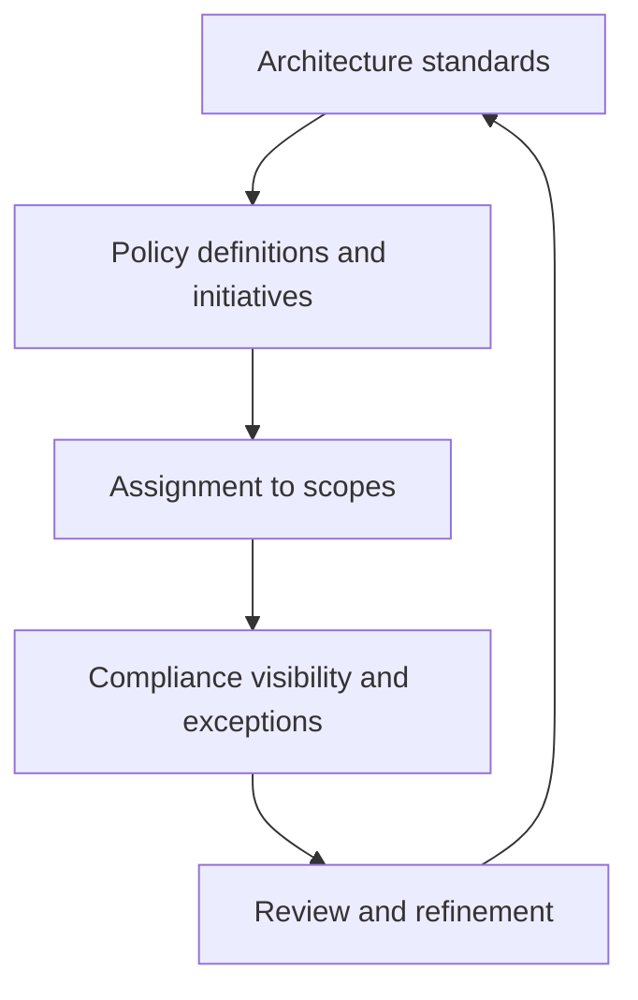

---
content_sources:
  diagrams:
    - id: policy-guardrails-diagram-1
      type: flowchart
      source: mslearn-adapted
      mslearn_url: https://learn.microsoft.com/en-us/azure/governance/policy/overview
---
# Policy and Governance Guardrails

Guardrails are the controls that keep Azure architecture decisions from eroding under day-to-day pressure. Azure Policy is a primary mechanism for expressing those controls, but the broader discipline includes ownership, exception handling, auditability, and policy as code.

## What guardrails should do

[Inferred] Governance controls should enforce minimum standards without making every workload identical. Effective guardrails:

- block clearly unacceptable configurations,
- audit conditions that need review,
- guide teams toward approved patterns,
- make exceptions explicit and time-bounded,
- scale across subscriptions and landing zones.

## Guardrail model

<!-- diagram-id: policy-guardrails-diagram-1 -->

```mermaid
flowchart TD
    A[Architecture standards] --> B[Policy definitions and initiatives]
    B --> C[Assignment to scopes]
    C --> D[Compliance visibility and exceptions]
    D --> E[Review and refinement]
    E --> A
```

## Built-in versus custom policies

| Option | When useful | Risk |
|---|---|---|
| Built-in policies | Common baseline requirements and fast adoption | May not fully reflect internal standards |
| Custom policies | Organization-specific controls and exceptions | Higher maintenance burden |
| Initiatives | Grouping related controls for landing zones or workload types | Can become opaque if too large |

## Policy as code workflow

1. Define architecture standards and guardrail intent.
2. Map standards to built-in or custom policy definitions.
3. Version policy definitions and assignments in source control.
4. Test in lower scopes before broad assignment.
5. Review compliance, exceptions, and false positives regularly.

## Common anti-patterns

- Creating too many custom policies when built-in coverage is sufficient.
- Using audit everywhere and never progressing to enforcement.
- Assigning policies without exception workflow or ownership.
- Allowing long-lived exceptions that quietly replace standards.
- Measuring compliance percentages without checking actual risk reduction.

## Failure modes

[Observed] Governance problems often appear as:

- subscription sprawl with inconsistent control posture,
- manual remediation after blocked deployments,
- broad exemptions granted under delivery pressure,
- security or networking decisions implemented differently across teams,
- no clear link between policy failure and architecture intent.

## Ownership

- Governance teams define minimum standards and exception rules.
- Platform teams encode and assign policy at the right scopes.
- Application teams design workloads to fit paved-road constraints or justify exceptions.
- Security teams review controls affecting identity, data, and network exposure.

## Validation checklist

- Required standards are mapped to specific policy controls.
- [Observed] Policy violations and exemptions are visible by scope and owner.
- [Observed] Compliance trend and remediation time are tracked.
- [Validated] New policies are tested before wide enforcement.
- [Correlated] Repeated exception patterns trigger architecture or platform changes.
- [Unknown] Any control without owner or escalation path is flagged.

## Takeaway

[Validated] Strong guardrails are clear, versioned, reviewable, and paired with an exception process that keeps governance from becoming theater.

## Prerequisites

- Documented architecture standards that the guardrails are meant to enforce.
- Access to Azure Policy (built-in and custom definitions, initiatives) and the scopes — management groups, subscriptions, landing zones — where they apply.
- An exception workflow with owner and expiry, plus compliance visibility by scope and owner.
- Named ownership across governance, platform, application, and security teams.

## When to Use

Apply guardrails wherever architecture decisions must survive day-to-day delivery pressure. Introduce or tighten controls when:

- subscription sprawl produces inconsistent control posture,
- security or networking decisions are implemented differently across teams,
- exemptions are granted repeatedly under delivery pressure,
- a new landing zone or workload type needs a consistent baseline.

## Procedure

1. Define architecture standards and the guardrail intent behind them.
2. Map each standard to a built-in or custom policy definition, grouping related controls into initiatives.
3. Version policy definitions and assignments in source control.
4. Test in lower scopes before broad assignment, moving from audit toward enforcement.
5. Review compliance, exceptions, and false positives regularly, refining definitions from what you learn.

## Verification

- Required standards are mapped to specific policy controls, and violations and exemptions are visible by scope and owner.
- [Observed] Compliance trend and remediation time are tracked.
- [Validated] New policies are tested before wide enforcement.
- [Unknown] Any control without an owner or escalation path is flagged for follow-up.

## Rollback / Troubleshooting

- If enforcement blocks legitimate delivery, fall back to audit for that control while you refine the definition — do not grant a broad, open-ended exemption.
- Diagnose the documented failure modes — audit everywhere that never progresses to enforcement, long-lived exceptions that quietly replace standards, or compliance percentages reported without checking real risk reduction.
- When repeated exception patterns appear, treat them as a trigger to change the architecture or platform capability rather than to keep exempting.

## See Also

- [Identity and governance foundations](../platform/identity-and-governance-foundations.md)
- [Infrastructure as code and environment promotion](infrastructure-as-code-and-environment-promotion.md)
- [WAF security pillar](../waf/security.md)

## Sources

- [Azure Policy overview](https://learn.microsoft.com/en-us/azure/governance/policy/overview)
- [Cloud Adoption Framework governance](https://learn.microsoft.com/en-us/azure/cloud-adoption-framework/govern/)

