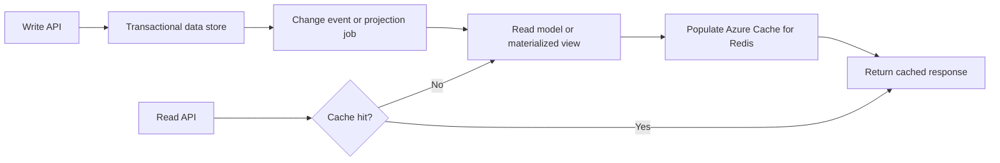

---
content_sources:
  diagrams:
    - id: cache-aside-cqrs-materialized-view-selection
      type: flowchart
      source: mslearn-adapted
      mslearn_url: https://learn.microsoft.com/en-us/azure/architecture/patterns/cache-aside
---
# Cache-Aside, CQRS, and Materialized View

Cache-aside, CQRS, and materialized view patterns improve read performance and query flexibility by separating how data is written from how it is served for different access paths. On Azure, these patterns are often combined so transactional systems can remain authoritative while optimized read models absorb fan-out, aggregation, and hot-query demand.

## Fundamentals

This pattern family usually includes:

- A write model that protects transactional consistency.
- A read model optimized for specific query shapes or user experiences.
- A cache that stores frequently requested data near the consumer.
- Materialized views that precompute joins, aggregates, or denormalized projections.

The main trade-off is accepting propagation delay and invalidation complexity in exchange for faster and cheaper reads.

## Why teams adopt cache-aside, CQRS, and materialized view

- Reduce load on transactional databases.
- Support different read and write scalability characteristics.
- Serve denormalized or aggregated queries efficiently.
- Tailor read models to APIs, dashboards, and search experiences.

## Azure service selection

| Service | Best for | Key trade-off |
|---|---|---|
| Azure Cache for Redis | Low-latency cache-aside reads and hot-key offload | Requires invalidation and eviction discipline |
| Azure Cosmos DB | Read-optimized denormalized models and globally distributed projections | Partition design and consistency settings need care |
| Azure SQL Database | Authoritative relational writes and materialized relational projections | Scale-out read patterns can still need caching or replicas |

## Pattern boundaries

### Cache-aside

- The application checks the cache first and loads from the primary store on a miss.
- Best when read patterns are repetitive and staleness tolerance is bounded.

### CQRS

- Commands update the write model while queries use a separate read model.
- Best when read traffic, query shape, or security boundaries differ from write operations.

### Materialized view

- Precomputed projections reduce runtime joins and aggregation work.
- Best when the same expensive query is served repeatedly.

## Read-model freshness

Teams should decide what stale means before implementation.

- Define acceptable projection lag by workload.
- Choose event-driven, scheduled, or change-feed update paths.
- Monitor cache hit ratio, projection lag, and rebuild time.

## Topology example

<!-- diagram-id: cache-aside-cqrs-materialized-view-selection -->

## Design guardrails

- Keep one authoritative write model even when many read models exist.
- Design cache keys, eviction rules, and invalidation paths explicitly.
- Build projections to be replayable and safe to rebuild.
- Separate user-facing freshness requirements from internal analytics latency.
- Protect read models from becoming shadow sources of truth for writes.

## Anti-patterns

- Using the cache as the only copy of important business data.
- Creating CQRS complexity when the workload has simple CRUD behavior.
- Building materialized views without a replay or backfill strategy.
- Letting query consumers write directly into read stores.
- Ignoring hot partitions or hot keys while assuming the cache solves everything.

## Evidence considerations

- [Documented] Microsoft Learn recommends cache-aside to improve performance when repeated reads target the same data.
- [Documented] CQRS is appropriate when read and write workloads have different scaling and model requirements.
- [Observed] Projection lag and invalidation mistakes are common causes of stale-data incidents.
- [Validated] Load tests should prove cache effectiveness and confirm the read model can be rebuilt without business disruption.

## When not to use

- The dataset is small and simple enough for direct reads from one store.
- The workload cannot tolerate asynchronous projection lag.
- The team lacks operational ownership for cache invalidation and projection rebuilds.

## Microsoft Learn reference

- https://learn.microsoft.com/en-us/azure/architecture/patterns/cache-aside
- https://learn.microsoft.com/en-us/azure/architecture/patterns/cqrs

## Takeaway

Adopt cache-aside, CQRS, and materialized views when one authoritative write path must serve many fast, specialized read experiences. On Azure, the pattern works best when teams define freshness, replay, and invalidation rules before optimizing for speed.
