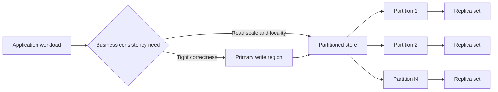

---
content_sources:
  diagrams:
    - id: consistency-partitioning-replication-tradeoffs
      type: flowchart
      source: mslearn-adapted
      mslearn_url: https://learn.microsoft.com/en-us/azure/architecture/best-practices/data-partitioning
---
# Consistency, Partitioning, and Replication

Consistency, partitioning, and replication are the core data architecture choices that determine whether a system scales cleanly, fails predictably, and preserves the right business guarantees. On Azure, these choices shape how teams select data stores, define fault domains, and balance throughput against correctness and latency.

## Fundamentals

This pattern area usually includes:

- Consistency choices that define how quickly replicas and readers converge on the latest state.
- Partitioning keys that distribute data and traffic across storage or compute boundaries.
- Replication strategies that improve durability, locality, and availability.
- Operational controls for failover, rebalancing, and hot-partition detection.

The primary design question is not whether all three are needed, but which trade-offs are acceptable for each workload boundary.

## Why teams adopt consistency, partitioning, and replication patterns

- Scale beyond single-node limits.
- Reduce blast radius from localized failures.
- Place data closer to users or workloads.
- Match consistency guarantees to business-critical operations.

## Azure service selection

| Service | Best for | Key trade-off |
|---|---|---|
| Azure Cosmos DB | Tunable consistency, partitioned scale, and multi-region replication | Partition key mistakes are costly to fix later |
| Azure SQL Database | Strong relational guarantees with replicas and read scale options | Elastic partitioning patterns are more application-driven |
| Azure Database for PostgreSQL | Relational workloads needing read replicas and flexible schema design | Cross-shard and geo-distributed patterns add application complexity |

## Consistency model choices

### Stronger consistency

- Better for balance changes, reservations, and decisions that must not read stale state.
- Usually costs more in latency, write coordination, or regional flexibility.

### Weaker or bounded consistency

- Better for global read scale, user feeds, and noncritical projections.
- Requires the business to tolerate stale reads or convergence windows.

## Partitioning strategy basics

- Choose a partition key that spreads both data volume and request rate.
- Design for tenant growth, time skew, and hot-key behavior.
- Keep cross-partition queries and transactions explicit rather than accidental.

## Topology example

<!-- diagram-id: consistency-partitioning-replication-tradeoffs -->

## Design guardrails

- Document which operations require strong guarantees and which can be eventually consistent.
- Validate partition keys with expected production traffic, not only data volume.
- Separate read replicas from write-authority decisions in runbooks and diagrams.
- Test failover, replica lag, and repartitioning triggers before scale events occur.
- Track hot partitions, skew, and cross-partition cost as first-class metrics.

## Anti-patterns

- Choosing a partition key from convenience instead of real access patterns.
- Assuming replication alone eliminates latency or consistency problems.
- Mixing critical and noncritical consistency requirements inside one undifferentiated data path.
- Treating read replicas as safe for every decision flow.
- Waiting until hot partitions appear in production before designing mitigation.

## Evidence considerations

- [Documented] Microsoft Learn emphasizes that partitioning strategy should align with scale, availability, and query patterns.
- [Inferred] Consistency requirements should be classified per business operation, not per database brand.
- [Observed] Hot partitions and uneven tenant growth are common failure points in otherwise scalable designs.
- [Validated] Resilience tests should measure replica lag, failover behavior, and partition rebalancing impact.

## When not to use

- The workload is small enough that a single-node relational design remains sufficient.
- Business stakeholders have not defined which operations truly require strong consistency.
- The team cannot operate cross-region failover or partition hot-spot mitigation.

## Microsoft Learn reference

- https://learn.microsoft.com/en-us/azure/architecture/best-practices/data-partitioning
- https://learn.microsoft.com/en-us/azure/cosmos-db/consistency-levels

## Takeaway

Treat consistency, partitioning, and replication as linked architecture decisions rather than isolated database settings. On Azure, the right design starts with business correctness boundaries, then chooses partition and replication strategies that scale without hiding failure modes.
