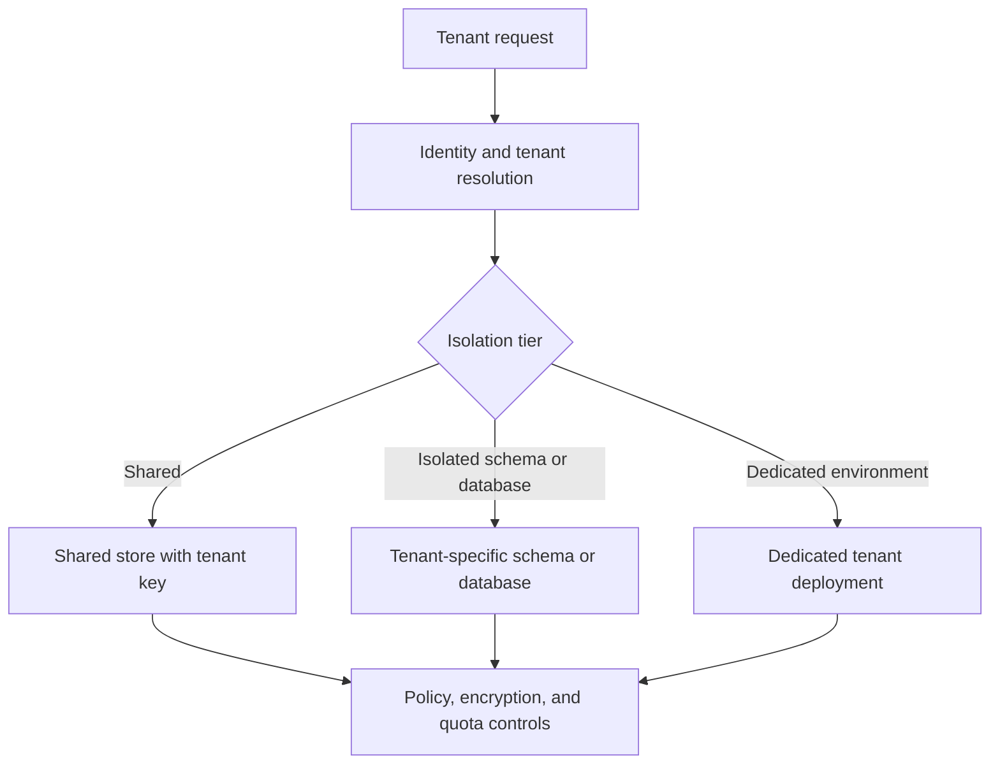

---
content_sources:
  diagrams:
    - id: multi-tenant-data-isolation-models
      type: flowchart
      source: mslearn-adapted
      mslearn_url: https://learn.microsoft.com/en-us/azure/architecture/guide/multitenant/overview
---
# Multi-Tenant Data Isolation

Multi-tenant data isolation patterns determine how securely and efficiently many customers share the same platform while preserving tenant boundaries for data access, performance, and operations. On Azure, isolation choices often span identity, database topology, encryption boundaries, and operational blast radius.

## Fundamentals

This pattern area usually includes:

- A tenancy model such as shared database, shared infrastructure with isolated schema, or dedicated tenant store.
- Tenant identity and authorization controls tied to every data access path.
- Data partitioning and encryption boundaries that reflect compliance and noisy-neighbor risk.
- Operational procedures for onboarding, backup, restore, and offboarding by tenant.

The key trade-off is balancing isolation strength against cost, operational complexity, and fleet scale.

## Why teams adopt multi-tenant data isolation patterns

- Serve many customers from a common platform.
- Limit cross-tenant exposure risk.
- Match isolation level to compliance tiers and tenant value.
- Reduce cost for smaller tenants while preserving upgrade efficiency.

## Azure service selection

| Service | Best for | Key trade-off |
|---|---|---|
| Azure SQL Database | Shared database, schema isolation, or database-per-tenant designs | Higher tenant count can complicate fleet operations |
| Azure Cosmos DB | Tenant partitioning with elastic scale and geo-distribution | Partition strategy must prevent tenant hot spots |
| Azure Key Vault | Tenant-specific key or secret segregation when stronger crypto boundary is required | More tenant-specific artifacts increase management overhead |

## Isolation model choices

### Shared data store with logical isolation

- Lowest unit cost and simplest fleet footprint.
- Requires strong authorization filters, testing, and noisy-neighbor controls.

### Schema or database per tenant

- Stronger separation and easier tenant-specific recovery.
- Increases provisioning, migration, and monitoring overhead.

### Dedicated tenant deployment

- Strongest isolation and customization path.
- Highest cost and operational sprawl.

## Boundary design basics

- Carry tenant context through APIs, jobs, caches, and logs.
- Ensure backups, exports, and analytics pipelines preserve tenant boundaries.
- Define how tenant data moves across environments and regions.

## Topology example

<!-- diagram-id: multi-tenant-data-isolation-models -->

## Design guardrails

- Make tenant context mandatory in authorization and data-access layers.
- Separate isolation tiers by clear business and compliance rules.
- Validate restore, export, and deletion procedures at tenant scope.
- Control noisy-neighbor risk with quotas, partition design, and workload shaping.
- Keep admin tooling tenant-aware to avoid accidental cross-tenant operations.

## Anti-patterns

- Relying on the UI to enforce tenant boundaries.
- Mixing shared and dedicated tenant rules without explicit tiering.
- Using one cache key or background queue without tenant scoping.
- Designing backups that cannot restore or delete one tenant independently.
- Moving sensitive tenants into a shared model without a compliance review.

## Evidence considerations

- [Documented] Microsoft Learn frames multitenant architecture around isolation, scale, operations, and cost trade-offs.
- [Inferred] Isolation should be tiered because not every tenant needs the same cost or compliance boundary.
- [Observed] Cross-tenant leakage often appears first in logging, caching, analytics, or admin tooling rather than in the core database path.
- [Validated] Access tests and tenant-scoped restore drills should prove boundaries hold during normal and break-glass operations.

## When not to use

- The workload serves one organization and has no credible multi-tenant roadmap.
- Regulatory demands require physically dedicated environments for every tenant.
- The team cannot enforce tenant context consistently across synchronous and asynchronous paths.

## Microsoft Learn reference

- https://learn.microsoft.com/en-us/azure/architecture/guide/multitenant/overview
- https://learn.microsoft.com/en-us/azure/architecture/guide/multitenant/approaches/storage-data

## Takeaway

Choose multi-tenant data isolation by matching the tenant risk profile to the minimum viable boundary that stays operable at scale. On Azure, successful designs treat tenant context, restoreability, and noisy-neighbor controls as part of the data architecture from day one.
