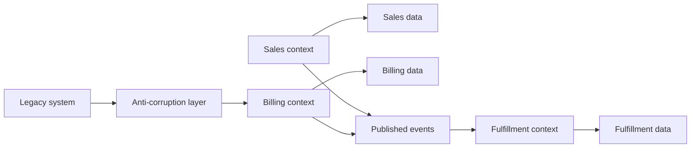

---
content_sources:
  diagrams:
    - id: bounded-context-ownership-map
      type: flowchart
      source: mslearn-adapted
      mslearn_url: https://learn.microsoft.com/en-us/azure/architecture/microservices/model/domain-analysis
---
# Bounded Contexts and Data Ownership

Bounded contexts define where a domain model is valid and who owns the language, logic, and data for that part of the system. In Azure architectures, this concept prevents hidden coupling and is one of the strongest defenses against the shared-database anti-pattern.

## Core decision

How should business capabilities be separated so each service or module owns its own model and data without leaking assumptions into neighboring domains?

## Why bounded contexts matter

- Different business capabilities often use the same term in different ways.
- Teams need autonomy to evolve rules without coordinated schema changes across the entire estate.
- Clear ownership makes reliability, cost, and change accountability visible.

## Data ownership principle

Each service or bounded context should own the persistence of its authoritative data.

- Other services consume published contracts, APIs, or events.
- Cross-context queries should be materialized or composed, not implemented by direct table sharing.
- Reporting stores can aggregate multiple sources, but they are not the transactional source of truth.

`[Documented]` Microsoft guidance for microservices emphasizes domain analysis and service boundaries before implementation detail.

## Azure implications

### Service boundary choices

- Azure SQL Database works well when a bounded context needs relational guarantees and its own schema lifecycle.
- Azure Cosmos DB can suit contexts with flexible document models and globally distributed reads.
- Service Bus or Event Grid can publish state changes so other contexts react without querying owned tables.

### Access control

- Managed Identity should be scoped per service.
- Key Vault access policies or RBAC should align with owning service identity, not a shared application principal.
- Private Endpoints can reinforce data store access boundaries when network isolation matters.

## Anti-corruption layers

An anti-corruption layer protects a new or separate domain model from legacy assumptions.

- Translate terminology and formats.
- Normalize identifiers and lifecycle states.
- Prevent external data models from becoming internal design constraints.

This is especially important during incremental migration when a modern service still depends on a legacy contract.

## Boundary model

<!-- diagram-id: bounded-context-ownership-map -->

## Decision signals for a good boundary

| Signal | Interpretation |
|---|---|
| Changes usually affect one capability only | Boundary is likely useful |
| Ownership and on-call map cleanly to a domain | Boundary is operationally meaningful |
| Schema changes require multi-team coordination | Boundary is probably weak |
| Multiple services read and write the same tables | Ownership is broken |

## Common anti-patterns

- Shared database with service logos added on top.
- Canonical enterprise data model imposed on all domains.
- Read access granted freely because "it is only reporting."
- Integration by direct SQL instead of contracts or events.
- Reusing legacy field semantics without translation.

## Trade-offs

- `[Inferred]` Strong ownership can increase data duplication and event propagation latency.
- `[Observed]` It reduces coordination cost and schema contention over time.
- `[Correlated]` Teams with explicit data ownership usually achieve clearer accountability during incidents.
- `[Assumed]` Additional reporting patterns may be needed when many cross-context queries exist.

## When not to over-separate

- The domain is still immature and boundaries are changing weekly.
- The team is very small and cross-context duplication would add more cost than value.
- Strong transactional consistency across functions is still the dominant business need.

## Practical Azure checklist

- Define the bounded context and owning team.
- Assign one authoritative data store or schema ownership model.
- Expose contracts through APIs, events, or replicated read models.
- Add anti-corruption layers where external or legacy models differ.
- Align identity, secrets, and network access with ownership boundaries.

## Microsoft Learn reference

- https://learn.microsoft.com/en-us/azure/architecture/microservices/model/domain-analysis

## Takeaway

Bounded contexts are valuable only when they change ownership, contracts, and data access in practice. On Azure, the most important proof of a real boundary is owned data plus controlled integration, not separate code repositories alone.
