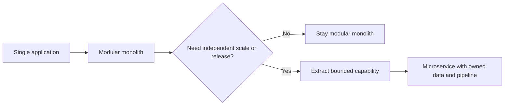

---
content_sources:
  diagrams:
    - id: modular-monolith-vs-microservices-map
      type: flowchart
      source: mslearn-adapted
      mslearn_url: https://learn.microsoft.com/en-us/azure/architecture/microservices/
---
# Modular Monolith vs Microservices

Teams often jump from a tightly coupled monolith directly to microservices. In Azure, that move only pays off when the business and operating model truly require independent scaling, release cadence, and ownership boundaries. Otherwise, a modular monolith can deliver many of the same design benefits with far less distributed complexity.

## Core decision

Should the system remain a monolith, evolve into a modular monolith, or split into independently deployed microservices?

## When a monolith is better

A monolith is usually better when these conditions hold:

- One team owns most of the change surface.
- End-to-end transactions dominate the workload.
- The scale profile is similar across features.
- Release coordination is not a bottleneck.
- Operational maturity for distributed tracing, messaging, and resilience is limited.

[Inferred] For many internal and early-stage business systems, the main risk is premature distribution, not insufficient decomposition.

## Why modular monolith is a strong intermediate state

A modular monolith keeps single-process deployment while enforcing internal boundaries.

- Modules align to business capabilities.
- Shared libraries are minimized.
- Internal contracts become explicit.
- Database ownership can begin at schema or table boundary level.
- Teams can identify future extraction points without paying network and consistency costs yet.

## When microservices are justified

Microservices become more appropriate when:

- Different domains have independent release cadences.
- Separate teams own different bounded capabilities.
- Scaling characteristics differ materially by capability.
- Fault isolation is critical.
- Polyglot runtime or data choices are justified by business needs.
- Platform engineering can support CI/CD, observability, identity, and service-to-service security at scale.

## Decomposition criteria

| Criterion | Monolith or modular monolith signal | Microservices signal |
|---|---|---|
| Team boundaries | Mostly one team | Many autonomous teams |
| Scaling needs | Similar scale across modules | Uneven scale by capability |
| Deployment independence | Low urgency | High urgency |
| Transaction model | Strong end-to-end consistency | Eventual consistency acceptable |
| Operational maturity | Limited | Strong platform and SRE capability |

## Azure implementation implications

### Modular monolith on Azure

- Common fits: App Service, Azure Container Apps, or AKS if container orchestration is already justified.
- Data often sits in Azure SQL Database or managed PostgreSQL.
- Internal modularity is enforced in code, not through network calls.
- Azure Front Door or Application Gateway provides ingress, but not internal service routing complexity.

### Microservices on Azure

- Common fits: AKS or Azure Container Apps for service hosting.
- Service Bus or Event Grid is often introduced for asynchronous interaction.
- Azure Monitor, Application Insights, and distributed tracing become mandatory operating capabilities.
- Managed Identity and Key Vault should replace embedded credentials early.

## Common migration path

1. Monolith with implicit modules
2. Modular monolith with explicit boundaries
3. Extract one high-value service at a time
4. Introduce asynchronous messaging where coupling should decrease
5. Reassess whether additional service extraction is still justified

## Anti-patterns

- Splitting by technical layer instead of business capability.
- Creating many services that still require coordinated releases.
- Keeping a shared database while claiming service independence.
- Forcing synchronous calls across every service boundary.
- Adopting Kubernetes before proving a need for container orchestration.

## Architecture comparison

<!-- diagram-id: modular-monolith-vs-microservices-map -->

## Trade-offs

- [Documented] Microservices improve independent deployment and scalability for the right workloads.
- [Observed] Network hops, observability overhead, and platform cost rise with service count.
- [Observed] Teams frequently underestimate testing and failure-handling complexity in distributed systems.
- [Validated] A modular monolith can be a durable target architecture, not merely a temporary compromise.

## When not to choose microservices

- The system is still discovering its domain boundaries.
- The team cannot support service-level SLOs and tracing.
- Scaling problems are not yet isolated to distinct capabilities.
- The driver is organizational fashion rather than architecture evidence.

## Microsoft Learn reference

- https://learn.microsoft.com/en-us/azure/architecture/microservices/

## Takeaway

Choose microservices only when business boundaries, scaling asymmetry, and operational maturity all justify distributed complexity. Otherwise, a modular monolith is often the more Azure-practical design.
