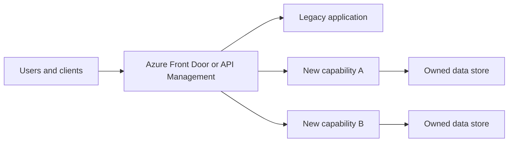

---
content_sources:
  diagrams:
    - id: strangler-fig-flow
      type: flowchart
      source: mslearn-adapted
      mslearn_url: https://learn.microsoft.com/en-us/azure/architecture/patterns/strangler-fig
---
# Strangler Fig Migration

The Strangler Fig pattern modernizes a legacy system incrementally by routing selected capabilities to new services while the remaining functionality stays on the old platform. In Azure, this pattern is especially practical when an estate cannot tolerate the risk of a big-bang rewrite.

## Core idea

Instead of replacing the entire application in one cutover, put a controlled routing layer in front of the legacy system and migrate capability by capability.

## When to use Strangler Fig

- Legacy functionality is business critical and cannot accept long freeze windows.
- Domain boundaries can be carved out incrementally.
- Teams need to learn the target platform while keeping current operations stable.
- The current system contains valuable business logic that must be preserved during transition.

## When to prefer a big-bang rewrite

A big-bang rewrite is still possible when:

- The existing system is small and well understood.
- The cutover window is acceptable.
- Regulatory or contractual constraints require a complete platform replacement by a fixed date.
- There is little value in keeping the old runtime available during migration.

`[Inferred]` Most enterprise workloads are poor candidates for big-bang rewrites because hidden dependencies surface late.

## Azure implementation pattern

### Front-door layer

- Azure Front Door can route by host, path, or origin health at global scale.
- Azure API Management can mediate API contracts, policies, authentication, throttling, and phased backend migration.

### Migration slices

- Carve out a business capability, not a technical tier.
- Route only the selected endpoint or journey to the new service.
- Keep authentication, telemetry correlation, and rollback paths consistent.

### Data transition

- Start with read replication, synchronization, or change-data capture where feasible.
- Move write ownership only when a capability boundary is stable.
- Avoid dual-write unless compensating logic and reconciliation are explicit.

## Recommended phases

1. Place routing facade in front of legacy entry points.
2. Establish shared identity, logging, and request correlation.
3. Extract low-risk, high-learning capabilities first.
4. Validate performance and rollback for each slice.
5. Retire legacy endpoints only after operational evidence is strong.

## Routing model

<!-- diagram-id: strangler-fig-flow -->

## Decision criteria

| Decision point | Strangler signal | Big-bang signal |
|---|---|---|
| Risk tolerance | Low cutover risk needed | One-time cutover acceptable |
| Domain clarity | Some boundaries known | Entire redesign already proven |
| Operational continuity | Legacy must stay live | Legacy can be retired quickly |
| Team learning curve | Platform transition in progress | New platform already mastered |

## Common anti-patterns

- Routing around domain boundaries and creating a maze of exceptions.
- Extracting UI fragments without fixing backend ownership.
- Keeping authentication and authorization inconsistent between old and new paths.
- Performing dual writes without reconciliation evidence.
- Declaring migration complete while critical shared dependencies still live in the monolith.

## Evidence to collect per slice

- `[Documented]` The migrated capability, contract, and rollback path.
- `[Observed]` Routing behavior, errors, and operational support burden.
- `Measured` Latency, success rate, and cost before and after extraction.
- `[Validated]` Failback and incident drill outcomes.

## Azure service considerations

- Front Door is strong for global HTTP ingress and regional failover concerns.
- API Management is strong where contract mediation, productization, and policy control matter.
- Service Bus can decouple new capabilities from legacy transaction timing.
- Application Insights helps compare legacy and modernized paths under the same journey.

## When not to use this pattern

- The system has no meaningful seams and no routing control can be inserted.
- Synchronization complexity exceeds the value of incremental migration.
- The business requires immediate retirement of the legacy estate.

## Microsoft Learn reference

- https://learn.microsoft.com/en-us/azure/architecture/patterns/strangler-fig

## Takeaway

Strangler Fig is the default modernization pattern when risk, continuity, and learning matter more than architectural purity. In Azure, Front Door and API Management make incremental redirection practical, but domain slicing and data ownership still determine success.
