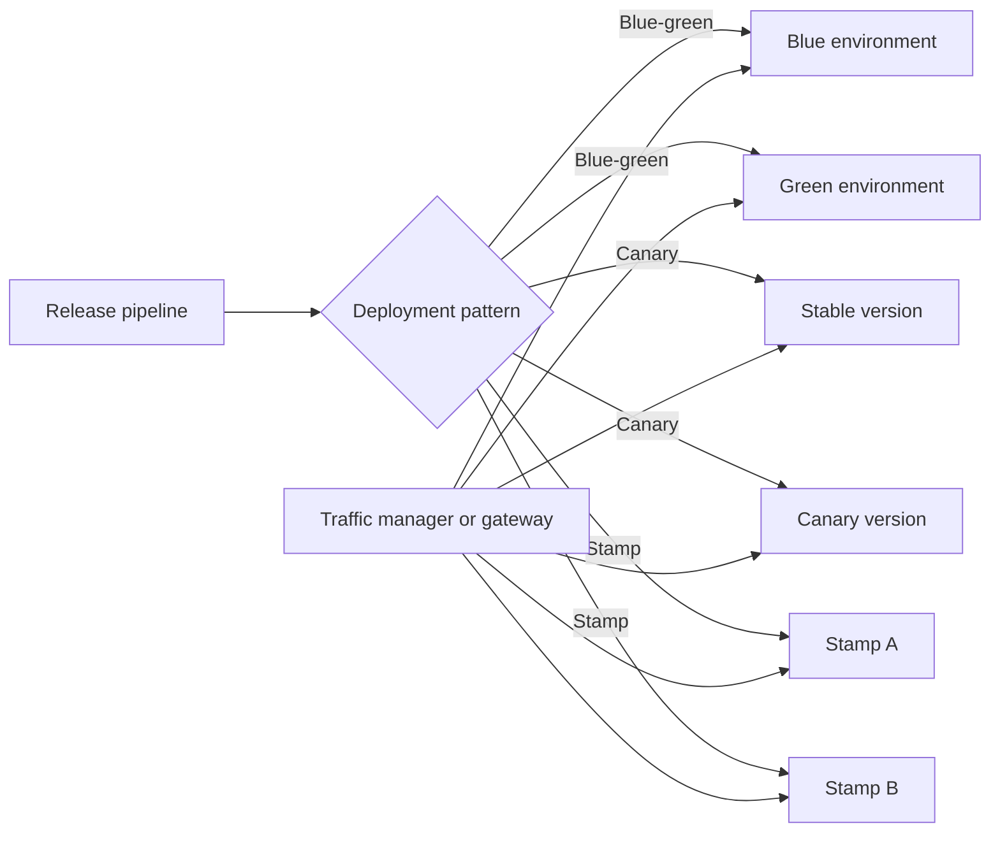

---
content_sources:
  diagrams:
    - id: deployment-rollout-pattern-selection
      type: flowchart
      source: mslearn-adapted
      mslearn_url: https://learn.microsoft.com/en-us/azure/architecture/guide/aks/blue-green-deployment-for-aks
---
# Blue-Green, Canary, and Stamp Patterns

Blue-green, canary, and stamp patterns are deployment approaches that reduce change risk by controlling how new versions are introduced, validated, and isolated. On Azure, teams use these patterns to shift traffic gradually, preserve rollback speed, and repeat proven deployment units across regions or tenants.

## Fundamentals

This pattern family usually includes:

- Parallel environments or instances that let old and new versions coexist.
- Traffic steering that controls who receives the new release.
- Health and rollback criteria tied to observable signals.
- Reusable deployment units, or stamps, that can be repeated consistently.

The shared goal is safer release progression, but each pattern optimizes a different balance of cost, isolation, and rollout precision.

## Why teams adopt blue-green, canary, and stamp patterns

- Reduce release blast radius.
- Shorten rollback time.
- Validate new versions with real traffic before broad exposure.
- Replicate a proven platform unit across scale or geography.

## Azure service selection

| Service | Best for | Key trade-off |
|---|---|---|
| Azure Kubernetes Service | Blue-green and canary rollouts with ingress or service mesh traffic control | Requires mature observability and release automation |
| Azure Front Door | Global traffic steering across versions, regions, or stamps | Application and session behavior still need careful design |
| Azure App Service deployment slots | Simpler blue-green style swaps for web workloads | Less flexible than full multi-stamp platform patterns |

## Pattern choices

### Blue-green

- Run old and new versions side by side, then switch traffic.
- Best when rollback speed matters more than infrastructure cost efficiency.

### Canary

- Send a controlled percentage or cohort of traffic to the new version first.
- Best when progressive exposure and signal-based promotion matter.

### Stamp

- Deploy the same architecture unit repeatedly for scale, region, or tenant segmentation.
- Best when growth and fault isolation depend on repeatable deployment cells.

## Rollout decision model

- Use blue-green when the environment can afford duplicate capacity.
- Use canary when you want incremental exposure with strong telemetry.
- Use stamps when the architecture itself must scale by repeating a bounded unit.

## Topology example

<!-- diagram-id: deployment-rollout-pattern-selection -->

## Design guardrails

- Define measurable promotion and rollback criteria before rollout starts.
- Keep schema, configuration, and feature-flag compatibility aligned with the deployment pattern.
- Make traffic shifts reversible and observable.
- Standardize stamp composition so each unit is deployable and supportable in the same way.
- Test release automation and rollback paths under failure, not only during happy-path demos.

## Anti-patterns

- Calling a release blue-green when rollback still depends on manual rebuilds.
- Running canary without cohort-aware metrics or error budgets.
- Creating custom stamps that drift until each one becomes snowflake infrastructure.
- Shifting traffic before dependency compatibility is proven.
- Using progressive delivery without a plan for data version rollback or forward compatibility.

## Evidence considerations

- [Documented] Microsoft guidance uses blue-green and progressive deployment to reduce production release risk.
- [Inferred] Stamp architecture is most valuable when repeated units provide a clear fault or growth boundary.
- [Observed] Deployment failures often come from configuration drift and incompatible dependencies rather than application code alone.
- [Validated] Release rehearsals should prove traffic shift, rollback, and stamp replacement work within the target recovery window.

## When not to use

- The workload is too small to justify duplicate capacity or advanced rollout tooling.
- The team lacks telemetry needed to decide whether promotion is safe.
- Shared data changes cannot support version overlap or gradual exposure.

## Microsoft Learn reference

- https://learn.microsoft.com/en-us/azure/architecture/guide/aks/blue-green-deployment-for-aks
- https://learn.microsoft.com/en-us/azure/architecture/framework/mission-critical/mission-critical-deployment-testing

## Takeaway

Choose blue-green, canary, and stamp patterns based on how much rollout isolation, traffic control, and repeatable scale your workload needs. On Azure, the pattern only pays off when observability, compatibility, and rollback automation are treated as release prerequisites.
