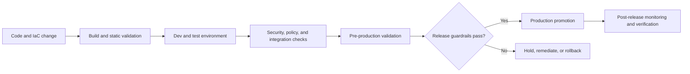

---
content_sources:
  diagrams:
    - id: environment-promotion-release-guardrails-flow
      type: flowchart
      source: mslearn-adapted
      mslearn_url: https://learn.microsoft.com/en-us/azure/architecture/framework/mission-critical/mission-critical-deployment-testing
---
# Environment Promotion and Release Guardrails

Environment promotion and release guardrails define how changes move from lower environments to production with evidence, controls, and rollback readiness at each stage. On Azure, the pattern links infrastructure-as-code, policy enforcement, deployment checks, and operational sign-off so promotion reflects proven readiness instead of optimism.

## Fundamentals

This pattern usually includes:

- A promotion path across environments with clear entry and exit criteria.
- Automated checks for policy, security, testing, and configuration drift.
- Release approvals or quality gates tied to risk, not habit.
- Rollback, hold, and incident procedures that are tested before production use.

The objective is not more bureaucracy. The objective is repeatable evidence that a release is safe enough to promote.

## Why teams adopt environment promotion and release guardrails

- Reduce production change failure rate.
- Catch defects and policy drift before broad exposure.
- Preserve traceability for who promoted what and why.
- Align platform, security, and application controls in one delivery path.

## Azure service selection

| Service | Best for | Key trade-off |
|---|---|---|
| Azure DevOps or GitHub Actions | Automated pipelines, approvals, and environment checks | Pipeline quality depends on disciplined gate design |
| Azure Policy | Enforcing baseline controls before or during promotion | Policy exceptions require deliberate governance |
| Azure Monitor | Release health signals, alerts, and rollback triggers | Signals must be tied to actionable thresholds |

## Promotion model

### Lower environments

- Validate build integrity, unit and integration coverage, and baseline policy compliance.
- Use production-like dependencies where meaningful risks need early discovery.

### Pre-production

- Validate performance, failover, security, and rollback readiness.
- Ensure configuration, identity, and network posture match production intent.

### Production promotion

- Promote only when checks pass and operational ownership is ready.
- Keep rollback and freeze criteria visible during the release window.

## Topology example

<!-- diagram-id: environment-promotion-release-guardrails-flow -->

## Design guardrails

- Define objective promotion criteria for quality, security, policy, and operability.
- Keep environment differences intentional, documented, and as small as practical.
- Version application code, infrastructure, and configuration together where possible.
- Require rollback steps and release ownership before approval to promote.
- Use post-release verification windows and alerts to confirm the change is truly healthy.

## Anti-patterns

- Treating promotion as a manual copy process without immutable artifacts.
- Allowing environment drift to grow until lower-environment results stop predicting production behavior.
- Using approvals without evidence-based checks.
- Promoting infrastructure and application changes on unrelated timelines without compatibility controls.
- Declaring success at deploy-complete instead of after production verification.

## Evidence considerations

- [Documented] Microsoft guidance for mission-critical workloads emphasizes staged validation, safe deployment, and continuous verification.
- [Inferred] Promotion quality depends more on gate relevance than on the number of gates.
- [Observed] Configuration drift and missing rollback drills are frequent contributors to failed releases.
- [Validated] The release process should be rehearsed end to end, including hold, rollback, and post-release validation paths.

## When not to use

- Never skip guardrails for high-impact production changes because the delivery window is short.
- Not as a heavyweight process for trivial internal prototypes with no shared production path.
- Not as a substitute for engineering quality when the pipeline only automates weak checks.

## Microsoft Learn reference

- https://learn.microsoft.com/en-us/azure/architecture/framework/mission-critical/mission-critical-deployment-testing
- https://learn.microsoft.com/en-us/azure/well-architected/operational-excellence/safe-deployments

## Takeaway

Use environment promotion and release guardrails to turn deployment progression into an evidence-based operating decision. On Azure, effective promotion combines automated checks, policy enforcement, and post-release verification so production change becomes predictable instead of hopeful.
