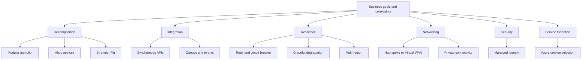

---
content_sources:
  diagrams:
    - id: patterns-overview-map
      type: flowchart
      source: self-generated
      justification: "Synthesized overview of architecture pattern categories used in this guide."
      based_on:
        - https://learn.microsoft.com/en-us/azure/architecture/
        - https://learn.microsoft.com/en-us/azure/architecture/guide/technology-choices/
        - https://learn.microsoft.com/en-us/azure/architecture/microservices/
---
# Architecture Patterns

This section organizes practical Azure architecture patterns into decisions that teams repeatedly face: how to decompose systems, integrate services, design for resilience, connect networks securely, and choose Azure services deliberately.

The goal is not to prescribe one universal design. The goal is to make trade-offs explicit so a team can choose a pattern that fits business criticality, team maturity, scale targets, and operating model.

## What this section covers

- Decomposition patterns for deciding service boundaries and migration paths.
- Integration patterns for synchronous APIs, messaging, and events.
- Resilience patterns for retries, failover, load shaping, and graceful degradation.
- Networking patterns for connectivity choices and private access.
- Security patterns for identity-first access and secrets flow.
- Service selection patterns for mapping architecture intent to Azure services.

## How to use these pattern guides

1. Start with the decision question, not the Azure service name.
2. Identify constraints such as latency, compliance, cost, or required uptime.
3. Compare the candidate patterns and their failure modes.
4. Map the chosen pattern to Azure services only after the architectural direction is clear.

>[!tip]
>Use the pattern pages together with [service selection guidance](service-selection-patterns.md) and workload-specific guidance in `docs/workload-guides/`.

## Pattern categories in this guide

| Category | Focus | Representative decisions |
|---|---|---|
| Decomposition | Boundaries and migration | Monolith vs microservices, bounded contexts, strangler migration |
| Integration | Communication style | Request-response, events, queues, orchestration |
| Resilience | Failure handling | Retry, circuit breaker, bulkhead, multi-region failover |
| Networking | Connectivity design | Hub-spoke, Virtual WAN, private connectivity |
| Security | Trust and secret flow | Managed identity, secret handling, workload access patterns |
| Service Selection Patterns | Azure mapping choices | Service fit by architecture intent and workload constraints |

## Decision model

Architecture patterns are rarely right or wrong in isolation. They are conditionally appropriate.

- `[Documented]` Microsoft Learn generally describes the baseline pattern and recommended Azure building blocks.
- `[Inferred]` The best fit often depends on team structure, release cadence, and operational maturity more than on raw service features.
- `[Validated]` The most reliable pattern choice comes from drills, performance tests, chaos tests, and rollback exercises.

## Pattern relationship map

<!-- diagram-id: patterns-overview-map -->

## Recommended reading order

### If you are designing a new workload

1. [Service selection patterns](service-selection-patterns.md)
2. Decomposition guidance
3. Integration guidance
4. Resilience guidance
5. Networking, security, and service selection guidance

### If you are modernizing an existing workload

1. [Strangler Fig migration](decomposition/strangler-fig-migration.md)
2. [Bounded contexts and data ownership](decomposition/bounded-contexts-and-data-ownership.md)
3. [Synchronous vs asynchronous integration](integration/synchronous-vs-asynchronous.md)
4. [Identity-first and secrets flow](security/identity-first-and-secrets-flow.md)

## Common mistakes across all pattern types

- Starting from a preferred Azure service and backfilling the architecture rationale.
- Splitting services before ownership, observability, and release isolation exist.
- Adding private networking everywhere without an operating model for DNS, routing, and troubleshooting.
- Choosing active-active regions without validating state consistency, failover, and cost tolerances.
- Treating pattern adoption as a one-time design choice instead of a revisitable operating decision.

## Evidence expectations

When applying any pattern in this guide, collect evidence beyond diagrams:

- `[Measured]` Latency, throughput, cost, and recovery time objectives.
- `[Observed]` Incident trends, deployment frequency, and dependency failures.
- `[Correlated]` Signals that link architecture choices to production pain points.
- `[Unknown]` Explicit gaps that still need tests or drills.

## Microsoft Learn references

- https://learn.microsoft.com/en-us/azure/architecture/
- https://learn.microsoft.com/en-us/azure/architecture/guide/technology-choices/
- https://learn.microsoft.com/en-us/azure/well-architected/

## Next steps

- Use [service-selection-patterns.md](service-selection-patterns.md) to frame architecture choices.
- Use the subfolders in this section to evaluate specific pattern families.
- Use workload guides to combine patterns into a deployable Azure baseline.
