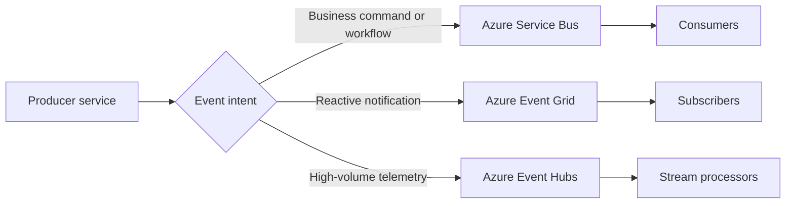

---
content_sources:
  diagrams:
    - id: event-driven-platform-selection
      type: flowchart
      source: mslearn-adapted
      mslearn_url: https://learn.microsoft.com/en-us/azure/architecture/guide/architecture-styles/event-driven
---
# Event-Driven Architecture

Event-driven architecture uses immutable notifications about things that already happened so systems can react without direct request-response coupling. On Azure, event-driven designs range from lightweight event routing to high-throughput streaming and durable business integration.

## Fundamentals

An event-driven system usually includes:

- Producers that emit domain or platform events
- Brokers or event backbones
- Consumers that react independently
- Observability and replay strategy

The producer should not require synchronous acknowledgement from every consumer to continue business progress.

## Why teams adopt event-driven architecture

- Decouple producers from consumers.
- Scale consumer groups independently.
- Enable new downstream capabilities without changing the producer.
- Capture business activity as a stream of facts.

## Azure service selection

| Service | Best for | Key trade-off |
|---|---|---|
| Event Grid | Reactive event routing, Azure-native event fan-out | Not a durable enterprise command queue |
| Service Bus | Durable messaging, commands, ordered workflows, dead-lettering | Lower raw event throughput than streaming platforms |
| Event Hubs | High-throughput telemetry and event streaming | Consumer state and processing logic are more application-managed |

## Event Grid vs Service Bus vs Event Hubs

### Event Grid

- Strong for event notifications, webhooks, and Azure resource event integration.
- Good when a producer simply announces state change and many subscribers may react.

### Service Bus

- Strong for business process integration where delivery guarantees, sessions, duplicate detection, and dead-lettering matter.
- Better for commands and workflow steps than for pure publish-notify telemetry streams.

### Event Hubs

- Strong for ingesting very large volumes of telemetry, logs, clickstream, or IoT events.
- Better treated as a streaming platform than as an enterprise workflow bus.

## Event sourcing basics

Event sourcing stores state changes as an append-only event log instead of only storing the current state.

- Useful when auditability and temporal reconstruction matter.
- Often paired with projections or materialized views.
- Adds complexity in schema evolution, replay, and debugging.

[Assumed] Event sourcing is a specialized pattern, not a default for every event-driven solution.

## Topology example

<!-- diagram-id: event-driven-platform-selection -->

## Design guardrails

- Make event contracts versionable.
- Preserve idempotency in consumers.
- Track correlation IDs across asynchronous paths.
- Separate business commands from pure notifications.
- Define retention, replay, and dead-letter handling early.

## Anti-patterns

- Using events for hidden synchronous dependencies.
- Publishing vague events that require consumers to call back for essential meaning.
- Mixing commands and events without ownership clarity.
- Choosing Event Hubs for transactional business workflow semantics.
- Declaring event sourcing without a real need for audit reconstruction.

## Evidence considerations

- [Documented] Azure architecture style guidance favors event-driven design where decoupling and extensibility are primary goals.
- [Inferred] Throughput, retention, and consumer lag are decisive for service choice.
- [Observed] Consumer sprawl raises ownership and debugging complexity over time.
- [Validated] Replay and poison-event drills are required before calling the design production ready.

## When not to use event-driven architecture

- The process requires a guaranteed immediate answer.
- The team cannot operate distributed tracing and asynchronous debugging.
- Eventual consistency is unacceptable for the critical decision point.

## Microsoft Learn reference

- https://learn.microsoft.com/en-us/azure/architecture/guide/architecture-styles/event-driven

## Takeaway

Choose event-driven architecture when business reactions should be decoupled in time and ownership. On Azure, select Event Grid, Service Bus, or Event Hubs based on semantics first, then throughput and operations second.
