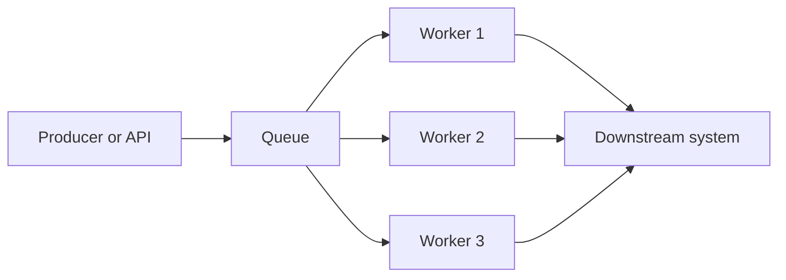

---
content_sources:
  diagrams:
    - id: queue-load-leveling-competing-consumers
      type: flowchart
      source: mslearn-adapted
      mslearn_url: https://learn.microsoft.com/en-us/azure/architecture/patterns/queue-based-load-leveling
---
# Queue-Based Load Leveling and Competing Consumers

Queue-Based Load Leveling protects back-end systems from bursts by buffering work in a queue. Competing Consumers increase throughput by allowing multiple workers to process queued messages in parallel. Together, they are a foundational Azure pattern for bursty and variable workloads.

## Pattern intent

- Smooth spikes in producer traffic
- Isolate front-end responsiveness from back-end processing time
- Scale workers independently of producers
- Improve resilience when a dependency slows down

## Queue-Based Load Leveling

In this pattern, the producer places work on a queue and returns quickly. Consumers process messages at a pace the downstream system can sustain.

This is useful when:

- Inbound demand is bursty.
- Processing takes longer than a user request should block.
- Downstream capacity is limited or expensive.

## Competing Consumers

Multiple worker instances pull from the same queue. Each message is processed by one worker instance, allowing throughput to scale horizontally.

This is useful when:

- Work items are independent.
- Ordering is either unnecessary or can be managed by partitioning or sessions.
- Worker count needs to increase under load.

## Azure implementation options

### Azure Service Bus

- Better for enterprise messaging semantics.
- Supports dead-letter queues, duplicate detection, sessions, and transactions in appropriate scenarios.
- Useful when processing correctness matters more than absolute simplicity.

### Azure Storage Queues

- Simpler and cost-effective for basic queueing needs.
- Better when advanced broker features are unnecessary.
- Often paired with Azure Functions for lightweight background processing.

## Flow model

<!-- diagram-id: queue-load-leveling-competing-consumers -->

## Decision criteria

| Question | Pattern signal |
|---|---|
| Does the caller need immediate completion? | If no, queueing is a strong option |
| Can work be processed independently? | If yes, competing consumers scale well |
| Is ordering strict? | If yes, use sessions, partitions, or fewer workers |
| Do poison messages matter operationally? | If yes, prefer stronger dead-letter capabilities |

## Operational trade-offs

- [Inferred] Queue depth, dequeue latency, and worker throughput are the main health indicators.
- [Observed] Scaling workers without downstream protection can simply move the bottleneck.
- [Validated] Poison message handling and replay must be exercised in tests.
- [Correlated] Backlogs often reveal hidden coupling or unrealistic SLA assumptions upstream.

## Common anti-patterns

- Using a queue but still blocking the user until completion.
- Scaling consumers aggressively without considering database or API rate limits.
- Ignoring idempotency when messages can be retried.
- Treating dead-letter queues as permanent storage instead of remediation signals.
- Assuming competing consumers preserve ordering automatically.

## Azure-specific guidance

- Use Functions, Container Apps jobs, or AKS workers as consumer hosts depending on control needs.
- Combine queue depth metrics with worker autoscaling triggers.
- Use Service Bus sessions when ordering is needed per entity.
- Add circuit breaker or rate-limit logic between workers and fragile dependencies.

## When not to use these patterns

- The work must complete before the caller can proceed.
- Every message requires global ordering.
- The team lacks message observability and remediation processes.

## Microsoft Learn reference

- https://learn.microsoft.com/en-us/azure/architecture/patterns/queue-based-load-leveling

## Takeaway

Queue-Based Load Leveling absorbs burst pressure; Competing Consumers turn buffered work into scalable throughput. In Azure, Service Bus is the default when reliability semantics matter, and Storage Queues are useful when simplicity is enough.
