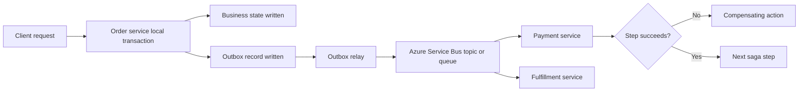

---
content_sources:
  diagrams:
    - id: saga-idempotency-outbox-flow
      type: flowchart
      source: mslearn-adapted
      mslearn_url: https://learn.microsoft.com/en-us/azure/architecture/patterns/saga
---
# Saga, Idempotency, and Outbox

Saga, idempotency, and outbox patterns are often used together when a distributed business workflow must cross service and data boundaries without relying on a single global transaction. On Azure, the combination helps teams coordinate long-running steps, tolerate retries, and publish integration events only after state changes are durably recorded.

## Fundamentals

This pattern combination usually includes:

- A saga that breaks a business process into local transactions and compensating steps.
- Idempotent handlers so retried messages do not duplicate business effects.
- An outbox record written in the same local transaction as the business change.
- A relay or processor that publishes pending outbox messages to the messaging backbone.

The design goal is controlled eventual consistency rather than distributed locking.

## Why teams adopt saga, idempotency, and outbox

- Coordinate workflows across services with independent data stores.
- Avoid dual-write failures between a database commit and message publication.
- Survive retries, duplicate delivery, and partial failures.
- Keep compensation logic explicit instead of hiding it in manual operations.

## Azure service selection

| Service | Best for | Key trade-off |
|---|---|---|
| Azure Service Bus | Durable commands, ordered workflow steps, duplicate detection, dead-lettering | Lower throughput than pure streaming platforms |
| Azure Functions | Event-driven saga step processing and outbox relays with managed scaling | Requires careful state, retry, and timeout design |
| Azure SQL Database or Azure Cosmos DB | Local transaction boundary for business state and outbox records | Data model and consistency design differ by store |

## Orchestration vs choreography

### Orchestrated saga

- A central coordinator decides the next step and compensation path.
- Better when auditability, timeout handling, and explicit control flow matter.

### Choreographed saga

- Services react to events and decide locally what to do next.
- Better when loose coupling matters more than central workflow visibility.

## Idempotency expectations

Every message handler should be safe to run more than once.

- Store an operation ID, message ID, or business key that proves whether work already completed.
- Make compensating actions idempotent too.
- Treat duplicate delivery as normal operating behavior, not as an exceptional bug.

## Topology example

<!-- diagram-id: saga-idempotency-outbox-flow -->

## Design guardrails

- Define the saga boundary from the business process, not from the org chart.
- Persist outbox data in the same transaction as the local state change.
- Use stable idempotency keys and retention rules for deduplication records.
- Time-box long-running steps and define compensation ownership.
- Monitor stuck saga instances, poison messages, and outbox backlog.

## Anti-patterns

- Publishing integration events directly after commit without an outbox or equivalent transactional guarantee.
- Assuming exactly-once delivery and skipping idempotency.
- Modeling every multi-step workflow as a saga when a simpler local transaction is enough.
- Writing compensations that are unsafe to retry.
- Hiding manual exception handling outside the documented saga design.

## Evidence considerations

- [Documented] Microsoft Learn presents saga as a way to manage data consistency across microservices with compensating transactions.
- [Inferred] Outbox is required when the architecture cannot tolerate a dual-write gap between database commit and message publication.
- [Observed] Duplicate delivery, replay, and timeout paths appear in production sooner than teams expect.
- [Validated] Failure injection should prove that retries, compensation, and outbox draining preserve business correctness.

## When not to use

- The workflow fits inside one transactional boundary.
- The team cannot operate asynchronous tracing, compensation, and replay procedures.
- Business rules cannot tolerate eventual consistency or compensation windows.

## Microsoft Learn reference

- https://learn.microsoft.com/en-us/azure/architecture/patterns/saga
- https://learn.microsoft.com/en-us/azure/architecture/patterns/compensating-transaction

## Takeaway

Use saga, idempotency, and outbox together when one business workflow spans multiple services and any retry or partial failure must remain safe. On Azure, Service Bus plus a durable application store gives a practical foundation for this pattern combination.
