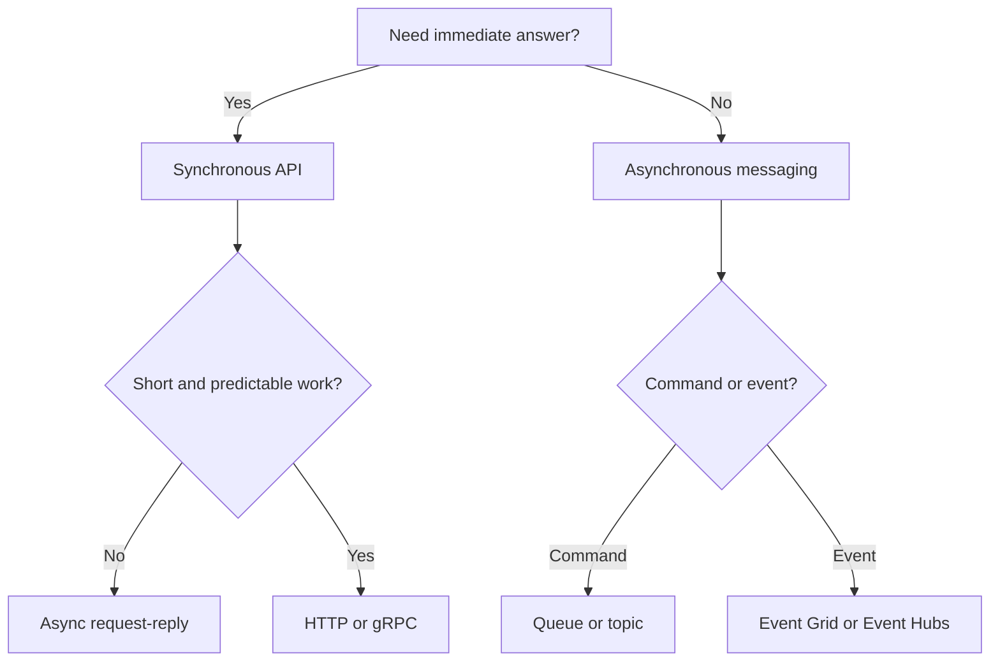

---
content_sources:
  diagrams:
    - id: sync-vs-async-decision-map
      type: flowchart
      source: mslearn-adapted
      mslearn_url: https://learn.microsoft.com/en-us/azure/architecture/patterns/async-request-reply
---
# Synchronous vs Asynchronous Integration

The choice between synchronous and asynchronous communication shapes latency, coupling, failure propagation, and operator experience. Azure offers strong options for both, but the right pattern depends on whether a caller truly needs an immediate answer.

## Core question

Should a workflow use immediate request-response over HTTP or gRPC, or should it decouple with queues and events?

## When synchronous integration fits

Use synchronous communication when:

- The caller needs an immediate response to continue the user journey.
- The operation is short-lived and predictable.
- Consistency of the returned result matters more than decoupling.
- The dependency graph is shallow and failure handling is well understood.

Typical Azure implementations include App Service to App Service HTTP, API Management to backend APIs, or internal service calls between Azure Container Apps or AKS services.

## When asynchronous integration fits

Use asynchronous communication when:

- Work can complete later without harming the user experience.
- Load arrives in bursts.
- Producers and consumers should scale independently.
- Failure isolation is more important than immediate visibility of completion.

Typical Azure implementations include Service Bus queues or topics, Event Grid for event routing, and Event Hubs for stream ingestion.

## Trade-offs

| Dimension | Synchronous | Asynchronous |
|---|---|---|
| Latency | Lower end-to-end if healthy | Higher perceived completion time |
| Coupling | Stronger temporal coupling | Lower temporal coupling |
| Failure isolation | Weaker, failures propagate quickly | Stronger if retries and dead-lettering are designed well |
| User feedback | Immediate | Often requires polling, callback, or status resource |
| Complexity | Simpler for short flows | Higher coordination and observability burden |

## Azure-specific implementation choices

### Synchronous

- HTTP via Front Door, Application Gateway, or API Management for public entry.
- gRPC for internal low-latency service communication when protocol support and tooling fit.
- Use timeouts, retries, and circuit breakers cautiously because synchronous chains compound latency.

### Asynchronous

- Service Bus for commands, work queues, sessions, ordered workflows, and poison message handling.
- Event Grid for reactive event fan-out from Azure resources or applications.
- Async request-reply pattern when the caller needs a status resource instead of blocking the request.

## Decision map

<!-- diagram-id: sync-vs-async-decision-map -->

## Failure behavior

- [Observed] Synchronous chains create visible outages quickly when a dependency is slow or unavailable.
- [Observed] Queue-based flows usually absorb burst load better at the cost of completion latency.
- [Validated] Async designs need dead-letter, replay, and idempotency tests before they can be trusted.
- [Unknown] If downstream processing time variance is not known, synchronous assumptions are weak.

## When not to use synchronous calls

- Long-running operations
- High fan-out dependency graphs
- Back-end work with bursty arrival rates
- Workflows that can tolerate delayed completion

## When not to use asynchronous messaging

- The user or calling system must receive a definitive result before proceeding.
- The team lacks message tracing, replay, and operational ownership.
- The business process cannot tolerate eventual consistency for the specific step.

## Review questions

- What is the maximum acceptable user wait time?
- What happens if the dependency is slow but not down?
- Can the caller tolerate duplicate delivery or out-of-order processing?
- Who monitors stuck, dead-lettered, or replayed work?

## Microsoft Learn reference

- https://learn.microsoft.com/en-us/azure/architecture/patterns/async-request-reply

## Takeaway

Use synchronous integration for short, user-blocking interactions. Use asynchronous integration when independence, buffering, and failure isolation are more valuable than immediate completion.
