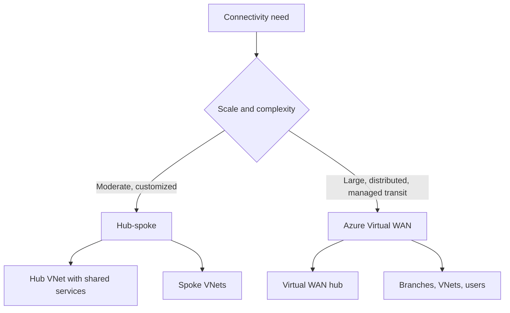

---
content_sources:
  diagrams:
    - id: hub-spoke-vs-vwan-topology
      type: flowchart
      source: mslearn-adapted
      mslearn_url: https://learn.microsoft.com/en-us/azure/architecture/networking/architecture/hub-spoke
---
# Hub-Spoke vs Virtual WAN

Azure network topology decisions often come down to a self-managed hub-spoke model or Azure Virtual WAN as a managed connectivity fabric. Both patterns centralize connectivity, but they differ in scale model, control responsibilities, and operational burden.

## Hub-spoke topology

In hub-spoke, shared connectivity and control services live in a hub virtual network while application workloads sit in spoke virtual networks.

Typical hub services include:

- Azure Firewall or NVA
- VPN Gateway or ExpressRoute gateway
- Shared DNS or inspection services
- Bastion and management services

### Strengths

- Clear separation between shared network controls and application VNets
- Flexible for many landing zone designs
- Familiar to many Azure teams

### Challenges

- Route management and peering complexity grow with scale
- Shared hub components can become bottlenecks or change hotspots
- Operational ownership remains largely with the customer

## Azure Virtual WAN

Azure Virtual WAN provides a Microsoft-managed transit architecture for branch, remote user, and VNet connectivity.

### Strengths

- Simplifies large-scale connectivity scenarios
- Reduces some routing and transit management burden
- Useful for distributed branch and global network scenarios

### Challenges

- Less design freedom than fully self-managed topology
- Cost model may not fit small estates
- Teams still need clear policy, segmentation, and route intent

## Topology comparison

<!-- diagram-id: hub-spoke-vs-vwan-topology -->

## Decision criteria

| Criterion | Hub-spoke signal | Virtual WAN signal |
|---|---|---|
| Estate size | Small to large, but manageable custom topology | Large-scale distributed connectivity |
| Custom routing and inspection | High need | More standardized managed model |
| Team network maturity | Strong customer-managed networking | Preference for managed transit |
| Cost sensitivity | Can optimize for smaller footprints | Better justified at larger scale |

## Connectivity patterns

### Hub-spoke fits well when

- Application landing zones need clear segmentation.
- Shared services are limited and highly customized.
- The organization already operates Azure Firewall, custom DNS, or NVA patterns centrally.

### Virtual WAN fits well when

- There are many branches, remote users, or globally distributed network edges.
- Transit management overhead is becoming the problem.
- Standardized connectivity is more valuable than bespoke topology tuning.

## Common anti-patterns

- Building a complex hub-spoke mesh when a simpler managed transit model would reduce risk.
- Choosing Virtual WAN without understanding route intent and segmentation needs.
- Centralizing all traffic inspection in a single bottleneck hub with no scale model.
- Over-peering environments without clear ownership or route documentation.

## Evidence and trade-offs

- `[Documented]` Hub-spoke is a standard Azure reference topology for centralized connectivity.
- `[Observed]` Operational complexity rises quickly when peering, route tables, firewalls, and DNS all evolve independently.
- `[Inferred]` Cost should include shared appliances, gateways, cross-region traffic, and support burden.
- `[Validated]` Connectivity failover and route-change drills should be tested before broad rollout.

## When not to use hub-spoke

- The organization mainly needs managed large-scale transit rather than custom central network services.
- The team cannot sustain route, firewall, and DNS operations centrally.

## When not to use Virtual WAN

- The environment is small and cost-sensitive.
- Highly customized transit and inspection behaviors are mandatory.

## Microsoft Learn reference

- https://learn.microsoft.com/en-us/azure/architecture/networking/architecture/hub-spoke

## Takeaway

Use hub-spoke when you need customer-controlled shared network services and explicit landing-zone segmentation. Use Virtual WAN when connectivity scale and transit operations are the real problem to solve.
