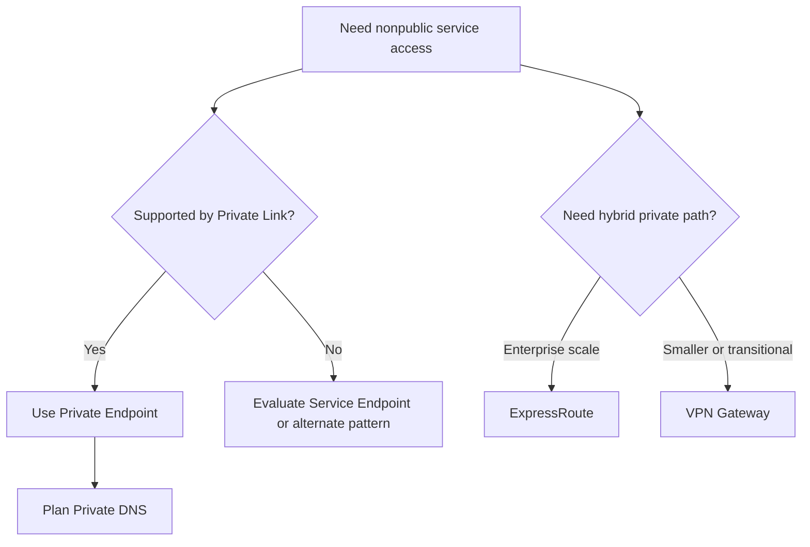

---
content_sources:
  diagrams:
    - id: private-connectivity-decision-map
      type: flowchart
      source: mslearn-adapted
      mslearn_url: https://learn.microsoft.com/en-us/azure/private-link/private-endpoint-overview
---
# Private Connectivity Patterns

Private connectivity on Azure is not one feature. It is a set of patterns for keeping service access on private paths, controlling DNS resolution, and linking on-premises or branch networks to Azure. The main decisions are usually Private Endpoints vs Service Endpoints, VNet integration approach, DNS ownership, and ExpressRoute vs VPN connectivity.

## Private Endpoints vs Service Endpoints

### Private Endpoints

- Provide a private IP in a VNet for access to a supported Azure service.
- Reduce exposure to the public internet path.
- Usually require Private DNS integration to resolve service names correctly.

### Service Endpoints

- Extend VNet identity to certain Azure services over the Azure backbone.
- Simpler in some cases, but the service still exposes a public endpoint model.
- Less isolating than Private Link-based access.

[Documented] Private Endpoints provide stronger private-access semantics than Service Endpoints for supported services.

## VNet integration patterns

- App Service VNet Integration for outbound connectivity from apps into VNets.
- Regional VNet injection or direct VNet hosting models for container and VM workloads.
- Private endpoints for inbound private service consumption.

The pattern must distinguish outbound app-to-network integration from inbound consumer-to-service private access. They are not interchangeable.

## Private DNS strategy

Private connectivity usually fails operationally because of DNS, not because of the network tunnel itself.

Recommended practices:

- Centralize Private DNS zone ownership.
- Document zone linking and conditional forwarding clearly.
- Validate hybrid name resolution from Azure and on-premises paths.
- Avoid ad hoc local host entries or manual DNS drift.

## ExpressRoute vs VPN Gateway

| Option | Best for | Main trade-off |
|---|---|---|
| ExpressRoute | Predictable private connectivity, larger enterprise environments, stricter performance or compliance demands | Higher cost and provisioning complexity |
| VPN Gateway | Faster setup, lower cost, smaller or transitional hybrid needs | Internet-based characteristics and lower predictability |

## Connectivity decision map

<!-- diagram-id: private-connectivity-decision-map -->

## Azure-specific guidance

- Prefer Private Endpoints for high-value PaaS services when network isolation is meaningful.
- Use Service Endpoints when simplicity is acceptable and the service pattern does not require full Private Link isolation.
- Treat DNS design as a first-class architecture decision.
- Align identity, firewall, and routing rules with the connectivity model.

## Common anti-patterns

- Adding Private Endpoints without planning DNS zones and resolvers.
- Assuming Service Endpoints and Private Endpoints are equivalent.
- Using private networking by default for every workload even when the operational burden is unjustified.
- Choosing ExpressRoute before validating real throughput, compliance, or reliability needs.

## Trade-offs and evidence

- [Observed] Private networking increases troubleshooting complexity for application teams.
- [Inferred] Cost should include DNS, firewall, routing, and support overhead, not just circuit or endpoint charges.
- [Validated] End-to-end connectivity tests must cover failover, name resolution, and certificate behavior.
- [Unknown] If hybrid DNS ownership is unclear, private connectivity will likely be fragile.

## When not to choose the more private option

- The data and threat model do not justify the added complexity.
- The team lacks DNS and network operations maturity.
- A public endpoint with strong identity and access controls already meets the risk profile.

## Microsoft Learn reference

- https://learn.microsoft.com/en-us/azure/private-link/private-endpoint-overview

## Takeaway

Private connectivity is effective only when network path, DNS resolution, identity, and hybrid routing are designed together. On Azure, Private Endpoints are the stronger isolation pattern, but they are not the cheaper or simpler default in every workload.
