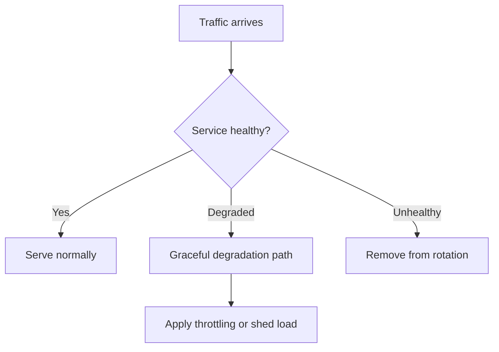

---
content_sources:
  diagrams:
    - id: health-degradation-backpressure-flow
      type: flowchart
      source: mslearn-adapted
      mslearn_url: https://learn.microsoft.com/en-us/azure/architecture/patterns/health-endpoint-monitoring
---
# Health Endpoints, Graceful Degradation, and Backpressure

A resilient Azure workload does more than restart when broken. It advertises health, sheds noncritical work, and limits demand when the system is under stress. Health endpoints, graceful degradation, and backpressure are three complementary controls for maintaining useful service during failure.

## Health endpoint monitoring

Health endpoints expose the current ability of a service to do useful work.

- Liveness asks whether the process should be restarted.
- Readiness asks whether the service should receive traffic.
- Dependency-aware checks can indicate degraded but still functional states.

[Documented] Health monitoring is most effective when checks reflect real dependency readiness rather than merely returning process status.

## Graceful degradation

Graceful degradation means the system intentionally reduces capability instead of failing completely.

Examples:

- Serve cached or partial results.
- Disable nonessential personalization.
- Defer expensive background features.
- Restrict write-heavy workflows while preserving read access.

## Backpressure and throttling

Backpressure limits incoming or downstream work when capacity is constrained.

This can include:

- Queue depth limits
- Concurrent request caps
- Rate limiting
- Producer throttling
- Admission control for expensive operations

## Operational flow

<!-- diagram-id: health-degradation-backpressure-flow -->

## Azure-specific implementation options

- App Service and Container Apps can expose liveness and readiness probes for traffic decisions.
- AKS supports probe-based orchestration and pod readiness gating.
- Azure Front Door and Application Gateway can use health probes for routing decisions.
- API Management can apply rate limits and quotas at the edge.
- Service Bus and queue metrics can trigger autoscaling or load shedding in consumers.

## Design guidance

- Separate liveness from readiness.
- Include critical dependency status in readiness, but avoid overly fragile checks.
- Define which features can degrade safely before incidents happen.
- Couple backpressure rules to measurable system limits such as CPU, queue depth, connection pool use, or downstream quotas.

## Common anti-patterns

- Health endpoints that always return success.
- Restarting unhealthy services when the real issue is downstream quota exhaustion.
- Treating graceful degradation as ad hoc feature removal with no business approval.
- Throttling at the edge without protecting internal bottlenecks.
- Returning success while silently dropping critical work.

## Evidence expectations

- [Observed] Queue depth, saturation, rejected requests, and degraded-mode latency should be tracked.
- [Observed] Good health checks reduce false positives during maintenance and downstream outages.
- [Validated] Degraded-mode drills must prove the workload remains useful, not merely reachable.
- [Correlated] Rising throttles often correlate with a dependency bottleneck elsewhere in the system.

## When not to over-engineer

- Small internal tools with low criticality may only need simple readiness checks.
- Degradation paths are not useful when the business action is all-or-nothing.
- Backpressure logic that operators cannot understand becomes a new reliability risk.

## Microsoft Learn reference

- https://learn.microsoft.com/en-us/azure/architecture/patterns/health-endpoint-monitoring

## Takeaway

Health endpoints tell Azure where traffic should go, graceful degradation preserves essential value, and backpressure prevents overload from turning a partial problem into a full outage.
