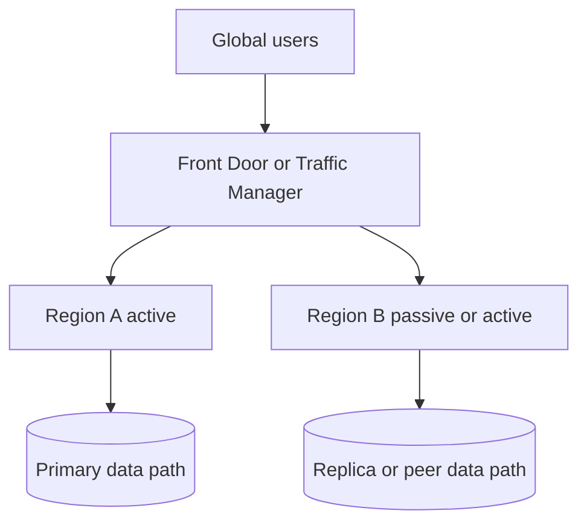

---
content_sources:
  diagrams:
    - id: multi-region-mode-comparison
      type: flowchart
      source: mslearn-adapted
      mslearn_url: https://learn.microsoft.com/en-us/azure/architecture/guide/networking/global-web-applications/overview
---
# Multi-Region Active-Passive vs Active-Active

Multi-region design improves continuity, but the right topology depends on state management, failover expectations, and cost tolerance. On Azure, active-passive and active-active are both valid; the wrong choice is usually the one whose operational implications were not tested.

## Active-passive

In active-passive, one region serves production traffic while another region is prepared to take over during failure or maintenance.

### Benefits

- Lower complexity than active-active
- Easier data consistency model
- Lower steady-state cost in some designs
- Simpler incident reasoning

### Limitations

- Passive capacity may lag or drift if not exercised
- Failover time is usually longer
- A region switchover is still a disruptive event

## Active-active

In active-active, multiple regions serve live traffic concurrently.

### Benefits

- Better distribution of user latency
- Faster response to regional failure
- Better utilization of deployed capacity

### Limitations

- Harder state consistency model
- More expensive testing and operations
- More complex traffic management and rollback decisions

## Replication strategy matters more than labels

| Replication model | Typical use | Trade-off |
|---|---|---|
| Asynchronous | Common for many globally distributed applications | Better latency and scale, but possible data lag |
| Synchronous | Narrower use where consistency is strict and latency budget allows | Higher write latency and tighter regional coupling |

[Inferred] Many teams say "active-active" when the stateless tier is active-active but the state tier is effectively active-passive or eventually consistent.

## Azure traffic options

- Azure Front Door is strong for global HTTP routing, health probing, and failover.
- Traffic Manager is useful for DNS-based traffic distribution patterns.
- Application Gateway is regional and typically complements, not replaces, global traffic design.

## Topology comparison

<!-- diagram-id: multi-region-mode-comparison -->

## Decision criteria

| Criterion | Active-passive signal | Active-active signal |
|---|---|---|
| RTO target | Minutes may be acceptable | Near-immediate failover needed |
| Data consistency | Simpler model required | Eventual or partitioned consistency acceptable |
| Operations maturity | Moderate | High |
| Cost tolerance | More constrained | Higher steady-state spend acceptable |

## Cost implications

- Active-passive may still require warm standby, replicated data, monitoring, and regular drills.
- Active-active increases baseline compute, networking, observability, and test cost.
- [Inferred] Cost comparison must include data replication, cross-region traffic, and failover exercises, not only idle compute.

## Common anti-patterns

- Declaring multi-region without automated failover and runbooks.
- Running active-active stateless tiers against a single-region database.
- Ignoring DNS, session, and cache invalidation behavior during failover.
- Treating the passive region as untested disaster storage.

## Evidence to require

- [Documented] Failover mode, authority to trigger, and rollback steps.
- [Observed] Replication lag and control plane propagation behavior.
- [Validated] Region failover drills and application recovery testing.
- [Unknown] Any dependency that remains single-region and untested.

## When not to choose active-active

- The workload has not mastered active-passive first.
- State consistency requirements are strict and cross-region write coordination is unacceptable.
- The business does not value the additional cost and complexity enough to justify it.

## Microsoft Learn reference

- https://learn.microsoft.com/en-us/azure/architecture/guide/networking/global-web-applications/overview

## Takeaway

Choose active-passive when you need regional resilience with simpler operations. Choose active-active only when latency, continuity, and traffic distribution benefits clearly outweigh the higher consistency and operating complexity.
