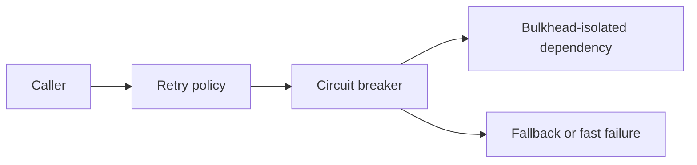

---
content_sources:
  diagrams:
    - id: retry-circuit-bulkhead-map
      type: flowchart
      source: mslearn-adapted
      mslearn_url: https://learn.microsoft.com/en-us/azure/architecture/patterns/retry
---
# Retry, Circuit Breaker, and Bulkhead

Retries, circuit breakers, and bulkheads are complementary resilience patterns. Together, they help Azure workloads survive transient faults, avoid cascading failures, and contain blast radius when dependencies degrade.

## Retry pattern

Retries address transient failures such as short-lived network drops, throttling, or temporary platform unavailability.

Good retry design includes:

- Exponential backoff
- Jitter to avoid synchronized retry storms
- Clear limits on retry count and total elapsed time
- Idempotent operations where possible

`[Documented]` Azure guidance recommends retries for transient faults, but not for every failure class.

## Circuit Breaker pattern

A circuit breaker stops repeated calls to an unhealthy dependency for a cooling period.

- Closed: normal traffic flows
- Open: requests fail fast or use fallback
- Half-open: limited probes test recovery

This prevents a failing dependency from consuming thread pools, sockets, or request budgets across the whole application.

## Bulkhead pattern

Bulkheads isolate resources so one failing component or dependency does not starve everything else.

Bulkheads can exist as:

- Separate worker pools
- Distinct queues
- Independent node pools or services
- Dedicated connection pools or concurrency limits

## Interaction model

<!-- diagram-id: retry-circuit-bulkhead-map -->

## Azure implementation notes

### Azure SDK retry policies

- Many Azure SDKs already implement retry behavior for transient faults.
- Default retries are useful, but teams should still validate timeout budgets and compound retry effects across call chains.

### Hosting platforms

- App Service, Container Apps, and AKS workloads can all implement application-level retry and breaker logic.
- API Management can enforce throttling and protect upstreams, but it is not a substitute for internal resilience design.

### Messaging systems

- Service Bus naturally supports retrying message processing with dead-letter fallback.
- Retries on queue consumers should still respect idempotency and poison-message thresholds.

## Design rules

- Retry only transient failures.
- Do not retry validation or authorization failures blindly.
- Apply circuit breakers around remote dependencies, not internal pure computation.
- Align bulkheads with meaningful failure domains.

## Common anti-patterns

- Infinite retries with no timeout budget.
- Nested retries at every layer creating retry amplification.
- Circuit breakers with no observability, leaving operators blind.
- Shared thread pools between critical and noncritical operations.
- Fallback responses that silently corrupt business meaning.

## Evidence and trade-offs

- `[Measured]` Retry success rate, fallback rate, and dependency latency distributions matter more than static policy values.
- `[Observed]` Breakers often reveal chronic dependency slowness rather than rare outages.
- `[Validated]` Chaos testing should confirm that a failing dependency does not consume all capacity.
- `[Unknown]` If failure modes are not classified, retry rules are usually too broad.

## When not to rely on retries alone

- The dependency is already timing out under sustained load.
- The operation is not idempotent and duplicates create business harm.
- Failure originates from quota exhaustion or persistent misconfiguration.

## Microsoft Learn reference

- https://learn.microsoft.com/en-us/azure/architecture/patterns/retry

## Takeaway

Use retries to survive transient faults, circuit breakers to fail fast when a dependency is unhealthy, and bulkheads to protect the rest of the workload from localized failure. Azure SDK defaults help, but architecture ownership still belongs to the application design.
