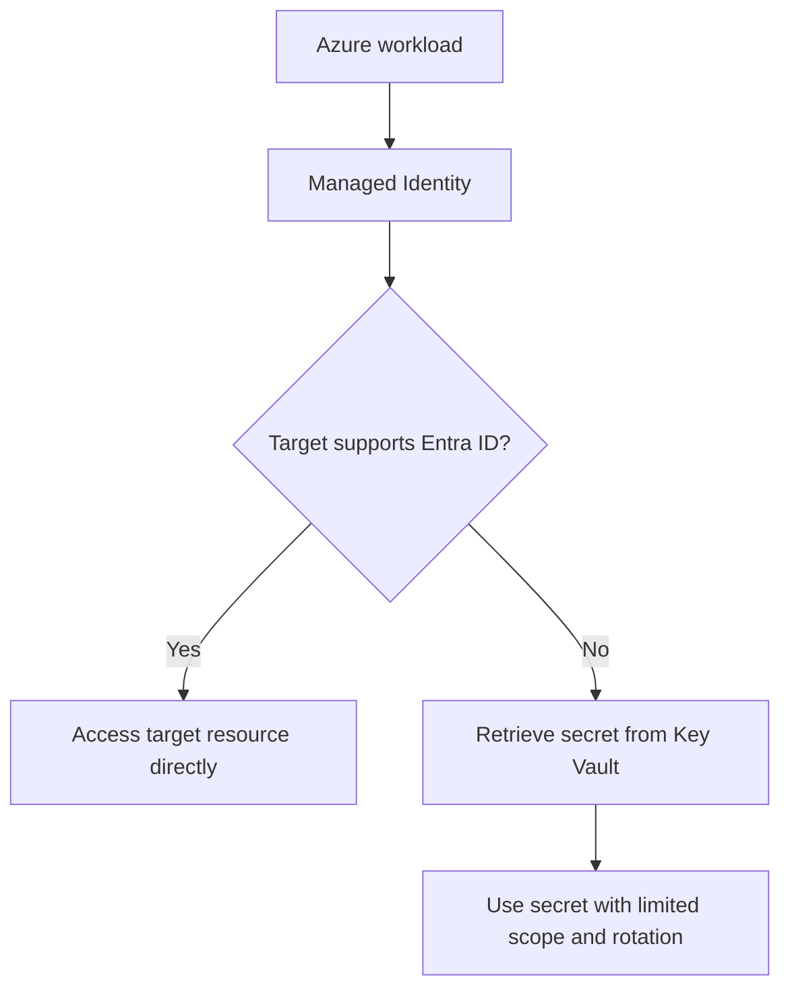

---
content_sources:
  diagrams:
    - id: identity-first-secrets-flow
      type: flowchart
      source: mslearn-adapted
      mslearn_url: https://learn.microsoft.com/en-us/azure/active-directory/managed-identities-azure-resources/overview
---
# Identity-First and Secrets Flow

An identity-first architecture assumes workloads should authenticate as themselves by default instead of carrying long-lived credentials. In Azure, Managed Identity and Key Vault allow teams to minimize secret sprawl, reduce rotation burden, and make access paths auditable.

## Core principle

Default to workload identity, not stored secrets.

That means:

- Services use Managed Identity whenever a target Azure service supports it.
- Key Vault stores the remaining secrets that cannot yet be eliminated.
- Access paths are explicit: who accesses what, and by which identity boundary.

## Managed Identity as default

Managed Identity is usually the preferred starting point for Azure-hosted workloads because it:

- Eliminates embedded credentials from code and configuration.
- Supports token-based access to Azure resources.
- Reduces secret rotation and distribution problems.

[Documented] Managed identities are the Azure-native way for resources to authenticate to services that support Microsoft Entra ID.

## Key Vault integration patterns

### Direct retrieval at runtime

- The application uses Managed Identity to retrieve a secret or certificate from Key Vault.
- Appropriate when a secret still exists but should not be stored locally.

### Platform reference integration

- Some Azure hosting platforms can reference Key Vault values directly in configuration.
- Useful for reducing secret-handling code, but access governance still matters.

### Certificate and key brokering

- Key Vault can centralize certificate lifecycle and key access policies.
- This is especially useful for TLS material or signing scenarios.

## Secrets flow design

The important architecture question is not only where a secret is stored, but how it moves.

- Who creates the secret?
- Which identity retrieves it?
- Where is it cached, if anywhere?
- How is rotation detected?
- Can the dependency switch to token-based access instead?

## Flow model

<!-- diagram-id: identity-first-secrets-flow -->

## Eliminating connection strings

Preferred order:

1. Replace connection strings with Entra-integrated identity where supported.
2. If not possible, store connection strings in Key Vault.
3. Minimize secret lifetime, access scope, and local persistence.

Examples where identity-first often works well include Azure SQL Database, Storage, Service Bus, and Key Vault itself when client libraries support token-based access patterns.

## Azure implementation notes

- Use system-assigned or user-assigned managed identities according to lifecycle and sharing needs.
- Grant least-privilege RBAC at the resource scope.
- Use Key Vault for residual secrets, certificates, and keys that cannot yet be removed.
- Combine private connectivity with identity controls only when the threat model and operations justify it.

## Common anti-patterns

- Keeping connection strings in app settings because migration is inconvenient.
- Using one shared identity for many unrelated services.
- Granting broad Key Vault read access to every workload.
- Moving secrets into Key Vault without reducing how many secrets exist.
- Forgetting that secret caches and deployment pipelines are part of the secrets flow.

## Evidence and trade-offs

- [Observed] Managed Identity usually lowers rotation burden and accidental secret exposure risk.
- [Observed] Access failures often decrease when secret distribution steps are removed.
- [Validated] Rotation drills should prove the application survives key or secret renewal without manual intervention.
- [Unknown] Third-party dependencies may still force nonideal secret handling patterns.

## When not to overcomplicate

- Very small internal tools may start with Key Vault-backed secrets before full identity migration.
- Some external services do not yet support Azure-native identity integration, so a residual secret path remains necessary.

## Microsoft Learn reference

- https://learn.microsoft.com/en-us/azure/active-directory/managed-identities-azure-resources/overview

## Takeaway

In Azure, identity-first means treating Managed Identity as the default access path and Key Vault as the controlled exception path. The architectural win is not merely secret storage, but shrinking the entire secrets flow.
