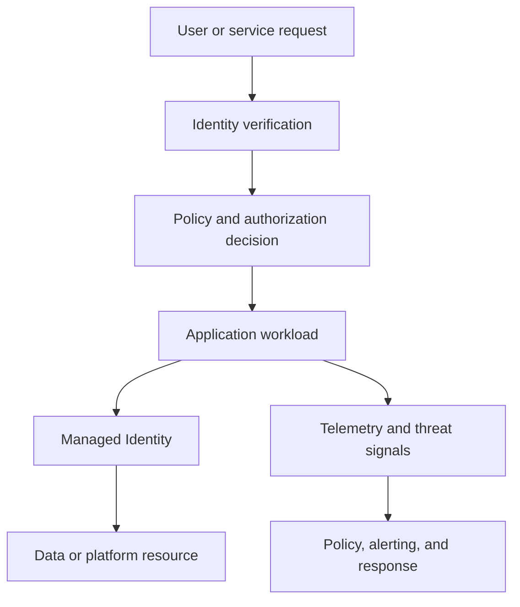

---
content_sources:
  diagrams:
    - id: zero-trust-workload-controls
      type: flowchart
      source: mslearn-adapted
      mslearn_url: https://learn.microsoft.com/en-us/azure/security/fundamentals/zero-trust
---
# Zero Trust at Workload Level

Zero Trust at workload level means every service-to-service path, operator action, and runtime dependency is explicitly verified instead of being trusted because it sits inside a familiar network boundary. On Azure, this pattern combines strong identity, least privilege, private access controls, policy enforcement, and continuous monitoring around each workload path.

## Fundamentals

A workload-level Zero Trust design usually includes:

- Explicit identity for every workload, platform component, and operator action.
- Authorization and network controls that assume the environment may already be hostile.
- Continuous verification through policy, logging, and drift detection.
- Segmented blast radius so one compromised component does not imply total compromise.

The objective is not one product deployment but a trust model that applies to every request path.

## Why teams adopt workload-level Zero Trust

- Reduce implicit trust created by flat networks and shared credentials.
- Limit lateral movement after compromise.
- Make access decisions auditable and policy-driven.
- Align workload controls with modern cloud operating models.

## Azure service selection

| Service | Best for | Key trade-off |
|---|---|---|
| Microsoft Entra ID and Managed Identity | Strong workload and operator identity with token-based access | Legacy dependencies may still require exceptions |
| Azure Key Vault | Secret, certificate, and key controls when identity-first cannot eliminate them | Secret sprawl still needs governance if exceptions accumulate |
| Azure Policy and Defender for Cloud | Continuous control validation, drift detection, and security posture enforcement | Alerts and policy findings need operational follow-through |

## Control pillars

### Verify explicitly

- Authenticate and authorize each workload path.
- Validate device, identity, resource, and policy context where relevant.

### Use least privilege

- Grant the narrowest role, network reachability, and secret scope needed.
- Remove standing privilege where just-in-time access is possible.

### Assume breach

- Segment workloads, monitor east-west traffic, and protect recovery paths.
- Design break-glass and incident response with the expectation that one component may be compromised.

## Topology example

<!-- diagram-id: zero-trust-workload-controls -->

## Design guardrails

- Prefer workload identity over shared secrets and long-lived credentials.
- Enforce least-privilege RBAC, network segmentation, and explicit egress rules.
- Protect management planes, automation identities, and recovery workflows as critical assets.
- Make policy violations and security drift visible before release and continuously after deployment.
- Define exception handling so temporary trust relaxations do not become permanent architecture.

## Anti-patterns

- Assuming private network reachability means a request is trustworthy.
- Reusing one broad identity across many services.
- Treating Zero Trust as only an identity project without network, workload, and operations controls.
- Keeping break-glass access undocumented or untested.
- Accepting permanent policy exceptions for convenience.

## Evidence considerations

- [Documented] Microsoft guidance defines Zero Trust around explicit verification, least privilege, and assumed breach.
- [Inferred] Workload-level Zero Trust is only credible when identity, network, and policy signals are all part of the access path.
- [Observed] Lateral movement risk usually increases fastest where shared credentials and overbroad network paths remain.
- [Validated] Access reviews, incident simulations, and policy drift tests should prove that compromise stays contained.

## When not to use

- Never as an excuse to avoid basic security controls because the workload seems low risk.
- Not as a one-time product rollout without ownership for policy, exceptions, and monitoring.
- Not as a full pattern if critical dependencies still depend on unbounded shared trust and no mitigation exists.

## Microsoft Learn reference

- https://learn.microsoft.com/en-us/azure/security/fundamentals/zero-trust
- https://learn.microsoft.com/en-us/security/zero-trust/azure-infrastructure-overview

## Takeaway

Apply Zero Trust at workload level by making every identity, network path, and privileged action earn trust continuously. On Azure, the pattern succeeds when least privilege, policy enforcement, and telemetry are built into normal platform operations instead of added after incidents.
