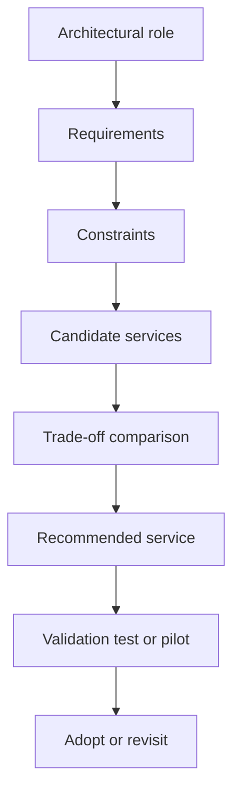

---
content_sources:
  diagrams:
    - id: service-selection-decision-flow
      type: flowchart
      source: mslearn-adapted
      mslearn_url: https://learn.microsoft.com/en-us/azure/architecture/guide/technology-choices/
---
# Service Selection Patterns

Service selection in Azure should begin with the architectural role that must be filled, not with a favorite product name. A good selection process turns requirements into constraints, compares viable options, and produces a recommendation with trade-offs documented.

## Decision question

Which Azure service or service family best fits a required architectural role such as compute, data store, messaging backbone, API gateway, identity boundary, or global traffic layer?

## Decision framework

Use a four-stage sequence:

1. Requirements
2. Constraints
3. Options
4. Recommendation

## Requirements first

Capture the workload need before discussing services.

- User-facing latency target
- Throughput and burst characteristics
- Data consistency expectations
- Regulatory or residency requirements
- Availability target and recovery objectives
- Team skill set and operating capacity
- Deployment speed and rollback expectations

`[Documented]` Microsoft Learn technology choice guides organize Azure options around workload needs rather than around product marketing categories.

## Constraints narrow the field

The same requirement can produce different answers once constraints are explicit.

| Constraint | What it changes |
|---|---|
| Strict network isolation | Pushes toward Private Link capable services and managed egress controls |
| Short staff or limited platform maturity | Favors managed PaaS over self-managed clusters |
| High tenant isolation needs | May require stronger service, data, and network boundaries |
| Extreme burst or event volume | Favors elastic serverless or partitioned event platforms |
| Legacy protocol support | May require gateway, adapter, or VM-based transition layers |

## Options by architectural role

| Role | Common Azure options | Primary differentiators |
|---|---|---|
| Web/API compute | App Service, Azure Container Apps, AKS, Functions | Control plane complexity, scale behavior, runtime control |
| Transactional data | Azure SQL Database, Azure Cosmos DB, PostgreSQL flexible server | Consistency model, data model, scale pattern |
| Messaging | Service Bus, Event Grid, Event Hubs, Storage Queues | Delivery semantics, fan-out, throughput, ordering |
| Global ingress | Front Door, Traffic Manager, Application Gateway | L7 routing, global acceleration, WAF scope |
| Secrets and identity | Managed Identity, Key Vault, Entra ID | Credential elimination, access brokering, federation |

## Recommendation criteria

Prefer the option that satisfies must-have requirements with the least operational burden.

- `[Inferred]` The most feature-rich service is often not the best fit if the team cannot operate it safely.
- `[Inferred]` Selection should consider projected cost under normal and failure scenarios, not just nominal load.
- `[Validated]` If two options remain close, test them against latency, deployment, and observability expectations.

## Azure-specific selection pattern

### Compute

- Choose App Service when you need fast delivery, standard web workloads, and low platform management overhead.
- Choose Azure Container Apps when container packaging is useful but full Kubernetes ownership is unnecessary.
- Choose AKS when you need Kubernetes APIs, service mesh integrations, or advanced scheduling and policy controls.
- Choose Functions for event-driven or bursty execution where request duration and trigger model fit the platform.

### Data

- Choose Azure SQL Database for relational workloads with strong transactional needs and familiar operational patterns.
- Choose Azure Cosmos DB when global distribution, flexible schema, or low-latency document access is central.
- Choose managed PostgreSQL or MySQL when open-source compatibility is a primary requirement.

### Integration

- Choose Service Bus for durable commands, queues, sessions, and enterprise messaging semantics.
- Choose Event Grid for lightweight event routing and broad Azure event integration.
- Choose Event Hubs for high-throughput streaming and telemetry ingestion.

## Service selection anti-patterns

- Service-first design: choosing a platform before clarifying the problem.
- One-service standardization: forcing all teams onto one compute or one database option regardless of workload fit.
- Distributed monolith bias: choosing microservice tooling without independent ownership and release needs.
- Over-privatization: selecting private connectivity everywhere without DNS, routing, and support readiness.
- Hidden state mismatch: choosing stateless compute while quietly depending on sticky sessions or local disk.

## Practical review questions

- What architectural role is this service filling?
- Which requirement is decisive, and which requirements are merely desirable?
- What is the operating burden during incidents, upgrades, and failover?
- What evidence disproves this recommendation?
- How easily can the workload move to a different option if assumptions fail?

## Decision flow

<!-- diagram-id: service-selection-decision-flow -->

## Recommended evidence to capture

- `[Documented]` Microsoft Learn guidance for candidate service categories.
- `Measured` Estimated cost, scaling thresholds, and latency under expected load.
- `[Observed]` Team support capability, incident history, and operational complexity.
- `[Unknown]` Assumptions not yet tested in a proof of concept.

## Microsoft Learn reference

- https://learn.microsoft.com/en-us/azure/architecture/guide/technology-choices/

## Takeaway

The best Azure service is the one that fits the architectural role with the clearest evidence, smallest avoidable complexity, and strongest alignment to the team's real operating model.
