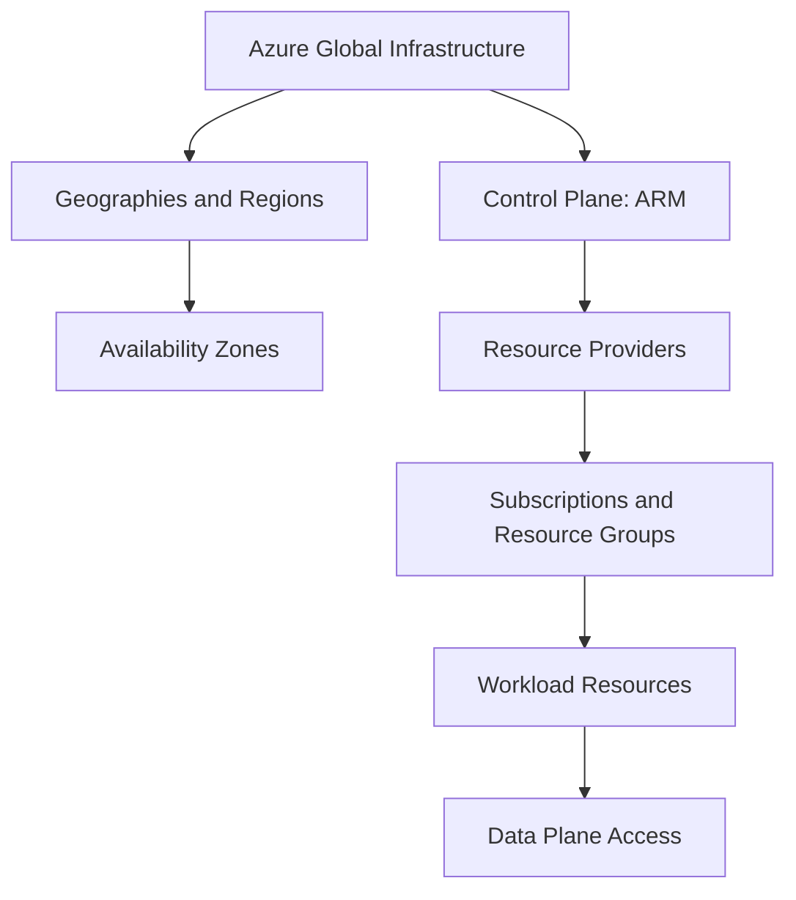

---
content_sources:
  diagrams:
    - id: platform-azure-architecture-on-azure-diagram-1
      type: flowchart
      source: self-generated
      justification: "Synthesized from Azure Architecture Guide concepts for global infrastructure, ARM, resource providers, and control versus data plane separation."
      based_on:
        - https://learn.microsoft.com/en-us/azure/architecture/guide/
        - https://learn.microsoft.com/en-us/azure/azure-resource-manager/management/overview
        - https://learn.microsoft.com/en-us/azure/azure-resource-manager/management/control-plane-and-data-plane
---
# Azure Architecture on Azure

Azure architecture starts with understanding where resources live, how they are controlled, and which parts of the platform are shared versus workload-owned.

## Global infrastructure model

[Documented] Azure is organized into geographies, regions, availability zones, and edge locations, each with different implications for compliance, latency, and resilience.

Architecturally, these layers matter because they answer different questions:

- geography helps with data residency and broad legal boundary discussions
- region is the main deployment and failure-domain choice for most workloads
- availability zone adds intra-region fault isolation where services support it
- edge locations help deliver content closer to users but do not replace regional architecture decisions

## Resource control model

[Documented] Azure Resource Manager (ARM) provides the control plane for creating, updating, and organizing Azure resources.

[Inferred] Architects should treat ARM as the policy and orchestration layer, not as the runtime path for application data.

## Control plane versus data plane

| Plane | What it does | Typical concern |
|---|---|---|
| Control plane | Creates, updates, secures, and organizes resources | Governance, RBAC, policy, deployment automation |
| Data plane | Handles workload data and service operations | Latency, throughput, access patterns, private connectivity |

[Documented] The separation matters because different permissions, network controls, and operational paths may apply to each plane.

[Observed] Teams often secure one plane more rigorously than the other, creating false confidence.

## Resource providers

[Documented] Azure services are exposed through resource providers such as `Microsoft.Compute`, `Microsoft.Network`, and `Microsoft.Storage`.

Architecturally, resource providers matter because:

- they define which resource types are available in a subscription
- they influence deployment dependencies and policy scope
- they provide a stable control-plane contract for infrastructure-as-code workflows

## Azure organization in practice

<!-- diagram-id: platform-azure-architecture-on-azure-diagram-1 -->

## Architectural implications

### 1. Region choice is not only a latency choice

- [Documented] service availability varies by region and by zone support
- [Inferred] region selection should be made alongside resilience, sovereignty, and operations plans
- [Observed] teams that pick the nearest region first often discover missing dependencies later

### 2. Control boundaries should be explicit

- [Documented] management groups, subscriptions, resource groups, RBAC, and policy form a hierarchy of control
- [Validated] clear control boundaries reduce drift and speed review conversations

### 3. Shared services require a different ownership model

- [Inferred] DNS, identity, connectivity, logging, and policy usually behave like platform products rather than workload components
- [Observed] failure to separate shared-service ownership leads to inconsistent rollout quality

## Common failure modes

- [Observed] assuming regional deployment automatically implies zonal resilience
- [Observed] ignoring data-plane network paths while focusing only on ARM permissions
- [Observed] mixing platform resources and application resources without clear ownership
- [Unknown] treating all Azure services as if they have the same regional, SLA, or private connectivity behavior

## Validation questions

Ask these before moving into workload design:

1. Which geography and region constraints are business-mandated?
2. Which resources are shared platform services versus workload-local services?
3. Are control-plane and data-plane permissions separately reviewed?
4. Does the selected region support the service capabilities the architecture depends on?

## Microsoft Learn anchors

- [Azure Architecture Guide](https://learn.microsoft.com/en-us/azure/architecture/guide/)
- [What is Azure Resource Manager?](https://learn.microsoft.com/en-us/azure/azure-resource-manager/management/overview)
- [Control plane and data plane](https://learn.microsoft.com/en-us/azure/azure-resource-manager/management/control-plane-and-data-plane)
- [Azure geographies](https://learn.microsoft.com/en-us/azure/reliability/regions-list)

## Takeaway

[Inferred] Good Azure architecture begins with control boundaries and failure domains, not with a service catalog.

Understand the platform shape first, then choose workload services inside that shape.
