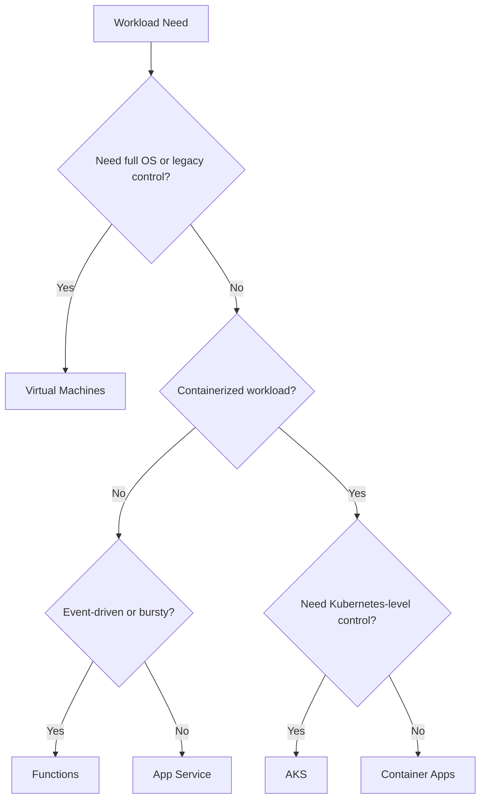

---
content_sources:
  diagrams:
    - id: platform-compute-selection-basics-diagram-1
      type: flowchart
      source: self-generated
      justification: "Synthesized from Microsoft Learn compute decision tree and Azure architecture technology choice guidance."
      based_on:
        - https://learn.microsoft.com/en-us/azure/architecture/guide/technology-choices/compute-decision-tree
        - https://learn.microsoft.com/en-us/azure/architecture/guide/technology-choices/compute-overview
---
# Compute Selection Basics

Compute choice is rarely only about runtime compatibility.

It is mostly about how much control, scaling behavior, operational burden, and team specialization the workload truly needs.

## Decision tree

<!-- diagram-id: platform-compute-selection-basics-diagram-1 -->

## Selection criteria

| Criterion | Favors managed PaaS/serverless | Favors VM or AKS control |
|---|---|---|
| Team skill depth | Smaller or app-focused platform skill set | Strong infrastructure or platform engineering capability |
| Control needs | Limited OS/runtime customization | Full control over node, runtime, or orchestration behavior |
| Scaling pattern | Burst or app-level autoscale | Complex container orchestration or stateful node concerns |
| Cost predictability | Simpler at moderate scale | Sometimes better at sustained scale with strong ops discipline |
| Operational burden tolerance | Lower | Higher |

## Option summaries

### Virtual Machines

- [Documented] best when you need OS-level control, legacy software support, or infrastructure patterns not easily expressed in higher-level services
- [Observed] often over-selected when teams are optimizing for familiarity rather than total lifecycle cost

### App Service

- [Documented] strong default for web apps and APIs that do not need deep infrastructure control
- [Validated] usually reduces operational burden compared with self-managed hosts

### Functions

- [Documented] good for event-driven, short-lived, bursty, and integration-heavy execution patterns
- [Observed] poor fit when teams ignore state, cold-start sensitivity, or execution-boundary design

### Container Apps

- [Documented] useful for containerized workloads needing managed scaling and modern app patterns without full Kubernetes management
- [Inferred] attractive middle ground when teams want containers but not cluster ownership

### AKS

- [Documented] appropriate when Kubernetes portability, advanced orchestration, or platform-level container control is a real requirement
- [Observed] expensive when selected primarily for trend alignment without team readiness

## Decision heuristics

- [Inferred] choose the highest-level abstraction that still satisfies hard constraints
- [Validated] only move down the abstraction stack when a specific requirement demands it
- [Correlated] increased control usually increases patching, networking, observability, and reliability obligations

## Common failure modes

- [Observed] choosing AKS without a platform team and SRE operating model
- [Observed] placing long-running stateful workloads into Functions without clear boundaries
- [Observed] using VMs for greenfield apps because migration tools or legacy habits made it feel safer
- [Unknown] assuming containerization automatically implies Kubernetes

## Validation questions

1. What control requirement cannot be met by the more managed option?
2. Which team will own runtime patching, release safety, and scaling behavior?
3. What is the expected burst pattern and steady-state utilization?
4. How much platform complexity can the organization sustainably operate?

## Microsoft Learn anchors

- [Compute decision tree](https://learn.microsoft.com/en-us/azure/architecture/guide/technology-choices/compute-decision-tree)
- [Choose a compute service](https://learn.microsoft.com/en-us/azure/architecture/guide/technology-choices/compute-overview)
- [App Service documentation](https://learn.microsoft.com/en-us/azure/app-service/)
- [Azure Kubernetes Service documentation](https://learn.microsoft.com/en-us/azure/aks/)
- [Azure Kubernetes Service (AKS) overview](https://learn.microsoft.com/en-us/azure/aks/what-is-aks)
- [Azure Container Apps overview](https://learn.microsoft.com/en-us/azure/container-apps/overview)
- [Choose between Azure Container Apps, AKS, and App Service](https://learn.microsoft.com/en-us/azure/container-apps/compare-options)

## Takeaway

[Inferred] Compute selection is a staffing and operations decision disguised as a runtime decision.

Prefer the most managed service that still clears the workload's non-negotiable constraints.
